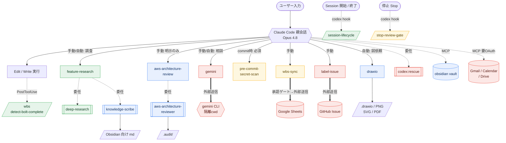

# SubBuddy ハーネスマップ

> Claude Code 実行環境（ハーネス）の構成をまとめた記録。
> **生成日**: 2026-06-05 / 対象リポジトリ: `/workspaces/SubBuddy`
> このファイルは現状の観測結果であり、設定変更時は手動で更新すること。

## 0. 全体像

```
┌────────────────────────────────────────────────────────────────┐
│ Claude Code ハーネス（モデル: Opus 4.8 / claude-opus-4-8[1m]）  │
│                                                                  │
│  設定レイヤ（後勝ち）                                            │
│    ~/.claude/settings.json   ← ユーザー全体                     │
│      └ .claude/settings.json ← プロジェクト共有（コミット対象） │
│          └ .claude/settings.local.json ← ローカル個人（gitignore）│
│                                                                  │
│  機能の提供元                                                    │
│    ├ Agents（サブエージェント）  .claude/agents/ + plugin       │
│    ├ Skills（スラッシュ/自動起動）.claude/skills/ + 組込 + plugin│
│    ├ Commands（スラッシュ）       .claude/commands/             │
│    ├ Hooks（自動実行）            settings + codex plugin        │
│    ├ MCP Servers                  .mcp.json + claude.ai 連携     │
│    └ Plugins / Marketplaces       ~/.claude/plugins/            │
│                                                                  │
│  記憶                                                            │
│    ├ プロジェクトメモリ  CLAUDE.md                              │
│    ├ 自動メモリ          ~/.claude/projects/.../memory/         │
│    └ ステアリング        .steering/ , .claude/.steering/        │
└────────────────────────────────────────────────────────────────┘
```

---

## 0.5 ハーネスの挙動図解

各ハーネスが「いつ・誰が・何を起こし・どこへ出すか」を、**挙動フロー図（全体像）と対応表（詳細）** の二段で示す。
挙動フロー図では**色が副作用・確認ゲートの区分**を表す（凡例参照）。線種は委任関係を表す。

### 0.5.1 挙動フロー図（起動契機 → コンポーネント → 出力）

下の Mermaid を VS Code の Markdown プレビュー（`Ctrl+Shift+V`）がライブ描画する（VS Code 1.61 以降は
Mermaid を**標準サポート**しており、拡張は不要。`bierner.markdown-mermaid` が入っていると**競合して描画
されない**ため、その場合は無効化すること）。ノード幅はブラウザの実測（`htmlLabels`）で決まるため、日本語
でも文字が図形からはみ出さない。長いラベルは `<br/>` で改行して視認性を確保している。図を直すときは
このブロックを直接編集する（画像生成や再生成スクリプトは不要）。



**凡例（色＝副作用/確認ゲート軸）**

| 色 | 意味 |
|---|---|
| 🟩 緑 `ro` | 読取専用（書込・外部送信なし） |
| 🟦 青 `wr` | ローカル書込あり（ファイル生成/更新） |
| 🟥 赤 `ext` | 外部送信あり（プロセス/サービスへ出る） |
| 🟧 橙 `gate` | 確認・停止ゲートを持つ（承認/中断で守る） |

線種: 実線 `-->`＝直接呼出 / 点線 `-.->`＝イベント・委任・MCP / 太線 `==>`＝外部送信。

### 0.5.2 挙動一覧表（全コンポーネント × 4軸）

| コンポーネント | 種別 | ① 起動契機 | ② 実行主体・委任 | ③ 副作用 | ③ 確認ゲート | ④ 出力先 |
|---|---|---|---|---|---|---|
| `detect-bolt-complete` | Hook | Edit/Write 後（PostToolUse） | 外部script（node, 15s） | 読取（検知） | なし | WBS状態 |
| `session-lifecycle` | Hook(codex) | Session 開始/終了 | 外部script（5s） | ライフサイクル管理 | なし | codex状態 |
| `stop-review-gate` | Hook(codex) | 停止時（Stop, 900s） | 外部（codex） | 読取（レビュー） | 🟧 任意の停止ゲート | 親会話 |
| `drawio` | Skill | 自動（図作成依頼） | 親会話 | 🟦 書込 | なし | `.drawio`/PNG/SVG/PDF |
| `feature-research` | Skill | 手動/自動（調査依頼） | 親＋委任（deep-research, Explore, Plan, codex:rescue, knowledge-scribe） | 🟩 読取専用（実装禁止） | なし | 親会話＋ナレッジ文書 |
| `gemini` | Skill | 手動/自動（Gemini相談） | 外部プロセス（gemini CLI・隔離cwd） | 🟥 読取＋外部送信 | なし | 親会話 |
| `pre-commit-secret-scan` | Skill | commit時（**必須**） | 親（gitleaks） | 読取（走査） | 🟧 検出時コミット中止 | 親会話 |
| `aws-architecture-review` | Skill | 手動（明示のみ・自動禁止） | 親 → `aws-architecture-reviewer` 委任 | 🟦 書込 | なし | `.audit/`＋親へ要約 |
| `label-issue` | Command | 手動 | 親（`gh`, ラベルのみ） | 🟥 外部送信 | なし | GitHub Issue |
| `wbs-sync` | Command | 手動 | 親（`gws`） | 🟥 外部送信（Sheets書込） | 🟧 **書込前 承認必須** | Google Sheets |
| `aws-architecture-reviewer` | Agent(opus) | Skill経由のみ | サブエージェント | 🟦 書込 | なし | `.audit/` |
| `cc-intel-scribe` | Agent(sonnet) | 自動起動（CC調査後） | サブエージェント | 🟦 書込 | なし | 日時付き md |
| `knowledge-scribe` | Agent(inherit) | 自動起動（解決/決定後） | サブエージェント | 🟦 書込 | なし | Obsidian向け md |
| `codex:rescue` | Plugin Agent | 手動/委任 | 外部（codex CLI） | 🟥 読取／委任時 書込 | なし | 親会話 |
| `obsidian` | MCP | ツール呼出時 | 外部MCP（mcpvault） | 🟦 読取/書込 | なし | `/workspaces/vault` |
| `claude.ai Gmail/Cal/Drive` | MCP | ツール呼出時 | 外部MCP | 🟥 読取/外部送信 | 🟧 OAuth認証要 | 外部サービス |

> 軸の対応: ①=起動契機 / ②=実行主体・委任 / ③=副作用と確認ゲート / ④=データ出力先。
> 🟥外部送信・🟧ゲートを持つ行は、PII方針（CLAUDE.md）上とくに注意して扱う。

> 表示の前提：VS Code 1.61 以降は Mermaid をプレビューで標準描画する（拡張不要）。出ないときは
> `bierner.markdown-mermaid` が**競合していないか**確認し（入っていれば無効化）、`Developer: Reload Window`。

---

## 1. ランタイム / モデル

| 項目 | 値 |
|---|---|
| モデル | Opus 4.8（`claude-opus-4-8[1m]` / 1M コンテキスト） |
| プラットフォーム | linux（devcontainer）/ shell: bash |
| 作業ディレクトリ | `/workspaces/SubBuddy` |
| Git | branch `main` / user `colorfulrhythms927` |
| Fast モード | `/fast` で切替可（Opus 4.6+） |

---

## 2. 設定レイヤ（settings）

後に読むものが前を上書き。`local` は個人用で gitignore 対象。

### 2.1 `~/.claude/settings.json`（ユーザー全体）
- `enabledPlugins`: `codex@openai-codex`
- `extraKnownMarketplaces`: `openai-codex` (github: `openai/codex-plugin-cc`)
- `theme`: dark / `skipWorkflowUsageWarning`: true

### 2.2 `.claude/settings.json`（プロジェクト共有・コミット対象）
- `enabledPlugins`:
  - `codex@openai-codex`
  - `example-skills@anthropic-agent-skills`
  - `document-skills@anthropic-agent-skills`
  - `deploy-on-aws@agent-plugins-for-aws`
- `hooks.PostToolUse`（後述 §6）

### 2.3 `.claude/settings.local.json`（ローカル個人）
- `permissions.allow`: 約140件の許可ルール（git / npm / npx prisma / playwright / gws / psql / WebFetch ドメイン許可 / Skill 許可 など）
- `enableAllProjectMcpServers`: true
- `enabledMcpjsonServers`: `["obsidian"]`

> 許可リストの代表カテゴリ:
> - **Git**: `git add/commit/config/checkout/push/branch/fetch/credential *`
> - **Node/Web**: `npm run/install/test *`, `npx prisma *`, `npx tsx *`, `npx playwright *`, `node *`
> - **DB**: PostgreSQL 起動・ロール/DB作成・`psql` クエリ群
> - **Google Workspace**: `gws auth/sheets *`（WBS同期用）
> - **WebFetch**: 調査で訪れた特定ドメインの許可リスト
> - **Skill**: `codex:rescue`, `deep-research`

---

## 3. Agents（サブエージェント）

`Agent` ツールの `subagent_type` で起動。

### 3.1 プロジェクト定義 `.claude/agents/`
| 名前 | model | 役割 | 起動経路 |
|---|---|---|---|
| `aws-architecture-reviewer` | opus | AWS Well-Architected 6本柱の総合レビュー | `aws-architecture-review` Skill 経由のみ（直接呼出禁止） |
| `cc-intel-scribe` | sonnet | Claude Code 製品情報の記録（出典・取得日・対象バージョン付き） | Web調査後に自動起動 |
| `knowledge-scribe` | inherit | 設計/実装ナレッジを Obsidian 向け Markdown 化 | 非自明な判断・トラブル解決後に自動起動 |

### 3.2 Plugin 提供
| 名前 | 提供元 | 役割 |
|---|---|---|
| `codex:codex-rescue` | codex plugin | Codex へ調査/実装/診断を委任 |

### 3.3 組込（ハーネス標準）
`general-purpose` / `Explore`（読取専用検索）/ `Plan`（実装計画）/ `claude`（汎用）/ `statusline-setup` / `output-style-setup` など。

---

## 4. Skills

`Skill` ツールまたは `/<name>` で起動。出所は3系統。

### 4.1 プロジェクト `.claude/skills/`
| 名前 | 自動起動 | 概要 |
|---|---|---|
| `aws-architecture-review` | 明示依頼のみ | AWS構成レビューをサブエージェントに委任、`.audit/` に保存 |
| `drawio` | 図作成依頼で自動 | `.drawio` 図生成・PNG/SVG/PDF エクスポート |
| `feature-research` | 実装方式調査で | deep-research→Explore→Plan→codex:rescue→knowledge-scribe の定型フロー（実装はしない） |
| `gemini` | Gemini相談時 | Gemini CLI（無料OAuth枠）への軽量・読取専用問い合わせ窓口 |
| `pre-commit-secret-scan` | commit時 必須 | コミット前に gitleaks で秘密情報・PII を全走査 |

補助コマンド: `wbs-sync`・`label-issue` は §5 のコマンドからも起動。

### 4.2 Plugin 提供 Skills
- **codex@openai-codex**: `codex:rescue`, `codex:setup`, `codex:codex-cli-runtime`, `codex:codex-result-handling`, `codex:gpt-5-4-prompting`
- **anthropic-agent-skills / document-skills**: `wbs-sync`, `label-issue` ほか
- **deploy-on-aws@agent-plugins-for-aws**

### 4.3 組込（ハーネス標準）
`deep-research` / `code-review` / `simplify` / `verify` / `run` / `review` / `security-review` / `init` / `loop` / `schedule` / `update-config` / `keybindings-help` / `fewer-permission-prompts` / `claude-api`

---

## 5. Commands（スラッシュコマンド）`.claude/commands/`

| 名前 | 説明 | allowed-tools |
|---|---|---|
| `label-issue` | GitHub Issue へラベル付与（コメントはしない） | `gh label/issue/search` のみ |
| `wbs-sync` | `wbs.yml` を Google スプレッドシートへ同期（**書込前に確認ゲート必須**） | — |

---

## 6. Hooks（自動実行）

| イベント | matcher | コマンド | 提供元 | timeout |
|---|---|---|---|---|
| `PostToolUse` | `Edit\|Write` | `node wbs/scripts/detect-bolt-complete.mjs` | プロジェクト settings | 15s |
| `SessionStart` | — | `session-lifecycle-hook.mjs SessionStart` | codex plugin | 5s |
| `SessionEnd` | — | `session-lifecycle-hook.mjs SessionEnd` | codex plugin | 5s |
| `Stop` | — | `stop-review-gate-hook.mjs`（任意の停止時レビューゲート） | codex plugin | 900s |

> `detect-bolt-complete.mjs`（3,238 bytes, 実在）は Edit/Write 後に WBS のボルト完了を検知する。

---

## 7. MCP Servers

### 7.1 プロジェクト `.mcp.json`
| サーバー | type | 起動 | 状態 |
|---|---|---|---|
| `obsidian` | stdio | `npx @bitbonsai/mcpvault@latest /workspaces/vault` | `enabledMcpjsonServers` で有効化済 |

obsidian 系ツール（read_note/write_note/search_notes/patch_note/manage_tags 等）が利用可能。

### 7.2 claude.ai 連携（要OAuth・未認証キャッシュあり）
`Gmail` / `Google Calendar` / `Google Drive` — `mcp-needs-auth-cache.json` に記録。利用時に `authenticate` → `complete_authentication` が必要。ヘッドレス/cron では不在の可能性あり。

---

## 8. Plugins / Marketplaces `~/.claude/plugins/`

### マーケットプレイス（`known_marketplaces.json`）
| 名前 | source |
|---|---|
| `openai-codex` | github: `openai/codex-plugin-cc` |
| `claude-plugins-official` | github: `anthropics/claude-plugins-official` |

### インストール済（`installed_plugins.json`）
| プラグイン | version | scope | パス |
|---|---|---|---|
| `codex@openai-codex` | 1.0.4 | project | `~/.claude/plugins/cache/openai-codex/codex/1.0.4` |

codex plugin 構成: `commands/`（review, setup, rescue, status, adversarial-review, result, cancel）, `agents/codex-rescue.md`, `hooks/hooks.json`, `scripts/`（codex-companion, broker, lifecycle/review-gate hooks）, `skills/`, `schemas/`, `prompts/`。

---

## 9. 記憶（Memory）系統

| 種別 | 場所 | 役割 |
|---|---|---|
| プロジェクトメモリ | `CLAUDE.md`（リポジトリ直下） | 標準ルール・ペルソナ運用・ドキュメント分類・PII方針 |
| 自動メモリ | `~/.claude/projects/-workspaces-SubBuddy/memory/` | `MEMORY.md` 索引 + 1ファイル1事実（user/feedback/project/reference） |
| ステアリング（永続docs） | `docs/` | product-requirements / functional-design / architecture / repository-structure / development-guidelines / glossary |
| ステアリング（作業単位） | `.steering/`, `.claude/.steering/` | `[YYYYMMDD]-[タイトル]/` に requirements/design/tasklist |

現在の自動メモリ: `dev-env-quirks` / `gym-visit-auto-import-research` / `mvp-status`。

現在の `.claude/.steering/`:
- `20260603-feature-research-skill/`（requirements, design, tasklist）
- `20260605-gemini-consult-skill/`（requirements, design）

---

## 10. ディレクトリ構成（`.claude/`）

```
.claude/
├── settings.json            # プロジェクト共有（plugins, hooks）
├── settings.local.json      # ローカル個人（permissions, MCP有効化）
├── agents/                  # サブエージェント定義
│   ├── aws-architecture-reviewer.md
│   ├── cc-intel-scribe.md
│   └── knowledge-scribe.md
├── commands/                # スラッシュコマンド
│   ├── label-issue.md
│   └── wbs-sync.md
├── skills/                  # スキル
│   ├── aws-architecture-review/SKILL.md
│   ├── drawio/{SKILL.md, references/}
│   ├── feature-research/SKILL.md
│   ├── gemini/{SKILL.md, scripts/gemini-ask.sh}
│   └── pre-commit-secret-scan/{SKILL.md, assets/}
├── .steering/               # 作業単位ステアリング（ハーネス開発分）
└── harness/                 # ← 本マップ
```

---

## 11. メンテナンス指針

- 設定/プラグイン/フック/MCP を変更したら本マップを更新する。
- `settings.local.json` の許可リストは肥大化しやすい。`/fewer-permission-prompts` で整理可。
- PII方針（CLAUDE.md）はどのペルソナでも最優先。秘密情報・実データは本マップにも記載しない。
- claude.ai MCP は認証状態に依存するため、ヘッドレス実行では事前に認証確認。
