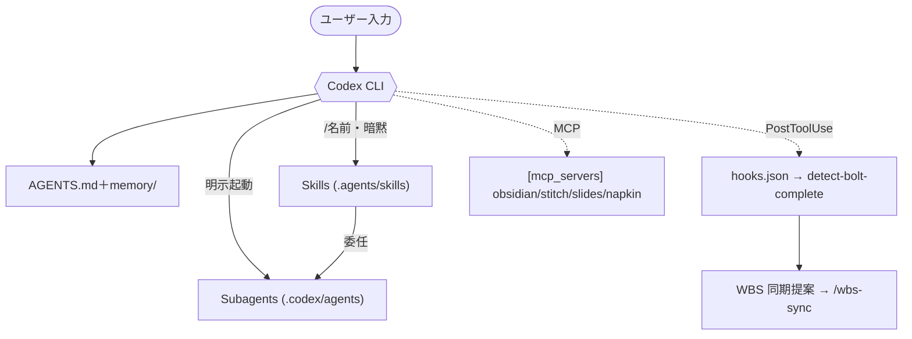

# SubBuddy ハーネスマップ（Codex CLI 版）

> Codex CLI 実行環境（ハーネス）の構成記録。**生成日**: 2026-06-27 / 対象: `/workspaces/SubBuddy`
> Claude Code（`.claude/`）からの移行に伴い新規作成。旧版は `.claude/harness/harness-map.md`（参考・残置）。
> 設定変更時は手動更新する。

## 0. 全体像

```
┌──────────────────────────────────────────────────────────────────┐
│ Codex CLI ハーネス                                                 │
│                                                                    │
│  設定レイヤ（後勝ち。プロジェクト設定は trusted のときのみ有効）  │
│    ~/.codex/config.toml        ← ユーザー全体／trust 設定         │
│      └ .codex/config.toml      ← プロジェクト（trusted 時のみ）   │
│                                                                    │
│  指示・記憶                                                        │
│    ├ AGENTS.md（プロジェクト指示＋ルール系メモリ＋索引を統合）    │
│    └ memory/（旧自動メモリ。自動注入なし→関連時に明示 read）      │
│                                                                    │
│  機能の提供元                                                      │
│    ├ Skills          .agents/skills/（SKILL.md 標準）             │
│    ├ Subagents       .codex/agents/*.toml（明示起動のみ）         │
│    ├ Hooks           .codex/hooks/hooks.json（command 型のみ）    │
│    └ MCP Servers     .codex/config.toml [mcp_servers.*]           │
└──────────────────────────────────────────────────────────────────┘
```

## 1. コンポーネント一覧

### Skills（`.agents/skills/`、9個）
明示起動（`/名前`）＋ description による暗黙起動。

| Skill | 役割 | 備考 |
|---|---|---|
| feature-research | 実装方式の調査・戦略立案 | 委任先を Codex agent 名へ調整済み |
| gemini | 軽量 Gemini 相談（OAuth・読み取り専用） | |
| drawio | 図表生成 | references 同梱 |
| procedure-guide | 初学者向け手順書（MD＋HTML） | assets 同梱 |
| handoff | 引き継ぎ書作成 | |
| pre-commit-secret-scan | commit 前 gitleaks スキャン（必須ゲート） | assets 同梱、フラグは `~/.codex/.gitleaks_confirmed` |
| aws-architecture-review | AWS WA レビュー（agent 委任） | |
| grilling | 計画の叩き上げ面談 | 暗黙起動可 |
| grill-me | 同・明示専用 | `disable-model-invocation`（実機検証） |

### Subagents（`.codex/agents/*.toml`、7個・明示起動のみ）

| Agent | 役割 | sandbox |
|---|---|---|
| knowledge-scribe | ナレッジ記録（Obsidian 向け） | workspace-write |
| aws-architecture-reviewer | AWS WA レビュー本体 | workspace-write |
| cc-intel-scribe | Claude Code 製品情報の記録 | workspace-write |
| explore | コードベース探索（旧 Explore） | read-only |
| plan | 実装計画立案（旧 Plan） | read-only |
| deep-research | 出典付き外部調査 | read-only |
| adversarial-review | 批判的反証（旧 codex:rescue） | read-only |

### Hooks（`.codex/hooks/hooks.json`、command 型のみ）

| イベント | matcher | コマンド | 出力 |
|---|---|---|---|
| PostToolUse | `Edit|Write`（実名は要検証） | `detect-bolt-complete.mjs`（git rev-parse 起点） | tasklist 完了時に WBS 同期を提案 |

### MCP Servers（`.codex/config.toml [mcp_servers.*]`、4個）

| サーバ | 秘密情報 |
|---|---|
| obsidian | なし |
| stitch | `env_vars=["STITCH_API_KEY"]`（ホスト環境変数） |
| google-slides | なし（別途認証） |
| napkin-ai | `env_vars=["NAPKIN_API_KEY"]`＋非秘密設定は env テーブル |

## 2. Claude Code → Codex 対応

| Claude Code | Codex |
|---|---|
| `CLAUDE.md` | `AGENTS.md`（ルール系メモリ・索引を統合） |
| `.claude/skills/` | `.agents/skills/`（SKILL.md 標準） |
| `.claude/agents/` | `.codex/agents/*.toml` |
| `.claude/commands/` | Skill 化（wbs-sync）。label-issue は非スコープ |
| `settings.json` hooks | `.codex/hooks/hooks.json` |
| `.mcp.json` | `.codex/config.toml [mcp_servers.*]` |
| 自動メモリ（自動注入） | AGENTS.md 統合＋`memory/` 明示 read |
| settings 権限 | `approval_policy`/`sandbox_mode` |

## 3. 移行で等価にならない点（注意）

- **自動ディスパッチなし**：サブエージェントは明示起動のみ（Claude のような自動委任は無い）。
- **メモリ自動注入なし**：AGENTS.md のリンク参照では外部メモリは読まれない。ルールは本体統合、文脈は明示 read。
- **trust 必須**：`.codex/` の config・hooks は trusted project でないと全スキップ。
- **非スコープ**：codex プラグイン hook（stop-review-gate / session-lifecycle）、label-issue（GitHub Actions 専用）。

## 4. 図（Mermaid）

> VS Code 1.61+ は Mermaid を標準描画。`bierner.markdown-mermaid` 拡張は競合するため無効化する。


