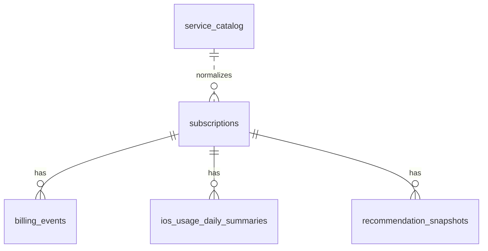

# 初回実装 — 設計（design）

> ステアリング：`20260602-initial-implementation`
> ドキュメント種別：作業単位ドキュメント（`.steering/`）
> 作成日：2026-06-02
> 前提：`requirements.md`（承認済み。Q1=最小形 / Q2=容量はモデル余地のみ / Q3=初回は無認証 localhost）

---

## 1. 実装アプローチ

- **まず一通りの流れを動かす**：「サブスクを登録 → 利用量を受け取る（合成データを送信）→ 判定する → 画面に出す」という一連の流れを、最小構成で端から端まで動かすことを最優先にする。
- **作り込みすぎない**：取得源ごとの取り込み部品（コネクタ）は今回作らない。利用量は「同期 API → 整形（normalize）→ 保存」という一本道で実装し、2 つ目の取得源が必要になった時点で部品化する。
- **判定ロジックを独立させる**：判定・集計（`src/domain/`）はデータベースや画面に依存させず、入力を受けて結果を返すだけにする。データベース操作は `src/repositories/` にまとめ、画面・API からはその順番でしか呼ばない（`development-guidelines.md` §2）。
- **入力チェックを1か所に集める**：API やデータ送信で受け取る値は、まず `src/schemas/`（Zod）で形式を確認してから処理に渡す。
- **設定値は外に出す**：判定の基準値（何日未使用か、いくら以上か等）はコードに直書きせず `src/config/scoring.ts` にまとめ、Zod で内容を確認する。

---

## 2. 構築するコンポーネント

`repository-structure.md` §4 のツリーに沿って、**今回必要な分だけ**作成する（空ディレクトリは作らない）。

```
apps/web/
├── prisma/
│   ├── schema.prisma          # 5テーブル定義（§3）
│   ├── migrations/
│   └── seed.ts                # 合成データ（実PII禁止）
└── src/
    ├── app/
    │   ├── (dashboard)/
    │   │   ├── page.tsx                 # ダッシュボード（合計・件数）
    │   │   ├── subscriptions/           # 一覧・登録/編集・詳細
    │   │   ├── recommendations/         # 判定別レコメンド一覧
    │   │   └── renewals/                # 更新日前レビュー
    │   └── api/
    │       ├── subscriptions/           # GET/POST, [id] GET/PUT/DELETE
    │       ├── summary/                 # GET
    │       ├── usage/daily/             # POST（冪等 upsert）
    │       ├── recommendations/         # GET, recompute POST
    │       ├── renewals/upcoming/       # GET
    │       └── service-catalog/         # GET
    ├── domain/
    │   ├── scoring/           # 判定ルール（§8）＝純関数
    │   └── usage/             # 集計・正規化（純関数）
    ├── repositories/          # Prisma 経由の永続化
    ├── config/               # scoring.ts（しきい値・Zod検証）
    ├── schemas/              # Zod（API入力・usageペイロード）
    ├── lib/                  # 通貨・日付など横断ユーティリティ
    └── components/           # SubscriptionCard 等（Tailwind）
└── tests/                    # Vitest（domain中心・合成データ）
```

> `ingestion/connectors/` は今回**作らない**（Q1=最小形）。`usage/daily` の正規化は `src/domain/usage/normalize.ts` に置き、2 例目の取得源が出たら `ingestion/` へ移設する。

---

## 3. データ構造（Prisma / `functional-design.md` §5）

5 テーブルを定義。全テーブルに `user_id`（MVP は単一の固定ユーザー ID を seed）。

| テーブル | 主な列 | 今回の実装範囲 |
|---|---|---|
| `subscriptions` | name, normalized_name, category, amount(整数), currency, billing_cycle, next_renewal_date, status, importance, cancellation_url, notes | CRUD 完全実装 |
| `billing_events` | subscription_id, amount, occurred_on, source(manual/email/screenshot), confidence, raw_reference | seed と参照のみ（自動取込はフェーズ2） |
| `ios_usage_daily_summaries` | subscription_id, usage_date, used, usage_bucket, est_minutes_min/max, source | `usage/daily` で upsert（`subscription_id × usage_date` 一意） |
| `recommendation_snapshots` | subscription_id, decision, **data_status, observation_days, days_until_ready**, cancel_score, cost_per_usage_day, used_days_30, last_used_days_ago, days_to_renewal, has_duplicate, **confidence**, reason, created_at | recompute で書き込み（§5.1 の段階的提供） |
| `service_catalog` | normalized_name, category, domains, app_bundle_ids, is_excluded | seed（Apple Music 等を `is_excluded`） |

設計上の注記：
- **金額は整数（最小通貨単位）**。`currency` 既定 `JPY`。
- **`usage_source`（time/capacity/visit）と `cost_per_visit` は今回追加しない**（`glossary.md` で候補・未確定）。`capacity` 軸は将来 `subscriptions.category` ＋ 別テーブルで拡張する余地を残すのみ。
- `recommendation_snapshots` は**履歴**として追記（最新を画面表示、過去は保持）。

### ER（今回実装分）



---

## 4. API 契約（Route Handlers / `functional-design.md` §10）

| メソッド | パス | 入力検証 | 備考 |
|---|---|---|---|
| GET/POST | `/api/subscriptions` | `subscriptionCreateSchema` | 一覧 / 登録 |
| GET/PUT/DELETE | `/api/subscriptions/[id]` | `subscriptionUpdateSchema` | 詳細 / 更新 / 削除 |
| GET | `/api/summary` | — | 月額/年額合計・件数 |
| POST | `/api/usage/daily` | `usageDailyBatchSchema` | **冪等 upsert**。不正→400 |
| GET | `/api/recommendations` | — | 最新スナップショット一覧 |
| POST | `/api/recommendations/recompute` | — | 全件再スコアリング |
| GET | `/api/renewals/upcoming` | クエリ `days`（既定14） | 更新間近 |
| GET | `/api/service-catalog` | — | 正規化辞書参照 |

- `/api/icloud-plus`（UC-08）は**今回未実装**（Q2）。
- 認証は**今回なし**（localhost 前提）。後続でローカル簡易認証を `architecture.md` §8.1.1 に従い追加（Q3）。
- 詳細ログは受け付けない（集計値のみ）。エラーレスポンスに内部情報・PII を含めない。

### `usageDailyBatchSchema`（要点）

```text
items: [{
  subscriptionId: string(既存IDを参照),
  date: ISO日付(YYYY-MM-DD),
  used: boolean,
  usageBucket: enum(none|1m_plus|5m_plus|15m_plus|30m_plus|60m_plus|120m_plus),
  estimatedMinutesMin?: int>=0,
  estimatedMinutesMax?: int>=min,
  source: enum(ios_device_activity|manual_synthetic)
}]
```
- 1 リクエストの最大件数を上限（例：1000）で制限。`subscriptionId × date` で upsert。

---

## 5. スコアリング設計（`src/domain/scoring`）

- 入力：`subscription` ＋ 直近30日の `usage` 集計（利用日数・最終利用からの日数・バケット）＋ 同カテゴリ重複有無 ＋ `importance` ＋ **登録からの観測日数**。
- 純関数 `computeRecommendation(input, config): RecommendationResult` を中核に置く。

### 5.1 段階的な情報提供（案A／`functional-design.md` §8.5）

利用量の集計は**登録時点（`subscriptions.createdAt`）から開始**し、過去に遡らない（最終利用日の手動入力はしない）。
判定を 2 系統に分け、**登録初日から価値を返す**：

- **利用に依存しない指摘（即時）**：同カテゴリ重複・割高・更新間近。観測日数に関係なく出す。
- **利用に依存する判定（観測が必要）**：◯日未使用・単価。観測日数が `cfg.minObservationDays`（既定14）未満の間は
  `data_status = 'observing'` とし、確定判定を保留。画面は **「観測中（あと N 日）」**（`days_until_ready = minObservationDays - observationDays`）。
  観測十分で `data_status = 'ready'` → 下記ルールで確定判定。
- 観測が短い間の利用日数・単価は `confidence`（暫定/確定）で明示。

### 5.2 判定ルール（`functional-design.md` §8.3、しきい値は `config`）

```text
data_status = observing（観測 < cfg.minObservationDays(=14)）       → 確定 decision は出さず「観測中（あと N 日）」
unusedDays >= cfg.strongCancelUnusedDays(=60)                    → strong_cancel_candidate
unusedDays >= cfg.considerCancelUnusedDays(=30) && monthly >= cfg.considerCancelMinAmount(=1000) → consider_cancel
同カテゴリ複数 && 低利用側                                        → consider_cancel（低利用側）
利用少 && importance 高                                            → review（様子見）
（容量余剰 iCloud+ → consider_downgrade：今回はルール枠のみ。capacity データ未投入のため発火しない）
上記以外で十分利用                                                → keep
```

- `cost_per_usage_day = 月額換算 ÷ 直近30日利用日数`（0 日は「未使用」として別扱い）。
- `reason` は判定ごとの**定型文**（`src/domain/scoring/reasons.ts`）。観測中は「観測中（あと N 日）」の定型文。
- `config` は `scoringConfigSchema`（Zod）で検証。`minObservationDays` 等を差し替えてテストで判定差分を確認する。

---

## 6. 影響範囲・他ドキュメントとの整合

- **基本設計の更新あり**：段階的な情報提供（案A）の採用に伴い、`functional-design.md`（§5 ER に `data_status`/`observation_days`/`days_until_ready`/`confidence`、§8.5 新設、§9.3 観測中表示）と `glossary.md`（観測期間・観測中・確定）を更新済み。
- 実装の新規作成は `apps/web/` 配下と seed。`functional-design.md` §5/§8/§10 に準拠。
- `visit`/`cost_per_visit`/`icloud-plus` を「今回対象外」とするのは §requirements の Out of Scope と一致（逸脱なし）。
- `glossary.md` の判定ラベル（`review`=様子見）・命名（`cost_per_usage_day` 等）に表示・コードを一致させる。
- バージョン具体値は `package.json` / `.tool-versions` を一次情報とし、ドキュメントに固定しない。

---

## 7. リスク・留意点

- **iOS 不在での検証**：利用量は合成 POST で代替。API 契約（§4.1 のスキーマ）を iOS 実装時にそのまま使えるよう固定する。
- **しきい値の妥当性**：初期値は §8 のまま。実データなしのため、合成シナリオ（未使用60日/重複/高importance低利用 等）でルール網羅をテストする。
- **正規化辞書の範囲**：seed の `service_catalog` は最小限。表記揺れ吸収は今回 seed 範囲に限定し、拡張はフェーズ2。
- **PII 厳守**：seed・テスト・スクショは合成データのみ。コミット前に `pre-commit-secret-scan` を実行。

---

## 8. 完了の定義（design 観点）

- §2 の構成で縦串が動作し、§4 の API が Zod 検証付きで応答する。
- §5 のスコアリングが §8 ルール通りに判定し、`recommendation_snapshots` に履歴が残る。
- ダッシュボード・一覧・詳細・レコメンド・更新レビューが合成データで表示される。
- 単体テスト（scoring/normalize/Zod/冪等 upsert）と lint/typecheck が通る。
