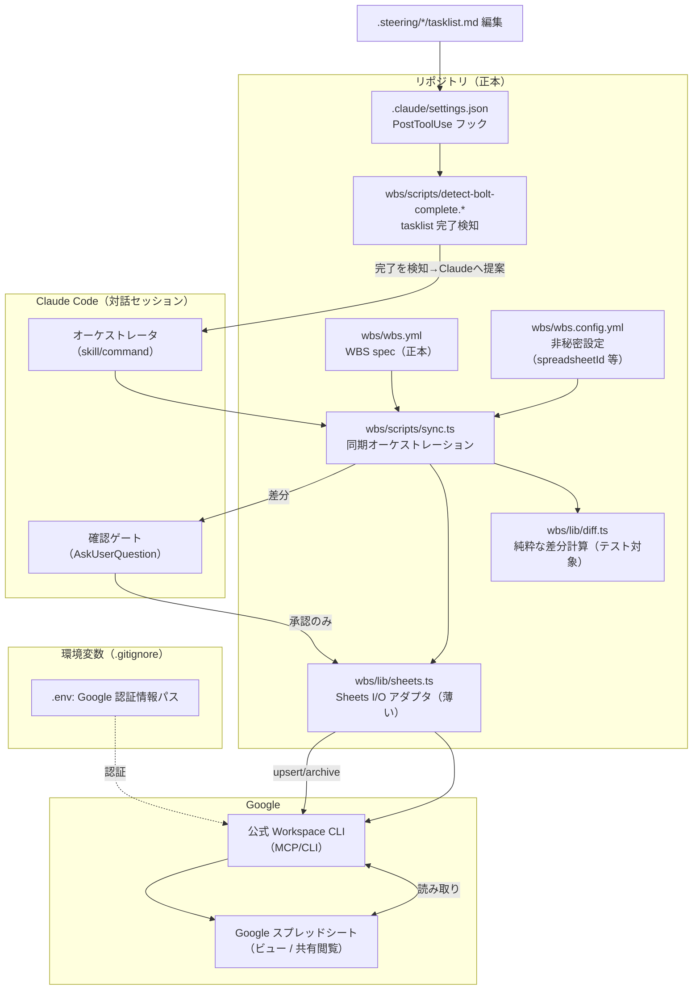
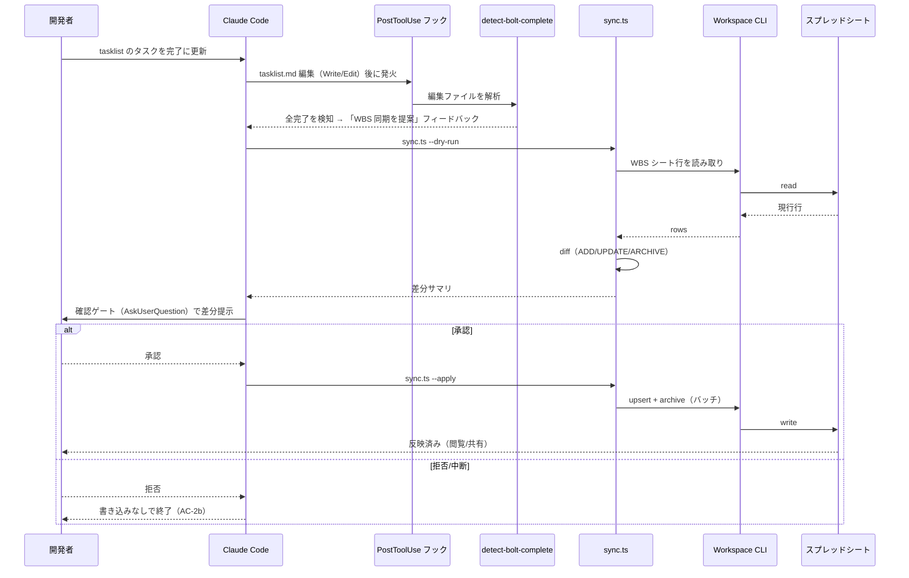

# 設計（Design） — WBS 同期の仕組み

> プロジェクト名 / アプリ名：**SubBuddy**
> ドキュメント種別：作業単位ドキュメント（`.steering/20260602-wbs-sync/`）
> 作成日：2026-06-03
> 関連：本作業の `requirements.md`、`docs/repository-structure.md`（配置）、`docs/development-guidelines.md`（規約・テスト・Git）、`docs/glossary.md`（用語）、`CLAUDE.md`（PII・段階承認）

---

## 1. 設計の基本方針

- **正本（Source of Truth）はリポジトリ内の構造化ファイル**。Sheets は生成ビュー（片方向：spec → Sheets）。
- **自動トリガ（Bolt / `.steering/*/tasklist.md` 完了）で起動**し、**書き込み前に必ず確認ゲート（ask）**を通す。
- **純粋ロジック（差分計算）と I/O（Sheets 読み書き）を分離**（`development-guidelines.md` §2 副作用分離）。差分は合成データで単体テスト可能にする。
- **まずは最小限の機能だけ作り、必要になってから足す**：v1 では「spec→Sheets への反映（追加・更新）」「消えたタスクの退避」「書き込み前の確認」までに絞る。双方向同期などは本当に必要になった時点で追加する（`repository-structure.md` の方針に沿う）。進捗の集計（ロールアップ）は Sheet の数式で軽く済ませる。
- **秘密情報・PII を持ち込まない**。WBS は開発タスクのメタ情報のみ。Google 認証情報は環境変数。

---

## 2. 全体構成



### 2.1 コンポーネント責務

| コンポーネント | 責務 | 副作用 |
|---|---|---|
| `wbs/wbs.yml` | WBS の正本データ（標準 WBS 一式） | — |
| `wbs/wbs.config.yml` | spreadsheetId・シート名・アーカイブ方針など**非秘密**設定 | — |
| `wbs/lib/diff.ts` | spec と現 Sheet 行から **ADD/UPDATE/ARCHIVE/UNCHANGED** を算出（純粋関数） | なし（テスト対象） |
| `wbs/lib/sheets.ts` | Sheets の行読み取り・書き込み（Workspace CLI 経由）。薄いアダプタ | I/O |
| `wbs/scripts/sync.ts` | spec 読込 → 現行読取 → diff → （`--dry-run`で差分出力 / `--apply`で書込） | I/O |
| `wbs/scripts/detect-bolt-complete.*` | 編集された tasklist を解析し「全完了」を判定。完了なら Claude へ提案メッセージを返す | 読み取りのみ |
| `.claude/settings.json`（フック） | `PostToolUse` で tasklist 編集を捕捉し検知スクリプトを起動 | — |
| Claude オーケストレータ（skill/command） | `sync --dry-run` で差分取得 → **確認ゲート** → 承認時のみ `sync --apply` | 人間承認を仲介 |

> **依存方向**：`sync.ts → diff.ts（純粋）/ sheets.ts（I/O）`。`diff.ts` は I/O に依存しない（テスト容易性・`development-guidelines.md` §2/§5）。

---

## 3. WBS spec のフォーマットと配置

### 3.1 配置

- **正本：`wbs/wbs.yml`**（リポジトリ直下に `wbs/` を新設）。
  - `docs/` には置かない：`docs/` は「基本設計の北極星・頻繁更新しない」思想で、頻繁に更新される WBS とは性質が異なるため（`repository-structure.md` §1）。
  - `.steering/` にも置かない：WBS は全工程を横断する恒久データで、作業単位（短命）とは粒度が違うため。
- **設定：`wbs/wbs.config.yml`**（spreadsheetId・シート名・列順・アーカイブ方針。**秘密でない**ためコミット可）。
- **認証情報：`.env`（`.gitignore`）**。`wbs/.env.example` にダミーのみ。

### 3.2 フォーマット：YAML を採用

標準 WBS 一式は 12 列あり、Markdown テーブルだと横長で編集・diff が破綻しやすい。**YAML（1 タスク 1 ブロック）**を正本とし、機械可読性・編集性・Git 差分のクリーンさを優先する。

> 人間がリポジトリ上で一覧したい需要には、同期時に **`wbs/wbs.md`（テーブル表示）を任意生成**できる（v1 では任意・後回し可）。「人間向け一覧」の主役はあくまで Sheets ビュー。

```yaml
# wbs/wbs.yml（正本・抜粋）
version: 1
tasks:
  - id: "1"            # WBS ID（結合キー・安定）
    parent: null
    level: 1
    phase: "設計"
    name: "WBS 同期の設計"
    assignee: ""
    plannedStart: 2026-06-10
    plannedEnd: 2026-06-12
    actualStart: null
    actualEnd: null
    estimateHours: 8
    actualHours: null
    progress: 0          # 0–100
    status: "未着手"      # 未着手 / 進行中 / 完了 / 保留
    predecessors: []     # 先行タスクの WBS ID
    deliverable: ""      # 成果物（PR リンク等）
    note: ""
  - id: "1.1"
    parent: "1"
    level: 2
    phase: "設計"
    name: "spec フォーマット確定"
    # …（同上）
```

- **WBS ID は不変**：リネーム・並べ替えがあっても ID は変えない（行の追跡が壊れるため）。
- 値の語彙（status の `未着手/進行中/完了/保留`）は `glossary.md` に追記して統一する。

---

## 4. Sheets ビューのレイアウト

| シート | 役割 |
|---|---|
| `WBS` | 同期対象の本体。1 行 = 1 タスク。先頭列が **WBS ID（キー）**。ヘッダ行は固定 |
| `Archive` | spec から消えたタスクの退避先（US-10）。削除はせず移送 |
| `Summary` | フェーズ別・全体の進捗ロールアップ（US-8）。**Sheet 数式**で `WBS` を集計（同期では数式を壊さない） |

- 列順は `wbs.config.yml` の `columns` で定義し、spec のフィールドと対応づける。
- `Summary` は初回に数式を1度だけ設置し、以後の同期は `WBS` シートの行のみ更新（ロールアップ書き込みロジックを持たない＝最小実装）。

---

## 5. 同期ロジック

### 5.1 差分計算（`diff.ts`・純粋関数）

入力：`specTasks[]`（wbs.yml）と `sheetRows[]`（現 `WBS` シート、WBS ID キー）。出力：

| 種別 | 条件 | アクション |
|---|---|---|
| **ADD** | spec にあり Sheet に無い ID | `WBS` に行追加 |
| **UPDATE** | 両方にあり、いずれかの列値が異なる | 当該行を更新（変更フィールドを明示） |
| **UNCHANGED** | 両方にあり差分なし | 何もしない |
| **ARCHIVE** | Sheet にあり spec に無い ID | `WBS` から削除し `Archive` へ移送（US-10。黙って消さない） |

- **冪等性（NFR-3）**：キーは WBS ID。同じ spec で再実行すると全件 UNCHANGED となり Sheet は不変。
- 比較は正規化後（日付フォーマット・空文字/null の同一視）に行う。

### 5.2 同期シーケンス（自動トリガ＋確認ゲート）



- **確認ゲートはフック自体ではなく Claude が実施**：フックはシェルなので対話できない。フックは「完了を検知して Claude に提案する」までを担い、**差分提示と承認は Claude の対話（AskUserQuestion）**で行う。これにより「対話コンテキスト内で必ず ask」（FR-4）を満たす。
- **書き込みは承認後の `--apply` のみ**。`--dry-run` は読み取りと差分計算だけで副作用なし。

### 5.3 自動トリガ検知（フック構成）

`.claude/settings.json`（プロジェクトスコープ、コミット可）に `PostToolUse` フックを定義し、`.steering/**/tasklist.md` への `Write`/`Edit` を捕捉する。

```jsonc
// .claude/settings.json（例・確定値は実装時に検証）
{
  "hooks": {
    "PostToolUse": [
      {
        "matcher": "Write|Edit",
        "hooks": [
          {
            "type": "command",
            "command": "node wbs/scripts/detect-bolt-complete.mjs \"$CLAUDE_TOOL_FILE_PATH\""
          }
        ]
      }
    ]
  }
}
```

- 検知スクリプトは対象が `.steering/*/tasklist.md` のときのみ動作し、**チェックボックス（`- [ ]` / `- [x]`）を解析**。未完が 0 かつ完了が 1 件以上なら「Bolt 完了」と判定。
- 完了時は Claude が読めるフィードバック（標準出力 / `additionalContext`）で「WBS 同期を提案してください」と返す。Claude がオーケストレータ（§5.2）を起動。
- **過剰起動の抑制**：完了直後の同一状態での多重提案を避けるため、最後に提案した tasklist のハッシュ等で重複を抑止（実装時詳細）。

> フックのイベント名・入力フィールド（`$CLAUDE_TOOL_FILE_PATH` 等）・出力契約は Claude Code のバージョンで差異がありうるため、**実装時に公式 Hooks リファレンスで確定**する（NFR-4 陳腐化耐性）。

---

## 6. Sheets 連携（公式 CLI `gws`）と認証

- **第一候補：Google 公式 Workspace CLI = `@googleworkspace/cli`（コマンド `gws`）**。`npm i -g @googleworkspace/cli` で導入、Node 18+。Rust 製・ビルド済みバイナリ同梱。
- `wbs/lib/sheets.ts` から `gws` を呼び出して `WBS`/`Archive` シートを読み書きする（`gws` は MCP サーバ（`gws mcp`）としても動くが、スクリプトからは CLI 直呼びが単純でテスト・dry-run と相性が良い）。
  - 読み取り例：`gws sheets spreadsheets values get --params '{"spreadsheetId":"<id>","range":"WBS!A1:Z"}'`
  - 書き込みも同系統の `values update`/`batchUpdate`。**1 セルずつでなくバッチ更新**でレート制限を回避（制約）。
- **Claude が対話的に使う場合**は同じ CLI を MCP として登録：
  ```bash
  claude mcp add --scope project --transport stdio google-workspace -- gws mcp
  ```
  → `.mcp.json`（コミット可）に保存。**鍵は `.mcp.json` に書かない**（`gws` は後述の `~/.config/gws/` から認証情報を読む）。
- **認証（v1 既定：サービスアカウント）** ※方針変更（2026-06-03）：
  - 当初 OAuth（自前クライアント）を既定にしていたが、**`gws` v0.22.5 の OAuth ブラウザログインが既知バグ（`invalid_request`／[Issue #695](https://github.com/googleworkspace/cli/issues/695)、個人 Gmail で [#119](https://github.com/googleworkspace/cli/issues/119)）で失敗**するため、**ブラウザ認証を使わない SA 方式へ切替**。
  - GCP でサービスアカウント鍵（JSON）を発行 → `secrets/`（`.gitignore` 済み）に配置 → **対象スプレッドシートを SA のメールに「編集者」で共有**。
  - `gws` へは環境変数 **`GOOGLE_WORKSPACE_CLI_CREDENTIALS_FILE=<path>`**（`.env`／`.gitignore`）で鍵パスを渡す。検証済み：ダミー SA で `gws` が SA の JWT トークン交換を実行することを確認（実 SA で疎通）。
  - 個人 Gmail でも、専用シートを SA に共有する方式なら成立（ドメインワイド委任は不要）。
  - 手順は [`manuals/wbs-google-setup.md`](../../manuals/wbs-google-setup.md) ステップ 6B に集約。
- **認証（将来）**：`gws` の OAuth ログインがバグ修正されたら、`~/.config/gws/client_secret.json` ＋ `gws auth login -s sheets,drive`（必要スコープのみ）の個人 OAuth へ戻す選択肢も残す。
- **フォールバック（FR-6）**：`gws` が不調な場合は `mcp-gsheets`／`xing5/mcp-google-sheets` 等コミュニティ MCP に差し替え。差し替え点は `wbs/lib/sheets.ts` に局所化（アダプタ境界）。

---

## 7. セキュリティ / PII（必須）

- **WBS spec・Sheets にエンドユーザーの PII・機微データを置かない**（NFR-1）。載せるのは開発タスクのメタ情報のみ。実サブスク契約・請求・メール等は対象外。
- **認証情報は環境変数**。`.env`・トークン・SA 鍵は `.gitignore`。`wbs/.env.example` はダミー（`development-guidelines.md` §2）。
- **コミット前にシークレットスキャン**（`pre-commit-secret-scan` スキル / `development-guidelines.md` §6.3）。`wbs.yml`・`.mcp.json`・`wbs.config.yml` に秘密が混入しないことを確認。
- **共有時の注意（US-11）**：Sheets を外部共有すると内容が公開され得る。共有前に PII/秘密が無いことを前提化（WBS の性質上もともと含めない）。
- `wbs.config.yml` には **spreadsheetId 等の非秘密のみ**。鍵・トークンは置かない。

---

## 8. データ構造の変更

- **DB（Prisma/PostgreSQL）への変更なし**：本機能はプロダクトのデータモデルに非関与。
- 新規データは **`wbs/wbs.yml`（YAML）と Sheets** のみ。プロダクトの `subscriptions` 等には触れない。

---

## 9. 影響範囲の分析

| 対象 | 影響 | 対応 |
|---|---|---|
| 新規 `wbs/`（spec・config・scripts・lib） | 追加 | 本作業で新設 |
| `.claude/settings.json` | `PostToolUse` フック追加 | 本作業で追加（プロジェクトスコープ） |
| `.mcp.json` | Workspace CLI を MCP 登録（対話利用時） | 追加（鍵は含めない） |
| `.gitignore` | `.env` 等の除外確認 | 追加/確認 |
| `docs/repository-structure.md` | トップレベルに `wbs/` を追記 | **design 承認後**に最小追記 |
| `docs/development-guidelines.md` | 「WBS 同期」の運用・フック方針を追記 | 同上・最小限 |
| `docs/glossary.md` | WBS / WBS ID / Sheets ビュー / Bolt / status 語彙 を追記 | 同上 |
| `product-requirements.md` / `functional-design.md` / `architecture.md` | **影響なし** | 更新しない |
| プロダクト実装（`apps/`） | **影響なし** | 触れない |

---

## 10. テスト方針（`development-guidelines.md` §5 準拠）

- **`diff.ts` を Vitest で単体テスト**（合成データのみ）。
  - ADD/UPDATE/ARCHIVE/UNCHANGED の各分岐。
  - **冪等性**：同一 spec 二回適用で全 UNCHANGED。
  - 正規化（日付・null/空文字）境界。
- `sheets.ts`（I/O）はアダプタをモックして `sync.ts` の制御フロー（dry-run/apply、承認なし時は書かない）を検証。
- 検知スクリプトは tasklist のチェックボックス解析（全完了/一部未完/タスクゼロ）をテスト。
- **実 PII・実スプレッドシートを使わない**。テストは合成データ・モック。

---

## 11. 未確定・実装時に確定する点（Open Issues）

1. **YAML 正本で確定して良いか**（人間が Markdown 編集を望むなら別案）。→ 推奨：YAML、`wbs/wbs.md` は任意生成。
2. **配置 `wbs/` で確定して良いか**（`tools/` 等の別名希望があれば）。
3. **書き込み経路**：スクリプトから CLI 直呼び（推奨）か、Claude が MCP 直操作か。→ 推奨：スクリプト＋CLI（dry-run/テスト容易）。
4. **ツーリング言語**：Node/TS（Vitest 再利用）で良いか。→ 推奨：Node/TS。
5. フックの正確なイベント名・入出力契約（公式リファレンスで確定）。
6. 認証方式（OAuth / サービスアカウント）の選択。
7. ロールアップを Sheet 数式（推奨）か spec 生成側で計算するか。

> 上記 1〜4・6〜7 は本 design の推奨で確定したい。異論があれば指摘ください。5 は実装時に公式ドキュメントで固める。
