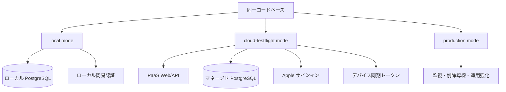
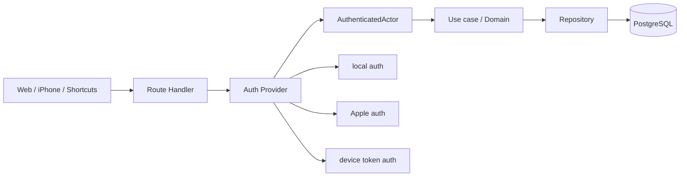

# 設計 — クラウド認証境界設計

## 実装アプローチ

最初の実装単位は、PaaS デプロイや iPhone 送信実装ではなく、実行モードと認証境界を先に設計する。

採用する方式:

- `local mode` / `cloud-testflight mode` / `production mode` を同一コードベースの実行モードとして扱う。
- 認証方式ごとの違いは provider / adapter に閉じ込める。
- Route Handler 以降は、認証済みの内部モデル `AuthenticatedActor` 相当を受け取る。
- local auth は `user_local` を返す開発用 provider として扱う。
- Apple auth は Web / iPhone ログイン用のユーザー認証 provider として扱う。
- device token auth は iPhone 同期 API 用のデバイス認証 provider として扱う。
- iPhone 同期 API は、リクエスト body の `userId` を信じず、デバイス同期トークンから `user_id` を解決する。
- repository / query は必ず解決済み `user_id` を条件に含める。

退けた代替案:

- 先に PaaS へデプロイする案: 認証・テナント分離が後追いになり、クラウド上で機微データを扱う準備として弱い。
- ローカル版とクラウド版を別構成にする案: 手元では動くがクラウドで壊れる差分が増える。
- ローカル版を廃止する案: 既存 MVP 資産と開発速度を失う。
- iPhone API で `user_id` を直接送らせる案: クライアント入力を信じる形になり、テナント越え事故の原因になる。

## 変更するコンポーネント

| 設計要素 | 変更内容 | 対応する受け入れ条件 |
|---|---|---|
| D-1 実行モード定義 | `local` / `cloud-testflight` / `production` の共通部分と差分を定義する | AC-1, AC-9 |
| D-2 内部認証モデル | Route Handler 以降で使う `AuthenticatedActor` 相当の型・責務を定義する | AC-2 |
| D-3 認証 provider 境界 | local auth / Apple auth / device token auth の入力・出力・失敗時の扱いを定義する | AC-3, AC-8 |
| D-4 既存同期トークン整理 | `USAGE_SYNC_TOKEN` を local mode 用に残し、クラウド版はデバイス同期トークンへ移行する | AC-4 |
| D-5 iPhone 同期認証 | 同期トークンから `user_id` と device を解決し、body のユーザー指定を信じない | AC-5, AC-8 |
| D-6 テナント分離境界 | API / repository が認証済み `user_id` で必ず絞り込む責務を定義する | AC-6 |
| D-7 データ保存境界 | 保存する中核データと保存しない詳細ログ・資格情報・生データを明記する | AC-7 |
| D-8 後続作業順 | Web/API/DB/認証を先に固め、iPhone クラウド送信、TestFlight へ進む順番を定義する | AC-9 |
| D-9 永続 docs 更新案 | `architecture.md` / `functional-design.md` / `product-requirements.md` / `glossary.md` への更新候補を整理する | AC-10 |

## データ構造の変更

このステアリングではマイグレーションを実行しない。設計上、後続作業で次のデータ構造が必要になる見込み。

- `users`: Apple サインイン由来の識別子、メール表示可否、退会/削除状態を扱う。
- `devices`: iPhone 端末登録、所有ユーザー、同期トークンのハッシュ、有効/失効状態、最終同期日時を扱う。
- `sessions` または認証基盤側のセッション: Web ログイン状態を扱う。
- 既存テーブル: `user_id` を必ず認証済みユーザーに紐づける。既存 `user_local` は local mode 用の合成ユーザーとして残す。

同期 API の考え方:

- local mode: `USAGE_SYNC_TOKEN` で `user_local` を解決する。
- cloud-testflight mode: device sync token で `device_id` と `user_id` を解決する。
- production mode: cloud-testflight と同じ境界を使い、監視・失効・レート制限・削除導線を強化する。

## 影響範囲の分析

- `docs/` への影響:
  - `docs/architecture.md`: 実行モード、認証 provider、デバイス同期トークン、クラウド小規模検証版の構成を追記する必要がある。
  - `docs/functional-design.md`: iPhone 同期 API の認証境界と `user_id` 解決責務を更新する必要がある。
  - `docs/product-requirements.md`: 小規模検証版の位置づけを必要に応じて補足する。
  - `docs/glossary.md`: 用語は先行して追記済み。
  - `docs/adr/`: ADR 2本を作成済み。
- 既存コード・既存機能への影響:
  - `apps/web/src/app/api/usage/daily/route.ts`: 認証境界の変更対象。
  - `apps/web/src/lib/usage-auth.ts`: local auth provider へ位置づけ直す対象。
  - `apps/web/src/lib/user.ts`: `LOCAL_USER_ID` の扱いを local mode 限定に整理する対象。
  - repository 層: `user_id` 絞り込みの一貫性を確認する対象。
  - iPhone Spike: クラウド送信前に device token 前提へ接続設計を更新する対象。
- 後方互換 / マイグレーションの要否:
  - local mode は残すため、既存ローカル DB はできるだけ維持する。
  - cloud-testflight mode では新規クラウド DB を前提にできるため、既存実データ移行はこの作業では扱わない。
  - 本作業ではマイグレーションは作らず、後続ステアリングで確定する。

## 設計上の前提

- 小規模検証版は TestFlight で 20〜50 人程度に配布する。
- 小規模検証版はフルクラウド化する。
- クラウド基盤は PaaS + マネージド PostgreSQL 方針とする。
- 認証は Apple サインインを本命にする。
- iPhone はネイティブアプリを主経路、Shortcuts は補助/フォールバックとする。
- iPhone から送るのは集計値のみで、詳細ログや全アプリ一覧は送らない。
- クラウドに保存するのは MVP 中核データ、利用集計値、レコメンド結果までとする。
- 外部サービスの ID / PW、Screen Time 詳細ログ、生メール本文、クレカ/銀行明細の生データ、位置情報の生ログは保存しない。
- Apple の配布用 entitlement / TestFlight / クラウド送信は iPhone 配布前の必須ゲートとする。

## 図表

### 実行モード

### 認証境界

