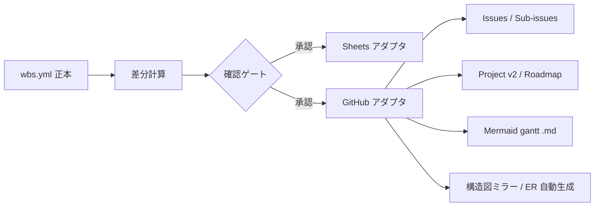

# 設計 — 進捗・計画を非公開 planning リポジトリで管理（GitHub 同期）

## 実装アプローチ

既存 `wbs/` の同期パイプライン（`読み込み(wbs.yml)` → `差分計算` → `確認ゲート` → `冪等反映`）を再利用し、出力先アダプタとして GitHub を追加する。Sheets 用アダプタと同列に「GitHub アダプタ」を置き、共通の差分・確認フローに載せる。

- 出力先: `Shintaro-Abe/SubBuddy-planning`（Private）。
- API: `gh` CLI をラップ。Issues は REST、Projects(v2)・Sub-issues は GraphQL を使う。
- 実行: 新コマンド `/wbs-sync-github`（手動、確認ゲート付き）。既存 `/wbs-sync`（Sheets）は不変で併存。
- 可視化: (a) Project ロードマップ（対話的バー）、(b) `predecessors` から生成する Mermaid `gantt`（静的・依存表示）、(c) アプリ構造図4点のミラー。

代替案を退けた理由:
- パブリック repo に Issue 化 → 進捗が公開され要件違反。
- Project 下書き項目のみ → Sub-issue 不可・構造図の非公開置き場が別途必要。
- GitHub Actions 自動化 → main がパブリックでログ露出・秘密管理リスク、確認ゲートと相性が悪い。

## 変更するコンポーネント

| コンポーネント / ファイル | 変更内容 | 対応する受け入れ条件 |
|---|---|---|
| `wbs/wbs.config.yml` | `github:` セクション追加（repo・projectNumber・フィールド対応・onMissing） | AC-3, AC-4, AC-6 |
| `wbs/lib/github/issues.ts`（新規） | Issue の作成/更新（本文マーカーで冪等）、Sub-issue 親子付け | AC-1, AC-2 |
| `wbs/lib/github/project.ts`（新規） | Project(v2) 項目登録・カスタムフィールド更新（GraphQL） | AC-3, AC-4 |
| `wbs/lib/github/gantt.ts`（新規） | `predecessors` から Mermaid `gantt` を生成し `.md` 出力 | AC-9 |
| `wbs/lib/github/diagrams.ts`（新規） | 構造図4点のミラー、ER は `schema.prisma` から自動生成 | AC-10 |
| `wbs/lib/github/adapter.ts`（新規） | 既存 diff→confirm→apply に接続する GitHub 出力アダプタ | AC-5, AC-6 |
| `wbs/scripts/setup-github.ts`（新規） | planning repo 作成、Project(v2) 作成、`projectNumber` 設定更新 | AC-3, AC-4, AC-11 |
| `wbs/scripts/sync-github.ts`（新規） | エントリポイント（確認ゲート→反映）。`/wbs-sync-github` | AC-5 |
| `wbs/lib/diff.ts` | GitHub 差分の表示に対応（既存を尊重して拡張） | AC-5 |
| `docs/adr/0003-progress-in-private-planning-repo.md`（新規） | 本方針の ADR | — |
| `docs/glossary.md` | 用語「計画リポジトリ」「片方向整流」を追記 | — |

## データ構造の変更

- `wbs.yml`: 変更なし（既存フィールド `plannedStart/plannedEnd/status/phase/progress/assignee/predecessors` を流用）。
- `wbs.config.yml`: `github:` セクションを追加。

```yaml
github:
  repo: "Shintaro-Abe/SubBuddy-planning"   # 非秘密
  projectNumber: 0                           # 作成後に採番して記入
  key: id                                    # 冪等キー（Issue 本文マーカー）
  fields:                                     # wbs.yml → Project フィールド
    status:       "Status"
    phase:        "Phase"
    progress:     "Progress"
    plannedStart: "Start"
    plannedEnd:   "Target"
    assignee:     "Assignee"
  gantt:
    out: "roadmap/gantt.md"                  # Mermaid gantt 出力先（planning repo 内）
  diagrams:
    out: "architecture/"                     # 構造図ミラー先
    er:  "prisma"                            # ER は schema.prisma から自動生成
  onMissing: keep                            # yml から消えた Issue の扱い
```

- Issue 本文フォーマット: 末尾に `<!-- wbs-id: X.Y -->` を必ず付与し、突き合わせキーにする。

## 影響範囲の分析

- `docs/` への影響: ADR-0003 追加、`glossary.md` に用語追記（基本設計そのものは不変）。
- 既存コード・既存機能への影響: `/wbs-sync`（Sheets）は不変。`wbs/lib/diff.ts` は後方互換で拡張。
- 後方互換 / マイグレーション: `wbs.config.yml` に `github:` が無ければ GitHub 同期はスキップ（既存動作を維持）。

## 設計上の前提

- 前提1: planning repo は Private。露出を嫌うのは進捗・図解の公開。
- 前提2: ロードマップのバーは予定日（`plannedStart/plannedEnd`）で描画。実績は補助フィールド保持。
- 前提3: 構造図の正本は公開 `docs/*.md` の Mermaid。公開 docs は残し、planning repo にミラー。
- 前提4: `gh` CLI に `project` スコープを付与済み（`gh auth refresh -s project,read:project`）。
- 前提5: PII・秘密は repo に非混入。planning repo は開発メタ情報と構造図のみ。

## 図表

同期フロー（正本 → 各出力先）:


