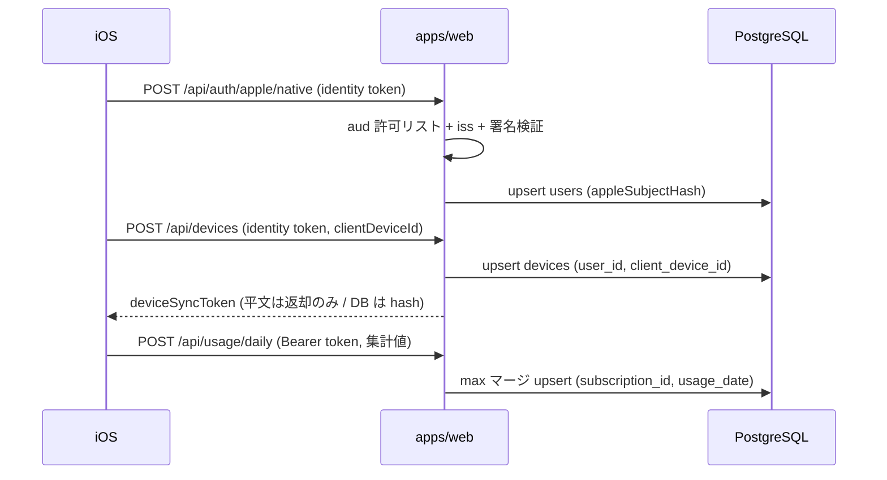

# 設計 — TestFlight 向けサーバー側整備（iOS 接続前）

> 後追い作成（2026-07-07 実施分の記録）。

## 実装アプローチ

既存の `apps/web`（Next.js App Router / Prisma / PostgreSQL）に対し、確定済み ADR に沿った最小差分で実装した。UI・iOS には踏み込まず、API・ドメイン・リポジトリ・スキーマ層に限定。

- 利用量マージ：Prisma の `upsert` は既存行の値を参照できないため、`findUnique`（既存取得）→ 純関数 `mergeUsageDaily` で合成 → `upsert` の順にした。競合の完全な原子性より、TestFlight 規模での正しさと可読性を優先（必要時に raw SQL の `GREATEST` へ移行可能）。
- aud 許可リスト：`verifyAppleIdentityToken` に `allowedClientIds` を導入。env `APPLE_ALLOWED_CLIENT_IDS`（カンマ区切り）を第一に、無ければ従来 `APPLE_CLIENT_ID` を fallback にして後方互換を維持。
- デバイス冪等：`devices.client_device_id`（iOS 生成 UUID）を追加し `(user_id, client_device_id)` を一意に。`clientDeviceId` があれば upsert、無ければ従来 create（後方互換）。
- アカウント削除：`deleteAppleUserAccount` で `appleSubjectHash` 一致 user を `deleteMany`。関連テーブルは既存の `onDelete: Cascade` に委譲。
- ビルド修正：`next/font/google` はビルド時に Google Fonts へ外部アクセスし、制限環境で失敗するため除去。2026-07-07 追補として、世界観維持のため `globals.css` のブラウザ実行時 `@import` で Google Fonts を読み込み、失敗時だけ system fallback に落とす方式へ変更。

## 変更するコンポーネント

| コンポーネント / ファイル | 変更内容 | 対応AC |
|---|---|---|
| `src/lib/usage-bucket.ts` | `usageBucketRank` 追加 | AC-1 |
| `src/repositories/usage.ts` | `mergeUsageDaily` 追加・upsert を max マージ化 | AC-1, AC-10 |
| `src/lib/apple-auth.ts` | `allowedClientIds` / `APPLE_ALLOWED_CLIENT_IDS` 対応 | AC-2 |
| `src/app/api/auth/apple/native/route.ts` | iOS 用検証エンドポイント新設 | AC-3 |
| `prisma/schema.prisma` | `Device.clientDeviceId` ＋ `@@unique([userId, clientDeviceId])` | AC-4, AC-7 |
| `prisma/migrations/20260707093000_add_client_device_id/` | 上記マイグレーション | AC-4, AC-7 |
| `src/schemas/auth.ts` | `clientDeviceId`（uuid 任意）・`accountDeletionSchema` | AC-4, AC-5 |
| `src/services/auth.ts` | `registerDeviceForAppleUser` upsert 化・`deleteAppleUserAccount` 追加 | AC-4, AC-5 |
| `src/app/api/devices/route.ts` | `clientDeviceId` を受けて登録 | AC-4 |
| `src/app/api/account/route.ts` | `DELETE /api/account` 新設 | AC-5 |
| `src/app/api/health/route.ts` | `GET /api/health` 新設 | AC-6 |
| `manuals/render-predeploy-setup.md` / `.html` | env 是正・health 手順追加・HTML 再生成 | AC-8 |
| `scripts/verify-cloud-apis.mjs` ＋ `package.json` | 実 DB 通し検証（`npm run verify:cloud-apis`） | AC-1,4,5,10 |
| `src/app/layout.tsx` / `src/app/globals.css` | next/font 除去・ブラウザ実行時 Google Fonts 読み込み・fallback | AC-9 |
| `docs/functional-design.md` / `docs/architecture.md` | client_device_id・API 追記 | AC-4, AC-8 |
| `.env.example` | `APPLE_ALLOWED_CLIENT_IDS` 追記 | AC-2, AC-8 |

## データ構造の変更

- `devices` に `client_device_id TEXT`（nullable）追加、`(user_id, client_device_id)` 一意インデックス追加。
- API 追加：`POST /api/auth/apple/native`、`DELETE /api/account`、`GET /api/health`。`POST /api/devices` に `clientDeviceId?` 追加。
- 破壊的変更なし（新カラムは nullable、既存フローは後方互換）。

## 影響範囲の分析

- `docs/` への影響：`functional-design.md`（devices ER・API 一覧）、`architecture.md`（デバイス同期トークン節）を更新済み。ADR 0004〜0006 は親ステアリングで作成済み。
- 既存コード・機能への影響：`registerDeviceForAppleUser` のシグネチャに `clientDeviceId` 追加（呼び出し側・テストを更新済み）。フォントは `next/font/google` ではなくブラウザ実行時の Google Fonts 読み込みに変わる。
- マイグレーション：新規1件。空 DB / 既存 DB とも additive で安全。

## 設計上の前提

- 前提1：iPhone から送るのは集計値のみ。`client_device_id` は端末内生成の UUID で、Apple の端末識別子や PII は使わない。
- 前提2：Web と iOS は同一 `users`（`sub` ハッシュ）へ集約する（ADR 0004）。
- 前提3：配布は cloud-testflight（フルクラウド送信）。`usage_date` の権威は端末側。
- 前提4：フォントは Render ビルドを外部取得に依存させないことを優先。見た目の再現はブラウザ実行時の Google Fonts 読み込みで行い、厳密なオフライン再現が必要になったら自ホスト化を検討。

## 図表

iOS 接続時の一気通貫（サーバー側の受け口）:

