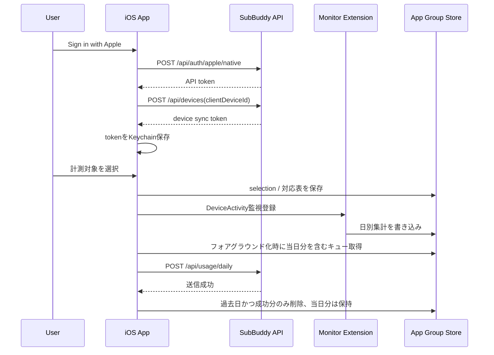

# 設計 — TestFlight iOS 実装

> ステアリング：`20260707-testflight-ios-implementation`
> 作成日：2026-07-07

## 実装アプローチ

`spikes/ios-screen-time/` の成立済み要素を正式版 `apps/ios/` に移植し、TestFlight に必要な認証・デバイス登録・同期・削除導線を足す。

最短経路は、画面を作り込みすぎず次の順に通す。

1. Xcode project / workspace と2ターゲット構成
2. Sign in with Apple
3. デバイス登録と Keychain 保存
4. FamilyControls 認可と Picker
5. DeviceActivity 監視と App Group 集計
6. 本体アプリの `syncAll`
7. アカウント削除とローカル消去
8. codesign / 実機一気通貫 / 7日連続計測開始

## 変更するコンポーネント

| コンポーネント / ファイル | 変更内容 | 対応する受け入れ条件 |
|---|---|---|
| `apps/ios/` | SwiftUI iOS アプリ、Xcode project、2ターゲット構成を追加 | AC-1, AC-2 |
| `apps/ios/SubBuddyApp` | サインイン、ログイン状態、サブスク一覧、計測対象選択、同期状態、アカウント削除 UI | AC-3, AC-5, AC-7, AC-9, AC-10 |
| `apps/ios/SubBuddyMonitorExtension` | DeviceActivityMonitor Extension。イベント受信と App Group 集計書き込み | AC-1, AC-6 |
| iOS Keychain helper | API token、device sync token、`clientDeviceId` を保存 | AC-4, AC-9 |
| App Group storage | 選択状態、対応表、日別集計キューを保存。同期 token は置かない | AC-5, AC-6, AC-7 |
| API client | `/api/auth/apple/native`、`/api/devices`、`/api/usage/daily`、`DELETE /api/account` を呼ぶ | AC-3, AC-4, AC-7, AC-9 |
| entitlement / signing 設定 | Family Controls、App Group、Sign in with Apple、配布プロビジョニングを確認 | AC-2, AC-11 |
| 既存 Web/API | 原則変更なし。疎通で不足が判明した場合のみ別タスク化 | AC-10, AC-12 |

## データ構造の変更

サーバー DB スキーマ変更は原則なし。既存の `users` / `devices` / `ios_usage_daily_summaries` を使う。

iOS 端末内には次のローカル状態を持つ。

| データ | 保存先 | 内容 |
|---|---|---|
| API token | Keychain | Apple サインイン後の API 認証用 token |
| device sync token | Keychain | `/api/usage/daily` 用 token |
| `clientDeviceId` | Keychain | 端末内生成 UUID。`POST /api/devices` の冪等 key |
| 計測対象 selection | App Group | FamilyControls の選択情報。端末ローカル限定 |
| subscription と selection の対応表 | App Group | 1サブスク=1計測対象アプリ |
| 日別集計キュー | App Group | `usage_date`、`subscription_id`、bucket、推定分数レンジ、送信状態 |

`usage_bucket` は既存 API に合わせる。しきい値は `15 / 30 / 60 / 120` 分を使い、日次範囲は iPhone 現地時刻の `0:00-23:59` とする。

## 同期フロー

## 影響範囲の分析

- `docs/` への影響: 基本設計は親ロードマップと `ios-implementation-decisions.md` で反映済み。実装中に差分が出た場合のみ `functional-design.md` / `architecture.md` / `glossary.md` を更新する。
- 既存コード・既存機能への影響: 既存 Web/API は原則変更しない。API 契約の不足が出た場合は、サーバー側ステアリングの追補または本ステアリングの逸脱ログで扱う。
- 後方互換 / マイグレーションの要否: DB migration は不要見込み。local mode の `USAGE_SYNC_TOKEN` 同期は残す。

## 設計上の前提

- Family Controls entitlement は本体・Extension とも承認済み。
- サーバー側 API、DB、Render 手順書、実 DB 通し検証は `../20260707-testflight-backend-readiness/` で完了済み。
- Mac/Xcode での作業が必要。Linux workspace だけでは `apps/ios/` の build / Archive / codesign は完了できない。
- 開発実機で DeviceActivity が動くことを前提に、7日連続計測は一気通貫確認後に開始する。
- 実在の個人データは使わない。確認は合成サブスク、合成ユーザー、開発用端末の集計値に限定する。
