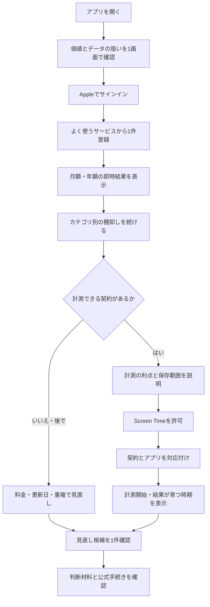
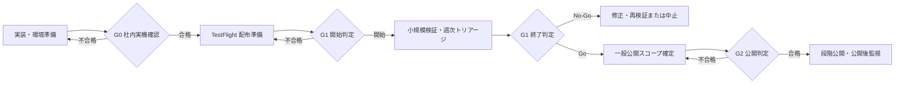

# 設計 - リリースロードマップ再基準化

## 採用する方式

機能の列挙を中心にしたロードマップから、段階別のリリースゲートを中心にした計画へ変更する。進捗率は作業量の印象値ではなく、子タスクの完了と証跡から算出する。コードが存在するだけでは完了とせず、対象環境で受け入れ条件を確認して完了とする。

代替案の「現行TF-1へ不足タスクだけを追加」は採らない。TestFlight と一般公開の要件差、運用準備、撤退判断が引き続き見えなくなるため。

## リリース段階

| ゲート | 目的 | 開始条件 | 完了条件 | 中止・差し戻し条件 |
|---|---|---|---|---|
| G0 社内実機確認 | 1台の実機で計測から表示まで成立させる | 開発用署名、検証用クラウド、合成契約データが利用可能 | サインイン、登録、計測、同期、判定、削除を一気通貫で確認。7日連続計測と復旧確認を完了 | データ越境、欠損・重複、認証迂回、クラッシュ、削除不能 |
| G1 TestFlight 小規模検証 | 20〜50人で価値・信頼・運用可能性を検証する | G0合格、審査・配布情報、プライバシー説明、問い合わせ・障害対応が準備済み | 定義済み期間を運用し、成功指標・重大不具合・問い合わせ・継続可否をレビュー | セキュリティ事故、データ消失、重大障害の未収束、同意と実収集の不一致 |
| G2 一般公開 | 不特定ユーザーへ継続提供する | G1終了レビューでGo。一般公開スコープとSLO（＝サービス目標）を再承認 | App Store公開、監視・サポート・復旧体制が稼働し、公開後レビューを完了 | G1で価値未確認、運用不能、法務・プライバシー未整備、復旧不能 |

## WBSの再編案

`REL` をプロダクトリリースの正本とし、現行 `TF-1` の未完了項目を移管する。完了済みの開発履歴は削除せず「完了済み成果」へ残す。`DOJO`、WBS同期、Codex移行などは「開発運用」レーンに分離し、リリースの親進捗へ含めない。`LOOP` / `FND` / `UI-2` は、ゲートに必要な項目だけ `REL` へ移管し、残りは配信後候補に置く。

### G0 必須タスク群

| 群 | 追加・再定義する完了条件 |
|---|---|
| 環境 | Render/DB/TLS/秘密の実環境疎通、環境変数一覧、期限・ローテーション手順 |
| iOS一気通貫 | Appleサインイン、契約登録、見直し、計測対象選択、日次集計、再送、iOS/Web反映を実機で確認 |
| iOS UI/UX | 開発者向け1画面を、オンボーディング、ホーム、契約、見直し、計測、設定へ再構成。API URL、Subscription ID、Device ID、Build表示を通常画面から除く |
| UI状態 | 初回、読込中、空、成功、権限拒否、通信失敗、同期失敗、再試行、削除確認・完了を定義 |
| データ整合性 | タイムゾーン、日境界、遅延・重複・順不同、オフライン再送、再インストールを確認 |
| アカウント | 削除がUIから実行でき、ユーザー・端末・集計値が消えることを合成データで確認 |
| 回帰 | Web単体、iOS、API契約、マイグレーション、主要E2E、対応OS・端末の確認 |
| 非機能 | 起動・同期時間、クラッシュ、VoiceOver、Dynamic Type、権限拒否・空・通信失敗状態 |
| 視覚検証 | 対応するiPhoneサイズ、ライト/ダーク、文字拡大、日本語長文でスクリーンショット比較。重なり、切れ、操作不能がない |
| 配布適合 | 提出時点の必須Xcode/iOS SDK、全ターゲットの署名・entitlement、Privacy Manifest、利用SDKを検査 |
| 継続計測 | 7日間の開始条件、日次確認、欠測時の扱い、終了判定と証跡 |

### G1 必須タスク群

| 群 | 追加・再定義する完了条件 |
|---|---|
| 配布 | App Store Connectメタデータ、輸出コンプライアンス、年齢区分、TestFlightテスト情報、審査メモ、デモ手順、連絡先、ビルド番号管理 |
| ブランド・アイコン | 正式アイコンのコンセプト、1024px原版、全出力、実機ホーム画面、小サイズ、ライト/ダーク/着色表示、競合との識別性を確認 |
| ストア素材 | 合成データだけを使った主要画面のスクリーンショット、短い説明、キーワード、サポート・プライバシーURLを準備 |
| 信頼 | プライバシーポリシー、利用規約、収集データ一覧、保持期間、削除方法、問い合わせ窓口をアプリ/Web/案内で一致させる |
| テスター運用 | 対象・除外条件、募集数、同意、導入手順、既知問題、報告様式、終了・離脱手順 |
| セキュリティ | 認証認可、テナント分離、レート制限、入力検証、依存脆弱性、ログのPII非混入、secret scanを確認 |
| 運用 | ヘルス・エラー・ジョブ監視、通知先、当番、重大度、初動、ロールバック、メンテナンス告知 |
| データ保護 | 自動バックアップ、保持、復元訓練、DBマイグレーションの前進・後退手順 |
| 計測 | イベント辞書、同意との一致、欠損・二重送信検査、成功指標・中止基準、集計手順 |
| 判定会 | 配信開始判定、週次トリアージ、終了判定、G2 Go/No-Goと残課題の記録 |

### G2 必須タスク群

| 群 | 追加・再定義する完了条件 |
|---|---|
| スコープ | G1の利用・離脱・誤判定・問い合わせデータから一般公開の必須機能を確定 |
| 信頼・法務 | TestFlightから提供する出力・削除をproduction運用へ引き継ぎ、保持、プライバシー表示、規約、サポート範囲を確定 |
| 信頼性 | SLO、容量見積もり、負荷試験、障害訓練、バックアップ復元目標、外部サービス障害時の縮退 |
| リリース | 段階公開、停止基準、緊急修正版、ストア文面・画像・サポートURL、公開後24/72時間確認 |
| 継続運用 | カタログ更新責任、料金鮮度、依存更新、脆弱性対応、データ削除要求、問い合わせ期限 |

## iOS UIとブランド資産の設計範囲

### UX評価の結論

現行仕様のままでは使いやすくない。理由は次のとおり。

1. Webで契約を登録し、iPhoneで計測対象を対応付け、結果確認でWebへ戻る必要があるが、この往復が画面遷移として定義されていない。
2. iOSが内部IDとサーバー設定を利用者へ要求する。ドメイン知識のない利用者は開始できない。
3. Screen Time権限を求める時点と理由が弱い。価値を理解する前の権限要求は拒否と離脱を招く。
4. 「登録完了」「計測開始」「同期成功」「判定可能」の違いが利用者の言葉で示されない。
5. ダッシュボード、支出、レコメンド、更新間近が並列で、最初に何をすべきかが分散している。
6. エラー後の復帰、途中離脱後の再開、計測できないサブスクの扱いが主要導線に含まれていない。

### プラットフォーム方針

- **iPhoneを主製品とする。** TestFlight版から、契約登録、一覧、支出確認、見直し結果、計測設定、アカウント削除をiPhone単体で完結させる。
- WebはiPhone固有機能を除く主要なクラウド機能を使える正式クライアントとする。Macの広い画面で比較・編集したい人も利用できる一方、Webを開かない利用者もiPhoneだけで中心価値を得られるようにする。判断理由は [adr/0003-web-is-a-full-client-for-cloud-features.md](./adr/0003-web-is-a-full-client-for-cloud-features.md) に記録する。
- iOSとWebは同じAppleアカウントとデータを共有する。どの情報がクラウドへ保存され、計測対象アプリの選択情報は端末内だけに残るかを平易に説明する。
- Webでは契約の一覧・登録・編集・削除、支出・月次推移、見直し一覧・詳細、更新日前確認、iCloud+容量管理、データ出力・完全退会、端末・セッション管理、問い合わせを提供する。
- Screen Time権限、計測対象アプリの選択、主計測iPhoneの端末内処理、Face IDアプリロックはiPhone専用とする。
- iOSの内部処理だけを先に通す検証ビルドと、利用者へ配るTestFlightビルドを分ける。開発者向けUIのまま外部テスターへ配らない。

この判断により、現行の「iOSはセンサー、Webが本体」という実装都合を製品仕様にしない。TestFlightで検証すべきなのは同期技術だけでなく、iPhoneで棚卸しと見直しを完了できるかである。

### 最初の価値までの一本道

- 最初から全件登録を要求しない。1件登録直後に月額・年額を示し、小さな価値を返してから棚卸しを続ける。
- 棚卸しは空のフォームを繰り返させず、「動画」「音楽」「クラウド」「仕事」「学習」等のカテゴリを順に確認する。該当なしを1タップで飛ばせるようにする。
- 金額・更新日が分からない場合は後回しにできる。必須入力を最小化し、未入力項目を後で埋める一覧を出す。
- 権限要求は、能動利用型の契約を1件登録し、計測の意味を説明した直後に行う。
- 計測を許可しなくても、料金・更新日・重複・安いプラン等の見直しを利用できる。拒否を行き止まりにしない。
- 各段階を「契約を登録」「計測を設定」「データをためる」「見直す」の4状態で表示し、内部用語を出さない。
- 中断時は完了地点を保存し、次回起動時の主CTAを「続きから」にする。

### 中心となる利用者の成果

SubBuddyのUIは、次の順で成果を出す。

1. **把握する:** 契約と年間支出の全体像が分かる。
2. **気づく:** 更新間近、重複、使っていない可能性など、見るべき契約が絞られる。
3. **納得する:** 事実、データの鮮度、判定理由、判断できない点が分かる。
4. **決める:** 継続、プラン変更、解約などをユーザー自身が判断できる。
5. **振り返る:** 更新予定と新しい見直し材料を後から確認できる。

「アプリを長く触る」ことを成功にしない。短時間で判断を終え、必要な時だけ戻れることを良い体験とする。

TestFlightの中心価値は、ユーザーが支出を把握し、優先して確認すべき契約とその根拠を理解して、自分で見直し判断を進められることである。SubBuddyは継続・解約を最終判断せず、Screen Time計測、Web同期、レコメンドは中心価値を支える補助手段として扱う。判断理由は [adr/0001-testflight-validates-review-support.md](./adr/0001-testflight-validates-review-support.md) に記録する。

利用者向けレコメンドは「継続・様子見・解約」ではなく、「今確認したい」「更新前に確認したい」「情報が不足している」「現時点では急いで確認する材料が少ない」の4区分で示す。最後の区分も継続推奨を意味しない。詳細には事実、対象期間、根拠、分からないこと、誤判定の可能性、選択肢を表示する。判断理由は [adr/0004-recommendations-show-review-priority.md](./adr/0004-recommendations-show-review-priority.md) に記録する。

次を重大な見直し情報エラーとし、一般公開移行判定時に未解決0件を必須とする。

1. 別ユーザーの契約情報を根拠または結果に使う。
2. ユーザーが登録した金額・更新日と異なる事実を表示する。
3. 鮮度切れの料金・プラン情報を最新情報として表示する。
4. 利用実績がゼロという情報だけで確認優先度を上げる。
5. 必要な情報が不足しているのに、十分な根拠があるように表示する。
6. 非公式または別サービスの解約・プラン変更ページへ案内する。
7. 解約、下位プラン、代替サービスの節約額と計算条件を取り違える。
8. 「現時点では急いで確認する材料が少ない」を継続推奨として表示する。

重大な見直し情報エラーを検出した場合は、影響する見直し表示を停止し、影響範囲を確認する。原因修正と対象シナリオの再検証が終わるまで一般公開へ進まない。別ユーザー情報の表示はセキュリティ事故としてTestFlight自体を即時停止する。

### TestFlightアンケートの非干渉原則

- アンケートは任意とし、回答を利用継続、見直し結果の閲覧、同期の条件にしない。
- 編集画面、保存処理中、同期中、項目単位の競合解決中、エラー復旧中には表示しない。
- 突然のモーダルや強制画面遷移を使わない。初回は、見直し詳細を確認したユーザーがホームへ戻った後に限り、ホーム画面内の閉じられる案内として表示する。詳細を開いただけの時、詳細表示中、別画面へ移動した時には表示しない。
- 「今は回答しない」を用意し、設定またはホームから後で回答できる。閉じた直後に繰り返し表示しない。
- アンケートの表示、回答、スキップ、送信失敗は、入力中のフォーム、下書き、未同期変更、スクロール位置に影響させない。回答送信は主要データの保存・同期と別処理にする。
- オフライン時は回答を端末内に保留できるが、回答送信のために契約名、金額、利用量、見直し内容を添付しない。送信失敗は操作を妨げず、後で再送または破棄できる。
- アプリの強制終了、通信切断、バックグラウンド移行をアンケート表示中に発生させ、契約編集と未同期変更が失われないことをテストする。

### TestFlightの評価母数

- 有効参加者は、18歳以上、日本国内利用、有料サブスク1件以上、自分の契約情報を登録して試せるという募集条件を満たし、参加同意と初回サインインを完了した人とする。
- 契約登録、年間支出確認、見直し詳細閲覧、アンケート回答まで進めなかった人も有効参加者から除外しない。各段階の離脱として記録する。
- 招待しただけでインストールまたは初回サインインをしなかった人は価値達成率の母数に含めず、招待から参加までの転換率として別に記録する。
- 募集条件を満たさないことが参加後に判明した人、同意を撤回した人、技術障害で一度もサービスを利用できなかった人は、除外理由と人数を残して価値達成率から除外する。技術障害は品質評価から除外しない。
- 募集目標は30人、上限は50人とする。有効参加者が20人以上になった時だけ成功・修正・中止を判定する。
- 有効参加者が20人未満の場合は価値がないと結論づけず、判定材料不足として募集または検証期間を延長する。

### TestFlightの検証期間

- 募集・参加開始期間を2週間、各参加者の評価期間を初回サインインから14日間、全体の基本期間を4週間とする。
- 中心価値への到達は初回サインインから7日以内で評価し、14日目に再利用、未回答、段階別離脱の理由を確認する。
- 4週間終了時に有効参加者が20人未満の場合だけ、募集または検証期間を最大2週間延長できる。延長理由と変更しない評価基準を記録する。
- セキュリティ事故、他ユーザーへのデータ越境、復元不能なデータ消失が起きた場合は、人数と期間を待たず新規参加と検証を停止する。

### 一般公開移行基準

| 判定項目 | 基準 | 未達時の扱い |
|---|---:|---|
| 中心価値への到達 | 有効参加者の70%以上が7日以内に年間支出を確認し、見直し詳細を1件以上開く | 導線、表示内容、機能不具合を修正して該当部分を再検証 |
| 任意アンケート回答 | 有効参加者の60%以上 | 表示時期、非干渉性、質問文を見直して再検証。未回答を価値なしと断定しない |
| 価値実感 | 回答者の70%以上が、少なくとも1件の次の行動を自分で決められたと回答 | 根拠、分からない点、選択肢の提示を見直して再検証 |
| 安全性 | 他ユーザーへのデータ越境、復元不能なデータ消失、完全退会不能が0件 | 新規参加と検証を停止し、修復・影響確認後に再開判定 |

- 3つの価値指標を満たし、重大事故が0件の場合は、同じ製品方針で一般公開準備へ進める。
- 価値指標の一部が未達でも開発とTestFlight更新は継続できるが、原因を修正せず同じ仕様のまま一般公開へ進まない。
- 修正後も中心価値を確認できない場合、または見直し情報が継続的に誤解・不利益を生む場合は、中心価値または製品設計を再検討する。
- これらの数値はAppleへ提出する審査基準ではない。App Store Connectには、実際に収集する操作イベントと任意アンケート情報の種類・利用目的を申告する。

### 問い合わせ診断情報

- 診断情報は自動送信しない。問い合わせ画面でユーザーが「診断情報を添付」を選び、送信前に内容を確認した場合だけ送信する。
- 診断情報には、アプリとOSのバージョン、一般的な端末種別、発生日時、エラーコード、通信要求の照合用ID、同期の成功・失敗件数、最終同期日時、画面名、権限状態だけを含める。
- 契約名、金額、更新日、利用量、見直し結果、Apple識別子、メールアドレス、認証トークン、端末内選択トークン、スクリーンショットを含めない。
- 診断情報の添付を拒否しても問い合わせを送信できる。問い合わせ対応の終了後30日以内に、問い合わせ本文と添付診断情報を削除する。
- 照合用IDから通常の運営画面で契約・支出・利用量をたどれないようにし、サーバーログにもそれらを記録しない。

### 1人運営の対応体制

- 管理者1人で24時間有人対応は行わず、日本時間の平日10時から18時を通常対応時間とする。
- TestFlightでは、通常問い合わせは3営業日以内、利用不能・同期障害は1営業日以内、データ越境・復元不能なデータ消失・認証迂回は24時間以内の状況確認を内部目標とする。
- 夜間・休日の人的即応を約束しない。重大事故を自動検知した場合は、影響する機能またはサービスを安全側へ停止し、管理者へ通知する。
- 管理者が対応不能になる予定期間は新規登録とTestFlight募集を停止する。既存利用者には期間、影響、問い合わせ受付状況を事前表示する。
- TestFlight開始前に重大度、停止対象、通知先、復旧、テスター連絡、管理者不在時の手順を決めて訓練する。
- 上記時間はTestFlightの内部目標とし、実績確認前に利用者向けの保証として掲示しない。一般公開時の回答目安とサポート範囲はTestFlightの対応実績を基に確定する。

### TestFlightの費用・不正利用制御

- TestFlight期間のクラウド費用上限を月10,000円とする。Render、DB、バックアップ、監視、通知等の継続的なクラウド費用を合算し、Apple Developer Program等の年額固定費は分けて管理する。
- 月上限の50%到達で管理者へ通知し、80%到達で増加原因を確認して新規テスター追加を停止する。
- 100%到達では見直し再計算等の重い処理と新規登録を一時停止する。既存ユーザーの契約・支出の閲覧、データ出力、完全退会、重要な安全通知は維持する。
- 認証、契約変更、利用量同期、見直し再計算、データ出力へ用途別の利用回数制限と重複実行防止を設ける。制限値は設定として外出しし、通常利用を誤って遮断しない負荷試験を行う。
- 費用調査では契約名、金額、利用量、見直し内容を閲覧せず、要求数、処理時間、応答サイズ、エラーコード、仮名IDの偏りだけを使う。
- 一般公開の費用予算と停止条件は、TestFlightの1人当たり実績、想定利用者数、Renderプランから一般公開移行判定時に再承認する。

### アカウント上限

| 対象 | 上限 |
|---|---:|
| 契約 | 解約済みを含め200件 |
| 登録iPhone | 5台 |
| 主計測iPhone | 1台 |
| Webの有効セッション | 10件 |

- 上限到達時は新しい契約、端末、セッションの追加だけを止め、既存データの閲覧、編集、削除、データ出力、完全退会を維持する。
- ユーザーは古い端末・セッションを確認して個別解除できる。上限超過を理由に既存端末を自動解除しない。
- 契約上限は200件の性能試験条件と一致させる。解約済み契約を削除しなくても通常利用できる余裕を確保する。
- 上限値はサーバーで検証し、iPhoneとWebで同じ値と理由を表示する。管理者が個別ユーザーの機微データを見て手動解除する運用にしない。

### バックアップ復旧目標

- TestFlightでは、障害時に失う可能性があるクラウド確定データを最大24時間分、障害発生からサービス再開までを24時間以内の内部目標とする。
- 一般公開では、許容データ損失を最大1時間分、復旧目標時間を8時間以内とする。Renderのプラン、バックアップ、時点復旧機能と費用で実現可能かを一般公開スコープ確定時に確認する。
- iPhoneの未同期変更はクラウド障害中も暗号化して保持し、復旧作業のために破棄しない。復旧後は通常の競合解決を経て同期する。
- TestFlight開始前に合成データを別環境へ復元する訓練を1回行う。一般公開後は月1回、バックアップから復元可能かを確認する。
- 全体復旧では削除記録を再適用し、削除済みアカウントと関連データが復活しないことを確認する。
- Renderで一般公開目標を満たせない場合は、目標を黙って緩和せず、費用、利用者影響、基盤変更を一般公開前に再判断する。

### 通知方針

初回版の通知は次の5種類だけとし、判断記録、再確認、見直し候補、節約訴求、利用促進、アンケート催促等の通知を追加しない。

| 通知 | 初期状態 | 停止 |
|---|---|---|
| 更新日の事前通知 | オフ | 可能 |
| 同期失敗の通知 | オフ | 可能 |
| 新しい端末・ブラウザでのサインイン | オン | プッシュだけ停止可能。アプリ内履歴は残す |
| アカウント削除予定 | オン | 重要連絡のため停止不可 |
| セキュリティ事故・長期障害 | オン | 重要連絡のため停止不可 |

- OS側でプッシュ通知が拒否されている場合は強制送信できない。新規サインインはアプリ内履歴、削除予定と重大障害はアプリ内表示と登録済み通知先メールで補う。
- ロック画面とメール件名には契約名、金額、更新日、利用量、見直し内容を表示しない。
- 競合、権限状態、情報不足、料金鮮度、移行・出力結果は、初回版では該当画面内の状態表示とし、通知を追加しない。

### 料金・プラン情報の鮮度

- ユーザーが登録した契約金額を本人の事実として扱い、サービスカタログの更新で自動上書きしない。
- カタログの料金、プラン、代替サービス、公式解約・変更導線は、公式情報を確認した日から90日間だけ確認済みとして扱う。情報源URLと最終確認日を保存する。
- 90日を超えた情報には「情報が古い可能性があります」と表示し、節約額と確認優先度の根拠に使わない。古い金額を最新として表示しない。
- 公式情報を再確認できないサービスは、プラン比較、代替案、節約額を隠し、ユーザー自身が登録した契約情報と情報不足だけを表示する。
- カタログ更新は契約データと分離し、更新失敗によって契約閲覧・編集を止めない。

### Web対応ブラウザ

- macOSとiOS上のSafari、Chromeについて、提出・公開時点の最新と1つ前のメジャーバージョンを正式対応とする。
- EdgeとFirefoxは最新版を動作確認対象とし、Appleサインイン、契約閲覧・編集、データ出力、完全退会を妨げる重大な問題は修正する。ただし初回一般公開では過去版まで完全保証しない。
- 画面幅360px以上、JavaScriptとCookieが有効な環境を前提とする。360pxで横にはみ出して主要操作が隠れないことを確認する。
- 対応外または必要機能が無効な環境では、処理途中で失敗させず、対応ブラウザ、JavaScript、Cookieの必要条件を表示する。完全退会と問い合わせの代替導線を残す。

### 性能合格基準

- iPhoneは起動後、暗号化キャッシュのホームを2秒以内に表示し、タップ後100ミリ秒以内に押下・読込等の反応を示す。同期中も契約閲覧と編集中入力を止めない。
- Webは実利用計測の75%以上で主要内容を2.5秒以内、操作への反応を200ミリ秒以内とし、意図しないレイアウト移動を主要導線で発生させない。
- APIは実環境計測の95%以上で読み取りを1秒以内、契約登録・編集を2秒以内に応答する。見直し再計算など長時間処理は受付状態を先に返し、画面操作を待たせない。
- iPhoneとWebは200件の契約を持つ合成データで一覧、支出、見直し、検索、編集を確認する。
- 日本からRenderシンガポールへの実通信、最低OS、正式対応ブラウザを含めて測定する。未達時は原因と利用者影響を確認し、一般公開移行判定前に修正または再承認する。

### クラッシュ合格基準

- 外部TestFlight開始前は、サインイン、契約保存、同期、データ出力、完全退会で再現するクラッシュと既知の未修正クラッシュを0件とする。24時間の社内実機確認でもクラッシュ0件を証跡化する。
- TestFlight終了時は、クラッシュしなかった利用セッション99%以上、クラッシュしなかった有効参加者95%以上、データ消失を伴うクラッシュ0件とする。
- 同じ原因のクラッシュが2人以上に発生した場合は、割合を満たしていても修正・再検証する。
- 一般公開後はクラッシュしなかった利用セッション99.5%以上とし、サインイン、保存、同期、出力、完全退会の未解決クラッシュを0件に保つ。
- 少人数のTestFlightでは割合だけで判定せず、原因、影響、再現性、データ整合性を確認する。クラッシュ情報へ契約、支出、利用量、認証情報を含めない。

### TestFlight操作イベント

TestFlightの参加同意で目的、項目、保存期間、削除方法を説明し、次の8項目だけをSubBuddyのDBへ記録する。

1. TestFlight参加を有効化した。
2. 初回サインインを完了した。
3. 契約を1件以上登録した。
4. 年間支出を表示した。
5. 見直し詳細を表示した。
6. 任意アンケートを表示した。
7. 任意アンケートへ回答した。
8. 任意アンケートの回答区分。

- 有効参加者ごとの7日以内到達を測るため、内部ユーザーIDをTestFlight評価専用の仮名IDへ一方向変換して関連付ける。Apple識別子、内部ユーザーID、端末IDをイベントへ直接保存しない。
- 契約名、金額、更新日、契約ID、見直し対象、確認優先度、利用量、入力内容、IPアドレス、端末識別子、広告識別子を含めない。
- 第三者の解析・広告サービスへ送らない。生イベントはTestFlight終了判定から90日以内、アカウント削除時は即時削除し、その後は個人へ戻せない集計人数だけを残す。
- イベント送信失敗は主要操作を失敗させず、契約保存・同期・アンケート回答と別処理にする。

### 通貨範囲

- 初回TestFlightと一般公開で扱う通貨は日本円だけとする。外貨の為替レート取得、自動換算、複数通貨の合算は行わない。
- 金額には、ユーザーが実際に請求される税込みの日本円を入力する。外貨建て契約はカード明細等で確認した日本円請求額を登録できる。
- 日本円請求額が分からない場合は、金額を未入力のまま契約登録・編集・見直しできる。未入力契約は月額・年額合計、単価、節約額から除外し、合計に含まれていないことと不足情報を表示する。
- DBとAPIの通貨コードは将来拡張のため維持できるが、初回版の入力、表示、計算では`JPY`以外を受け付けない。多通貨対応は一般公開後の別ステアリングで扱う。

### 初回一般公開地域

- 初回一般公開のApp Store配信地域は日本だけとし、アプリとWebの表示、利用規約、プライバシー説明、問い合わせ対応を日本語で提供する。
- 通貨は日本円、更新日・通知・サポート時間の基準は日本時間とする。日別利用量の集計日はiPhoneの現地日付を保持し、サーバー処理で別の日へ移さない。
- Webへの海外アクセスをIPアドレスや位置情報で強制遮断しない。日本国外での動作、料金情報、法令適合、問い合わせ時間は保証対象外であることを利用条件へ明記する。
- 多言語、多通貨、海外App Store配信、海外向け法務・サポートは別ステアリングで設計・承認する。

### TestFlight版のUXスコープ

| 優先 | 含めるもの | 理由 |
|---|---|---|
| 必須 | サインイン、契約の登録・編集・削除、月額・年額集計、支出内訳・月次推移、レコメンド一覧・詳細、更新日前レビュー、単価、iCloud+容量管理、任意の計測設定、設定・アカウント削除 | 既存MVP機能を維持し、中心価値をiPhoneだけで検証するため |
| 必須 | 空・読込・通信失敗・権限拒否・同期失敗・データ不足・削除確認 | 実環境で必ず発生し、復帰不能は離脱になるため |
| 必須 | 合成データのデモ状態または審査用デモ手順 | 審査担当とテスターが計測待ちなしで価値を確認するため |
| あれば良い | 検索・絞り込み、棚卸し再開、Webの詳細表示 | 理解と継続を助けるが中心価値を阻害しない範囲 |
| TestFlight後 | 高度なグラフ、節約台帳、共有カード、細かな通知設定、装飾的アニメーション | 検証前に作っても価値判断へ寄与しにくいため |

既存MVP機能は削除しない。iOSへの移植順は中心シナリオで決めるが、外部TestFlight開始時点の搭載範囲は [feature-preservation-audit.md](./feature-preservation-audit.md) の対応表を満たす。

完成済みMVP機能は、外部TestFlight前にすべてiPhoneへ移植する。TestFlight開始時期への影響を受け入れ、機能を減らして配布日を優先しない。ただし一括実装はせず、次の内部マイルストーンで実装・検証する。判断理由は [adr/0002-migrate-all-completed-mvp-features-before-testflight.md](./adr/0002-migrate-all-completed-mvp-features-before-testflight.md) に記録する。

1. Apple認証、契約管理、支出把握
2. 見直し一覧・詳細、更新日前確認
3. レコメンド保存・表示の既存不具合修復
4. Screen Time計測、同期、1利用日あたり単価
5. 月次推移、iCloud+容量管理
6. データ出力、完全退会、問い合わせ
7. 機能対応表の全件監査、実機回帰、安全性ゲート

請求履歴、自動抽出、AI補助、判断記録など、DB・構想だけで利用者向け機能が完成していないものは移植対象に含めない。内部マイルストーンの途中ビルドは、外部TestFlight開始条件を満たしたものとして扱わない。

### 情報設計

利用者の目的を次の3つへ絞る。

| 目的 | 主画面 | 内容 |
|---|---|---|
| 今の状態を知る | ホーム | 年間支出、次に見る1件、更新間近、未完了の棚卸し |
| 契約を整える | 契約 | 一覧、追加、編集、不足情報、計測対応 |
| 判断する | 見直し | レコメンド一覧、事実、根拠、データ鮮度、単価、代替案、節約額、公式導線 |

下部タブは「ホーム」「契約」「見直し」の3つとし、設定はホーム右上の歯車アイコンから開く。「支出の内訳」「レコメンド」「更新間近」を同格の主ナビにせず、上記3目的の中へ統合する。

### 画面仕様

UIサンプル: [ios-main-ui-sample.html](./ios-main-ui-sample.html)
編集可能なワイヤーフレーム: [ios-main-ui-wireframe.drawio](./ios-main-ui-wireframe.drawio)

#### ホーム

- 最上段: 「次に確認すること」。更新間近や未処理の見直しを1件だけ提示する。
- 次段: 月額合計と年額目安。登録件数と最終更新時刻を添える。
- 支出の内訳から、カテゴリ別内訳と月次推移を確認できる。
- 次段: 更新予定、見直し候補、棚卸しの続き。該当しない区画は表示しない。
- 同期正常時は状態を常時主張しない。失敗・長期未同期の場合だけ要対応として出す。

#### 契約

- サービス名、料金、請求周期、次回更新、現在の判断を一覧で比較できる。
- 検索、カテゴリ、更新時期、情報不足で絞り込める。
- 登録はカタログ検索を先にし、サービスと代表プランを選ぶと入力候補を埋める。
- カタログ外でも止めない。名前、金額、周期だけで仮登録できる。
- 詳細で1利用日あたり単価と計測状態を確認できる。
- iCloud+では契約プラン、使用容量、情報の鮮度、安全に下げられる条件を確認できる。

#### 見直し

- 優先順位は強い断定ではなく「更新が近い」「しばらく使っていない」「重複の可能性」等の事実名で示す。
- 詳細は「分かっていること」「分からないこと」「選択肢」の順に表示する。
- 判定根拠には対象期間、最終更新時刻、利用量の取得有無を表示する。
- レコメンドを内容別に一覧・絞り込みでき、1件だけに限定しない。
- 安いプラン、安い代替サービス、年間節約額の目安がある場合は根拠とともに表示する。
- 情報提供を主目的とし、判断記録の3択はTestFlight必須にしない。外部解約ページを開いただけで解約済みとみなさない。

#### 初回棚卸し

- 進捗率で急かさず、「あとで続けられます」と明示する。
- カテゴリごとに候補サービスを少数表示し、検索と「該当なし」を用意する。
- 1件ごとに登録完了画面を挟まず、連続追加できる。
- 3件程度登録した時点で合計を返し、「続ける」「いったん見る」を選べる。

#### 設定・信頼

- 「保存しているデータ」「iPhone内だけのデータ」「クラウドへ送る集計値」を分けて示す。
- Screen Time権限、計測対象、同期、通知、Web利用、問い合わせを管理する。
- アカウント削除は見つけやすくするが、通常操作から十分離し、削除対象と取り消せないことを確認する。

### 表現と操作原則

- ホームの最上位は金額だけでなく「次に何をすればよいか」とする。
- 「強い解約候補」のような結論を先に押し付けず、事実、理由、選択肢の順に示す。
- 1画面の主操作は原則1つにする。破壊的操作は確認と影響範囲を示す。
- 同期状態は常時大きく見せず、正常時は控えめ、要対応時だけホームに出す。
- 技術語の `DeviceActivity`、token、subscriptionId、bucket、sourceは利用者画面に出さない。
- 空状態は説明だけで終わらず、その場で実行できる主操作を1つ置く。
- エラー文は「何が起きたか」「データへの影響」「次にできること」を示す。
- 金額、日付、利用量には集計期間・更新時刻・目安か確定値かを表示する。
- 判定精度を装わない。データ不足時は「判断できません」ではなく、不足情報と追加すれば分かることを示す。
- 通知は更新日や本人が保留した判断など、行動可能なものだけに限定する。利用を促すためだけの通知を送らない。

### ユーザビリティ受け入れ基準

- 初見のテスターが口頭補助なしで、サインイン、契約1件登録、必要なら計測設定まで完了できる。
- API URL、内部ID、技術用語の入力や理解を要求しない。
- Screen Timeを拒否しても契約登録と見直しへ進める。
- 主要シナリオでWebやMacを要求しない。任意でWebへ移る場合も、目的と戻り方が分かり、契約ID転記を要求しない。
- 途中終了後に、次回起動から直前の未完了作業を再開できる。
- 削除、同期失敗、権限拒否、対象なしの各状態から行き止まりなく回復できる。
- 代表的な3シナリオを5人以上の合成データテストで確認し、重大な迷い・完了不能をG1開始前にゼロにする。
- 初回契約1件の登録と即時結果までの中央値を3分以内、5件の棚卸しを10分以内、計測対応付けを2分以内の目安とする。未達時は利用者の操作ではなく設計を見直す。
- テスト終了後の単一質問「次に何をすればよいか分かった」に5段階中4以上で全員が回答できることを目安とする。

テストする3シナリオ:

1. 計測対象外の年額契約をiPhoneで登録し、更新日と料金だけで最初の見直し結果を見る。
2. iPhoneアプリ型の月額契約をiPhoneで登録し、権限許可、計測対象の対応付け、同期状態の確認まで進む。
3. 権限拒否または通信失敗から復帰し、保存データを確認してアカウント削除まで完了する。

観察では氏名・メールアドレス等を記録せず、合成アカウントと合成契約だけを使う。記録するのは完了可否、所要時間、迷った箇所、誤操作、発話を匿名化した要点に限定する。

### 利用者向け画面

| 画面 | 主目的 | 必須状態・操作 |
|---|---|---|
| オンボーディング | 価値と保存範囲を理解して開始 | Appleサインイン、プライバシー表示、途中再開 |
| 棚卸し | 契約を負担なく洗い出す | カテゴリ候補、検索、連続追加、該当なし、後回し |
| ホーム | 状態と次の行動を短時間で把握 | 年額目安、次に見る1件、更新間近、棚卸し再開、要対応 |
| 契約 | 契約情報を登録・整理する | 一覧、検索、追加、編集、不足情報、計測設定 |
| 見直し | 根拠と選択肢を理解する | レコメンド一覧、事実、未知、鮮度、単価、代替案、節約額、外部手続き |
| 計測 | 契約とiPhoneアプリを対応付ける | 権限説明、許可・拒否、選択、変更・停止、同期失敗からの復帰 |
| 設定 | アカウント、データ、権限を管理する | 保存データ説明、任意のWeb導線、問い合わせ、サインアウト、アカウント削除 |

API URLはビルド設定とする。サブスクIDはiOSがAPI応答から内部的に扱い、Device IDとBuild情報は診断情報へ移す。通常利用者へ内部IDや開発設定を入力させない。

### デザインシステム

- `.steering/20260618-web-ui-implementation`で確定したWeb版をブランドの正本とする。背景の暖色オフホワイト`#f6f4ee`、文字の墨`#26231f`、主アクセントのセージ`#475347`、意味のある状態に限った琥珀・テラコッタ・赤・グレーをiPhone用トークンへ対応付ける。
- WebのShippori Mincho、Zen Kaku Gothic New、BIZ UDPGothicという書体の役割をiPhoneでも維持する。導入前に配布ライセンス、アプリ容量、日本語表示、Dynamic Type時の可読性を確認する。読みやすさや最大文字サイズで問題がある箇所は、意味階層を保ったままiOSシステムフォントへ切り替える。
- Webの静謐なエディトリアルという信頼トーン、余白、情報の強弱、中立的な表現を共有する。ただしCSS部品やデスクトップのサイドバーを模倣せず、iOSではSwiftUI標準のナビゲーション、フォーム、確認ダイアログ、Dynamic Typeを優先する。判断理由は [adr/0007-web-design-is-the-brand-source.md](./adr/0007-web-design-is-the-brand-source.md) に記録する。
- 初回TestFlightと一般公開の最低OSはiOS 17.4とし、iPhone専用・縦向きで提供する。iPad専用レイアウトと横向きは初回一般公開の対象外とする。
- iPhone SE第2世代または第3世代相当の小画面と標準サイズのiPhoneを実機必須とし、両方でScreen Time権限、計測、同期を含む一気通貫を確認する。
- 大画面のPro Max相当はシミュレーター必須、利用可能なら実機でも確認する。提出時点の最新iOSで主要回帰を行い、最低OSだけで確認を終えない。
- 色、文字、余白、角丸、状態色、アイコン利用をトークン化する。色だけで状態を伝えない。
- SF Symbolsを基本操作へ使い、独自記号はブランド資産に限定する。

### アクセシビリティ合格基準

- iPhoneはVoiceOverだけでサインイン、契約登録・編集、支出確認、見直し詳細、計測設定、データ出力、完全退会を完了できるようにする。読み上げ順、アイコンボタン名、エラー、同期状態、削除確認を確認する。
- 最大のDynamic Typeアクセシビリティサイズでも文字切れ、重なり、操作不能を発生させない。必要に応じて横並びを縦積みに変え、省略表示だけで情報を失わせない。
- iPhoneの操作領域は最低44×44ポイントとし、色だけで状態を伝えず、「視差効果を減らす」が有効な場合は不要なアニメーションを止める。
- Webはキーボードだけで主要操作を完了でき、可視フォーカス、見出し、入力ラベル、エラーとの関連を維持する。200%拡大で主要操作に不要な横スクロールや操作不能を発生させない。
- Webの通常文字は背景とのコントラスト比4.5:1以上を満たし、状態、優先度、エラーを色だけで区別しない。
- 自動検査だけで合格とせず、iPhone実機のVoiceOverとWebブラウザのキーボード・拡大表示で主要導線の手動証跡を残す。

### アプリアイコンと提出素材

- 現在の `generate-app-icons.mjs` はArchive成立用の仮画像生成であり、正式アイコンの正本にはしない。
- 正式アイコンは「契約の見直し」「信頼」「落ち着き」を表し、文字・細線・透明領域・写真を避ける。既存サービスのロゴに似せない。
- 1024x1024の正本からAsset Catalogへ反映し、角丸マスクは画像へ焼き込まない。
- 仮アイコンは社内実機確認までに限定する。Web版と統一した正式アイコンを外部TestFlight提出前に完成させ、実機ホーム画面、設定、通知等の小サイズで確認する。
- 一般公開申請前にApp Storeスクリーンショット、掲載文、キーワード、サポート・プライバシー用画像、ブランド使用ルールを完成させ、対象端末仕様で書き出す。
- アイコンとストア画像の制作は専用のデザイン子ステアリングで行い、案比較、選定理由、利用権、出力検証を記録する。

## スケジュール設計

- G0の日付は、Render実疎通完了日を起点に引き直す。7日連続計測は圧縮しない。
- G1開始日は「G0合格」と「TestFlight審査・配布準備完了」の遅い方とする。
- G1期間、成功指標、中止基準は配信開始前に固定する。期間中に都合よく変更しない。
- G2日はG1終了レビュー後にのみ設定する。日付は最短・標準・悲観の幅で持ち、外部審査と修正バッファを明示する。
- 道場発表は固定期限の別レーンとして扱い、衝突時の優先順位は明示するが、リリース進捗へ加算しない。

## 変更するファイル

| ファイル | 変更内容 | 対応AC |
|---|---|---|
| `wbs/wbs.yml` | `REL-G0/G1/G2`、ゲート、必須タスク、証跡・先行条件を追加。既存タスクを分類 | AC-1〜AC-10 |
| `.steering/20260704-testflight-sprint-roadmap/roadmap.md` | 旧日付中心計画を新ロードマップへの参照と差分記録へ変更 | AC-1, AC-2, AC-9 |
| `docs/product-requirements.md` | TestFlight成功条件、一般公開への移行条件、データ主体の権利を追記 | AC-1, AC-5, AC-6, AC-8, AC-11 |
| `docs/functional-design.md` | iOS/Webの役割、初回導線、情報設計、画面・遷移・状態、削除、失敗時UI、計測イベント、運用導線を追記 | AC-4〜AC-8, AC-11, AC-13, AC-15 |
| `docs/architecture.md` | 監視、バックアップ、復旧、SLO、ログ方針、環境分離を追記 | AC-5, AC-7, AC-11 |
| `docs/development-guidelines.md` | リリース判定、証跡、マイグレーション・ロールバック確認を追記 | AC-3, AC-7, AC-10 |
| `apps/ios` 子ステアリング | 利用者向けUI、デザイントークン、正式アイコン、起動画面、ストア素材を別実装単位として計画 | AC-13, AC-14 |

## データ構造の変更

この計画変更自体にDBスキーマ変更はない。計測・保持・削除の実装で変更が必要になった場合は、対象タスクから子ステアリングを作り、個別に設計・承認する。

## 設計上の前提

- 「SubBuddyリリース」はG1だけで終わらず、G2一般公開までをロードマップ対象とする。
- G1は20〜50人の招待制で、production品質をすべて先取りはしない。ただし削除、安全性、説明、復旧不能リスクは先送りしない。
- 現在の未コミットiOS変更は別作業として尊重し、この計画作業では変更・破棄しない。
- 証跡には実データを含めず、合成データ、チェック結果、日時、ビルド番号だけを記録する。

## 認証・アカウント設計の確定事項

### 利用者と環境の境界

- iPhoneとWebを正式クライアントとし、両方ともAppleサインインだけを使う。同じSubBuddy内部`users.id`へ正規化し、契約・支出・利用量集計・見直し結果を共有する。
- Apple提供の氏名・メールアドレスは要求・保存しない。Appleの識別子はハッシュ化して内部ユーザーへ関連付け、メールアドレスを本人識別・復旧・名寄せに使わない。
- `user_local`は開発用local modeだけで許可する。TestFlight版とApp Store版は、設定不足時に認証を迂回せず停止し、全主要APIが認証済み`userId`を受け取る。
- ローカルDBに引き継ぐ実利用データはないため、ローカルからクラウドへの移行機能は作らない。開発用の合成データも移行しない。
- TestFlight期間中は、招待済みiPhoneアプリで初回有効化したアカウントだけWebを利用できる。一般公開後はWebからも新規登録を許可する。
- 初回一般公開版までは、18歳以上・1アカウント1人・日本国内利用を対象とする。生年月日、本人確認書類、位置情報は収集せず、条件への自己確認だけを記録する。

### セッションと端末

- Appleのidentity tokenを通常APIへ毎回送らず、検証後に短期アクセストークンとローテーションする更新トークンへ交換する。
- iPhoneはAppleの認証状態が有効な間サインインを維持する。更新トークンはKeychainへ保存する。
- Webは`HttpOnly`・`Secure`・`SameSite` Cookieを使い、認証情報を`localStorage`へ保存しない。「このブラウザで保持」は初期オフとし、オンの場合は30日未使用または最長90日で再認証する。
- 完全退会、データ出力、全端末サインアウト、管理者の重大操作ではAppleまたはパスキーで再認証する。
- 主計測iPhoneは1台に限定する。閲覧・編集端末とWebセッションは複数許可し、端末一覧、個別解除、全端末サインアウト、主計測端末切替を提供する。
- 端末の実名は自動収集せず、一般的な端末・ブラウザ名と最終利用日時を表示する。新規サインインは既存端末へアプリ内通知し、許可済みの場合だけプッシュ通知する。
- Appleサインイン障害時は有効な既存セッションを最長72時間継続できるが、新規サインインと再認証必須操作は停止し、認証迂回を作らない。

### オフラインと競合

- iPhoneは暗号化キャッシュから直近データを閲覧し、契約をオフライン編集できる。Webはオンライン必須とする。
- 暗号化キャッシュには、現在・解約済みの契約、最新の月額・年額集計、最新の見直し結果と作成日時、過去90日分の利用量集計、未同期の契約編集だけを保存する。
- 詳細なアプリ利用ログ、Apple認証情報、他端末のセキュリティ履歴全件、問い合わせ・診断情報、アンケート回答履歴をキャッシュへ保存しない。
- 最後のオンライン認証から30日間はキャッシュの閲覧・編集を許可する。30日を超えた場合は再接続・再認証まで内容を表示せず、未同期変更は削除せず暗号化したまま保護する。
- サインアウト、完全退会、オンラインで端末失効を確認した場合はキャッシュを削除する。見直し結果には最終更新日時を常に表示する。
- 通信回復後に自動同期し、最終同期日時、未同期件数、同期中、失敗、競合を表示する。
- iPhoneとWebが同じ項目を変更した場合は自動上書きせず、競合項目だけ差分を表示して利用者が選ぶ。競合していない項目は自動統合する。
- オフライン編集後に別端末で同じ契約単体が削除されていた場合は、「削除を確定」と「同じ契約を復元」の2択を表示する。復元時は同じ契約IDを再有効化して未同期編集を反映し、複製契約を作らない。
- 完全退会、保持期限によるアカウント削除、セキュリティ上の強制削除は契約単体の競合と区別し、復元を許可せず端末キャッシュと未同期変更を削除する。
- 未同期変更がある状態のサインアウトは同期を先に試し、失敗時は再試行・明示的破棄・キャンセルを選べる。サインアウト後は端末キャッシュと認証情報を削除する。
- Face ID・端末パスコードによるアプリロックは外部TestFlight前から提供し、初期オンとする。5分以上バックグラウンドにあった場合は再ロックし、Face IDが使えない場合は端末パスコードを使う。
- アプリロックをオフにする操作は再認証を必須とする。バックグラウンド移行時は時間にかかわらず画面内容を即時に隠す。
- 別端末からの失効はオフライン端末へ即時到達できないため、再接続時に失効を確認してキャッシュと認証情報を削除する。30日間のオフライン利用期限だけを紛失対策としない。

### 削除・保持・利用者の権利

- Appleで再認証した完全退会は、通常DBの関連データ、全セッション、端末トークン、Apple識別子との関連を即時削除し、Apple側の認可も取り消す。復元は行わない。
- Apple認証不能時に限り、ログインや閲覧に使えない削除専用コードを使える。サーバーはハッシュだけを保存し、申請から7日後に削除する。有効な既存セッションから待機中の申請を取り消せる。
- 削除済みデータは暗号化バックアップ内で最長30日保持し、個別復元しない。全体復旧時は削除記録を再適用する。
- 同じAppleアカウントで再登録しても新しい空アカウントとし、削除前データ・セッション・端末トークンを結合しない。
- 空アカウントは最終利用から30日、データがある通常アカウントは2年間無活動後に90日前から通知して自動削除する。
- CSV・JSONのデータ出力をiPhoneとWebの両方でTestFlight開始前から提供する。再認証を必須とし、生成物をメール送信・長期保存しない。
- Apple提供メールは保存しない。任意の通知先メールだけを、セキュリティ事故、長期障害、削除予定の連絡用として認証情報から分離して保存できる。ログイン、復旧、広告には使わない。

### TestFlight参加運用

- 参加者は本人の実データで通常利用できる。ただし運営者は契約・金額・利用量・見直し結果を通常閲覧せず、開発、問い合わせ、テスト証跡、共有スクリーンショットへ実データを持ち出さない。
- 参加状態は20〜50人の範囲ではSubBuddy側で手動管理し、App Store Connectと週1回照合する。操作前確認、操作者・日時の監査記録、本人からの終了申請を必須にする。
- 検証終了または通常の途中終了後は30日間読み取り専用とし、Webから継続、CSV・JSON出力、完全削除を選べる。未選択は自動削除する。セキュリティ上の排除は即時失効とする。
- TestFlight環境と一般公開環境のDBは分離し、一般公開版への引き継ぎを本人が選択した場合だけ、契約、金額、更新日、iCloud+容量情報、利用量集計、任意メモを一度移行する。判断理由は [adr/0006-transfer-source-data-and-recompute-reviews.md](./adr/0006-transfer-source-data-and-recompute-reviews.md) に記録する。
- 見直し結果、確認優先度、単価、節約額は移行せず、一般公開環境の計算方式と料金情報で再計算する。再計算完了前にTestFlight側の古い結果を表示しない。
- セッション、認証トークン、端末同期トークン、問い合わせ、診断情報、アンケート回答、監査ログは移行しない。一般公開環境でセッションと端末同期トークンを再発行する。
- 自動移行と既存アカウントへの自動統合は行わない。移行失敗時はTestFlight側の元データを消さず、再試行またはCSV・JSON出力を選べるようにする。

### 運営者とデータ保護

- 一般ユーザー認証と管理者認証を分離する。TestFlightでは管理者1人とし、独立した2つのパスキーとオフラインの使い切り復旧コードを持つ。
- 参加終了、緊急失効、管理者認証手段変更、環境間移行承認などの重大操作は再認証し、監査記録を残す。
- 管理者は通常画面から利用者データを直接削除できない。本人操作、確認済み依頼、保持期限、法的・セキュリティ上の例外だけを分離した手順で扱う。
- 完全なエンドツーエンド暗号化は初回一般公開版では採用しない。TLS、DB・バックアップの保存時暗号化、本番直接アクセスの原則禁止、時間制限付き緊急アクセス、ログの機微データ非混入で保護する。
- API、PostgreSQL、バックアップはRenderのシンガポールリージョンへ置く。国内保存をうたわず、保存国、保存データ、安全管理、事業者と再委託先の取扱いを利用者へ説明する。判断理由は [adr/0005-use-render-singapore-for-cloud-data.md](./adr/0005-use-render-singapore-for-cloud-data.md) に記録する。
- 一般公開前に、Renderの契約、運用上のデータアクセス、再委託、削除、バックアップ、インシデント通知、シンガポールの個人情報保護制度、日本法上の国外保存・外国第三者提供への該当性を確認し、必要に応じて専門家確認を行う。
- 契約、金額、更新日、利用量、見直し結果を外部のログ・監視サービスへ送らない。TLS、保存時暗号化、本番DB直接アクセスの原則禁止、時間制限・監査付き緊急アクセスを維持する。
- 完全なIPアドレスは長期保存せず、不正検知用に仮名化して最長30日保持する。契約・支出・利用量と分析目的で結合しない。
- セキュリティ履歴は利用者へ直近90日分を表示する。契約・金額・利用量を含めず、完全退会時に本人へ結び付く履歴を削除する。
- 重要なプライバシー変更だけ再同意を求める。同意しない場合もデータ出力と完全削除は利用可能とする。

### 段階別の必須範囲

- Family Controlsの配布用権限申請はクリティカルパスの初期に、アプリ本体と監視拡張の両方で行う。承認待ちでも契約、支出、見直し、Web、認証、削除等の開発と内部実機確認は進めるが、待ち状態を配布可能とは扱わない。
- 初回不承認時は理由を確認して修正し、1回再申請する。再申請でも承認されない場合は、Screen Timeなしで外部TestFlightを行うか配布を延期するかを再承認し、無断で完成済みMVP機能から外さない。

TestFlight開始前は、Apple認証、テナント分離、安全なセッション、端末失効、主計測端末制約、初期オンのアプリロック、完全退会、Apple認可取消、削除専用コード、オフライン同期・競合保護、データ出力、Renderシンガポールの保存場所明示、ログ最小化を必須とする。

App Store一般公開前は、利用者向けセキュリティ履歴、新規サインイン通知、空・長期未利用アカウントの自動削除、任意端末名、Apple障害時継続、バックアップ削除再適用、Renderシンガポール障害手順、国外保存に関する法務・契約確認を完成させる。

課金方式、価格、無料・有料機能の境界はこの認証設計に含めない。TestFlightで価値を検証した後、収益化専用の子ステアリングで決める。

## Apple公式要件との照合（2026-07-11確認）

- TestFlight外部テスター向けには、Beta App Description、Feedback Email、審査用連絡先・説明を準備する。初回ビルドはTestFlight App Reviewの対象となる。
- アカウント作成を提供するため、アプリ内からアカウントと関連データの削除を開始できる導線をG0必須とする。一時停止だけでは完了としない。
- プライバシーポリシーURLとApp Store Connectの収集データ申告を、実装・第三者コードの実態と一致させる。
- 2026-04-28以降のiOSアプリ提出はiOS 26 SDK以降が必要。提出時点の要件を再確認し、ArchiveのXcode/SDKを証跡化する。
- `PrivacyInfo.xcprivacy` と利用する第三者SDKのPrivacy Manifest・署名要件をArchive時に検査する。

参照: [App Review Guidelines](https://developer.apple.com/app-store/review/guidelines/)、[TestFlight overview](https://developer.apple.com/help/app-store-connect/test-a-beta-version/testflight-overview)、[Provide test information](https://developer.apple.com/help/app-store-connect/test-a-beta-version/provide-test-information)、[Manage app privacy](https://developer.apple.com/help/app-store-connect/manage-app-information/manage-app-privacy)、[Account deletion](https://developer.apple.com/support/offering-account-deletion-in-your-app)、[SDK minimum requirements](https://developer.apple.com/news/?id=ueeok6yw)、[Third-party SDK requirements](https://developer.apple.com/support/third-party-SDK-requirements/)

## ゲート判定フロー

