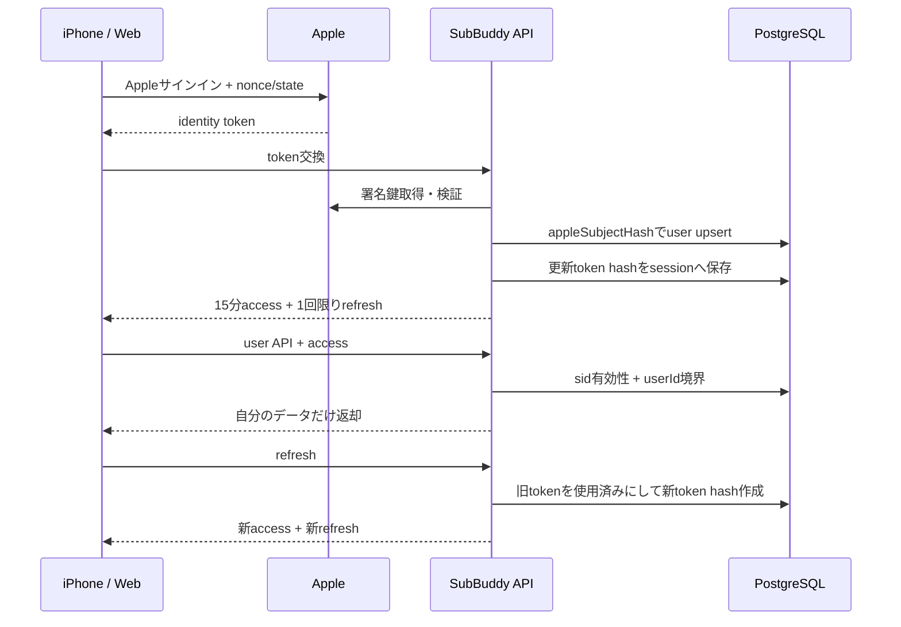

# 設計 - Apple認証・テナント境界

## 実装アプローチ

### 認証境界を1か所へ集約する

Route Handlerごとに`getCurrentUserId()`を呼ぶ方式を廃止し、`authenticateRequest(request, policy)`が返す`AuthenticatedActor`を唯一の利用者境界にする。リポジトリとサービスは引き続き`userId`を必須引数にし、IDだけの更新・削除を禁止する。

公開可能な経路はhealth、Apple認証交換、認証更新に限定する。サービスカタログを未認証公開するかは本作業では変更せず、ユーザーデータを含まないことを回帰確認する。利用量同期は通常セッションではなく、既存の端末同期トークンを使う。

### トークン方式

- アクセストークンは`jose`で署名・検証するJWTとし、有効期間は15分とする。`iss`、環境別`aud`、`sub=userId`、`sid=sessionId`、`jti`、`iat`、`exp`を必須にする。
- 更新トークンは256bit以上の暗号学的乱数によるopaque token（＝中身を読めないランダム文字列）とし、DBにはSHA-256ハッシュだけを保存する。
- 更新成功時は同じ行を上書きせず、新しいセッション世代を作成して旧トークンを使用済みにする。トランザクションと一意制約で並行更新の片方だけを成功させる。
- 使用済みトークンが再提示された場合は`tokenFamilyId`単位で失効する。通常の期限切れと再利用検知を区別して監査するが、応答本文では詳細を出しすぎない。

独自の署名・JWT解析は実装せず、検証実績のある`jose`を使用する。更新トークンをJWTにする案は、即時失効、ローテーション、再利用検知を確実に行うため採用しない。

### 保持期間

| クライアント | アクセス | 更新セッション |
|---|---:|---|
| Web・保持オフ | 15分 | ブラウザセッションCookie。サーバー側は24時間で失効 |
| Web・保持オン | 15分 | 30日未使用または発行から90日の早い方 |
| iPhone | 15分 | 30日未使用または発行から90日の早い方。Apple credential状態の確認と端末失効を優先 |

Apple障害時の72時間継続は、上記期限内の既存セッションに限り、Apple再検証が一時的に行えない場合だけ適用する。期限を72時間延長する仕様ではない。

### Web CookieとCSRF

- アクセスCookieと更新Cookieは`HttpOnly`、`Secure`、`SameSite=Lax`、`Path=/`とする。
- TestFlightとproductionでCookie名を分け、productionでは`__Host-` prefixを使う。Domain属性は設定しない。
- 状態変更要求は許可Originの完全一致とdouble-submit CSRF token（＝Cookieとヘッダーの同値確認）を必要とする。
- Apple callbackはstateとnonceを検証し、認証Cookie発行後に固定のアプリ内URLへだけ遷移する。任意redirect URLを受け取らない。

### iPhone

- 更新トークンとセッションIDはKeychainの`ThisDeviceOnly`保護へ保存する。アクセストークンは原則メモリだけに置く。
- APIが401を返した場合、同時更新を1つへまとめ、更新成功後に元の要求を1回だけ再試行する。無限再試行しない。
- サインアウト・端末失効・アカウント削除成功時はKeychainを消去する。未同期変更の扱いはオフライン同期の子作業で実装するため、本作業では消去前に未同期状態を呼び出し元へ通知できる契約だけを用意する。

## データ構造の変更

### `auth_sessions`

| 列 | 内容 |
|---|---|
| `id` | セッションID |
| `user_id` | 所有ユーザー。削除時cascade |
| `client_type` | `web` / `ios` |
| `token_family_id` | 再利用検知時の失効単位 |
| `refresh_token_hash` | 更新トークンSHA-256。unique |
| `replaced_by_session_id` | ローテーション後のセッションID。nullable |
| `device_id` | iPhoneの場合の登録端末。nullable |
| `remember_browser` | Web保持ログインの選択 |
| `last_used_at` | 未使用期限の計算 |
| `idle_expires_at` | 未使用期限 |
| `absolute_expires_at` | 最長期限 |
| `revoked_at` / `revoke_reason` | 失効日時と内部理由 |
| `created_at` / `updated_at` | 監査用時刻 |

平文トークン、Apple subject、メール、完全なIPアドレス、詳細User-Agentは保存しない。利用者向け一覧にはクライアント種別、利用者が付けた端末名、作成日時、最終利用日時だけを返す。

### API契約

| メソッド・パス | 認証 | 用途 |
|---|---|---|
| `POST /api/auth/apple/native` | Apple token + nonce | iPhoneの初回交換 |
| `POST /api/auth/apple/callback` | Apple token + state + nonce | Webの初回交換、Cookie発行 |
| `POST /api/auth/refresh` | 更新トークン | ローテーション |
| `POST /api/auth/logout` | 有効セッション | 現在セッション失効 |
| `GET /api/sessions` | user access token | セッション一覧 |
| `DELETE /api/sessions/{id}` | user access token | 自分のセッションだけ失効 |
| `DELETE /api/sessions` | Apple再認証 | 全セッション・端末トークン失効 |
| 主要ユーザーデータAPI | user access token | actorの`userId`へ限定 |
| `POST /api/usage/daily` | device sync token | token所有者の契約だけ保存 |

認証済みで他人のリソースを指定した場合は`404`、認証自体が無効なら`401`、CSRF不一致は`403`とする。

## 変更するコンポーネント

| コンポーネント / ファイル | 変更内容 | 対応AC |
|---|---|---|
| `prisma/schema.prisma`・migration | `AuthSession`と制約・索引を追加 | AC-2, AC-3, AC-10, AC-13 |
| `src/lib/auth.ts` | 実行モード別actor解決、JWT検証、固定ユーザー隔離 | AC-7, AC-11, AC-12 |
| `src/services/auth.ts` | Apple交換、更新、ローテーション、再利用検知、失効 | AC-1〜AC-3, AC-10, AC-13, AC-14 |
| `src/app/api/auth/**` | 交換・更新・logout、Web Cookie、CSRF | AC-1〜AC-5, AC-13 |
| `src/app/api/sessions/**` | 一覧、個別失効、全サインアウト | AC-10, AC-13 |
| ユーザーデータRoute Handler | `getCurrentUserId()`を廃止しactorを必須化 | AC-7, AC-8, AC-12 |
| 利用量サービス・repository | バッチ全件の所有権を同一transactionで検証 | AC-9 |
| iOS API client・Keychain | token保存、単一更新、1回再試行、再認証状態 | AC-6, AC-13, AC-16 |
| 起動時設定検証 | cloudモードの秘密・audience・issuer・cookie設定を必須化 | AC-12, AC-14 |
| テスト | 2人以上の合成ユーザーによる認証・認可・並行試験 | AC-3, AC-7〜AC-16 |

## 認証フロー

## 失敗時の境界

- Apple検証、署名鍵取得、DB、設定のどれかが不正なら新規セッションを発行しない。
- 更新処理はDB transaction内で旧トークンが未使用・未失効であることを条件更新し、競合した片方を拒否する。
- API認証失敗時にlocal actor、最新ユーザー、端末の最新所有者を推測して補完しない。
- 一括利用量同期に別ユーザーの契約が1件でもあれば、部分保存せずバッチ全体を拒否する。
- ログにはrequest ID、経路、結果コード、仮名化したsession IDだけを残し、token、Apple subject、メール、契約・支出・利用量を残さない。

## 影響範囲

- `docs/architecture.md`の認証方針は変更せず、実装後に具体APIと`auth_sessions`を追記する。
- `docs/functional-design.md`のAPI一覧、セッション管理、アカウント削除フローを実装完了時に更新する。
- Webの全ダッシュボードAPI呼び出しとiOS API clientが影響を受ける。
- DB migrationが必要。旧localデータをクラウドユーザーへ自動結合しない。
- localモードは明示設定時のみ互換維持する。cloudモードの既存`actor`応答を通常API tokenへ置換するため、iOS/Webは同時に切り替える。

## 設計上の前提

- Appleサインインだけを一般利用者の認証方式とする。
- TestFlightとproductionはDB・署名鍵・Cookie・tokenを共有しない。
- 管理者認証、オフライン同期、完全退会の削除コードは後続の独立した境界で扱う。
- 実データをテスト、seed、ログ、スクリーンショット、証跡へ使わない。
