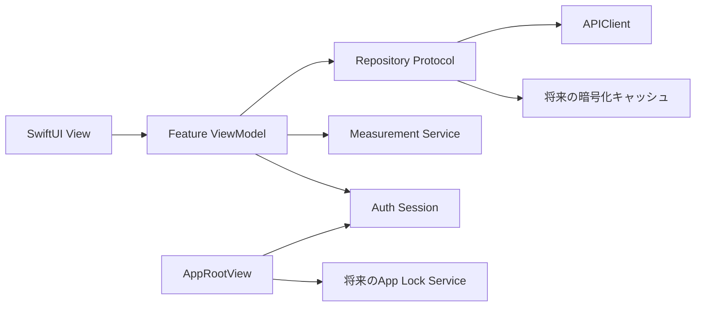
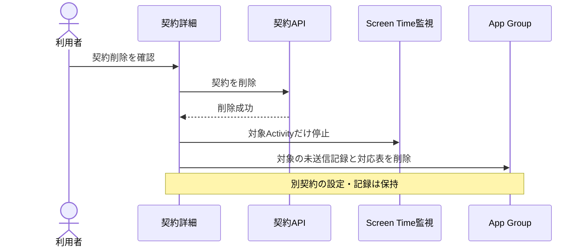

# 設計 — iPhone利用者向けメインUI

## 実装アプローチ

### 1. 親設計をSwiftUIへ写像する

WebのCSSやデスクトップ配置は模倣せず、ブランドの役割をSwiftUIへ対応付ける。画面構成は `TabView` とタブごとの `NavigationStack` を基本とし、フォーム、検索、確認ダイアログ、シートはiOS標準を使う。

既存の4画面サンプルは視覚方向の入力、親の機能維持監査は機能範囲の正本とする。本作業の画面遷移は [ios-screen-map.drawio](./ios-screen-map.drawio) を参照する。
実装時のフィールド単位の正本は [feature-migration-matrix.md](./feature-migration-matrix.md) とする。

### 2. ルート状態と画面構成

`AppRootView` は認証文字列や画面内の条件分岐ではなく、次の明示的な状態で表示を切り替える。

| ルート状態 | 表示 | 復帰条件 |
|---|---|---|
| 起動確認中 | 機微情報を含まない起動画面 | セッション・オンボーディング状態の確認完了 |
| 初回説明 | 価値とデータの扱い | 説明確認 |
| サインイン待ち | Appleサインイン | 認証成功 |
| 初回セットアップ | 最初の契約から最初の見直しまで | 各段階を端末内に保存して再開 |
| 利用中 | 3タブの `MainTabView` | 通常状態 |
| 再認証要求 | 内容を隠した再認証画面 | Apple再認証成功 |
| ロック中 | 内容を隠したロック画面 | 将来のAppLockService成功 |

`MainTabView` はタブごとにナビゲーション履歴を保持する。設定はホームのツールバーから開く。深い画面でタブを増やさない。

### 3. 画面カタログ

| 領域 | 画面 | 主な内容 | 対応AC |
|---|---|---|---|
| 初回 | 価値・データ説明 / Appleサインイン / 最初の契約 / 即時支出 / 棚卸し / 計測説明 / 最初の見直し | 一一本道、後回し、再開 | AC-1, AC-2, AC-8 |
| ホーム | ホーム | 次に確認する1件、年間支出、更新間近、支出内訳、棚卸し再開 | AC-3 |
| 契約 | 一覧 / 追加 / 詳細 / 編集 / 削除確認 | CRUD、検索、絞り込み、不足情報、契約に属する計測設定・利用記録の自動後片付け | AC-4, AC-5, AC-10 |
| 契約 | 計測設定 / iCloud+容量 | FamilyActivityPicker、保存範囲、容量と鮮度 | AC-5, AC-8 |
| 支出 | 支出の内訳 | 合計、カテゴリ、月次推移、集計前提 | AC-6 |
| 見直し | 一覧 / 詳細 | 優先度、事実、根拠、不明点、選択肢、公式導線 | AC-7 |
| 設定 | 設定 / データ説明 / Screen Time / 同期 / 通知 / 端末・セッション / 問い合わせ / 出力 / 完全退会 | 信頼と復旧の入口 | AC-9, AC-10 |

### 4. 状態モデル

各機能のViewModelは、最低限 `idle / loading / content / empty / failure` を持つ。保存処理は表示データと分離した `saveState`、同期は `syncState` として表し、読込失敗で既存表示や編集中の下書きを消さない。

| 状態 | 表示原則 | 利用者が取れる行動 |
|---|---|---|
| 空 | 理由と最初の1操作を示す | 追加、再開、別タブへ移動 |
| 読込中 | 画面構造を保ち、機微情報を疑似表示しない | 待機、必要時キャンセル |
| 通信失敗 | 保存済み内容を残し、通信の問題と範囲を示す | 再試行、オフラインで可能な操作 |
| 権限拒否 | Screen Timeなしでも使える機能を明示 | 設定を開く、後で行う、非計測で続ける |
| 同期失敗 | 最終成功時刻と未同期件数を示す | 再試行、詳細確認 |
| 情報不足 | 不足項目と集計・判断への影響を示す | 後で入力、該当項目だけ編集 |
| 保存中 | 二重送信を防ぎ、入力内容を保持する | 完了待ち |
| 削除確認 | 対象、計測対象の紐付け・端末内未送信記録・同期済み利用集計・見直し結果の削除、他契約への非影響、取消不能範囲を説明する | キャンセル、削除 |
| 再認証要求 | 契約・支出を隠す | Appleで再認証 |

### 5. データと依存境界

SwiftUI Viewは `APIClient` や `MeasurementSession` を直接操作せず、機能単位のプロトコルを通す。これにより、別子ステアリングでAPI、暗号化キャッシュ、競合解決、App Lockを実装しても画面構造を変えずに接続できる。

主な境界は `SubscriptionRepository`、`DashboardRepository`、`ReviewRepository`、`SettingsRepository`、`MeasurementService`、`SessionProviding` とする。プレビューと単体テストでは合成データのインメモリ実装を注入する。

既存APIの契約CRUD、概要、支出、見直し、更新、カタログ、端末・セッション、アカウント削除を再利用する。UIに必要なフィールド不足や別子ステアリング対象の機能は、移植対応表で「未接続」と明示し、仮の成功応答を本番構成へ入れない。

契約削除がサーバーで成功した後、iOSは対象Activityの監視停止、App Group内の未送信利用記録削除、契約と計測対象の対応表削除を行う。後片付けは対象Activity IDに限定し、別契約の設定と記録を残す。途中失敗で対応表を失った記録は、契約一覧の再読込時に有効な契約ID・対応表と照合して再削除する。サーバー側では既存の契約削除処理により、その契約に属する利用集計と見直し結果を削除する。DB・API仕様は変更しない。

### 6. iOSデザイントークン

`DESIGN.md` と ADR 0013の役割を次のように写像する。色はアセットカタログでライト・ダーク・高コントラストを持たせ、直接RGB指定を画面へ散在させない。

| Webブランドの役割 | iOSトークン | SwiftUIでの扱い |
|---|---|---|
| 暖色オフホワイトの背景 | `AppColor.background` | システム背景とのコントラストを検証 |
| 墨色の本文 | `AppColor.textPrimary` | `primary`相当、コントラスト優先 |
| セージ緑の主要操作 | `AppColor.accent` | tint、主ボタン、選択状態 |
| 深緑の見直しメモ | `AppColor.reviewSurface` | 事実と根拠の強調。断定には使わない |
| テラコッタ | `AppColor.caution` | 注意、更新間近、見直し候補 |
| 赤 | `AppColor.destructive` | 削除と重大エラーに限定 |
| 明朝の大見出し | `AppTypography.display` | 28pt以上の限定箇所。未同梱時はシステムserif |
| 端正なゴシック本文 | `AppTypography.body/title/caption` | Dynamic Type対応のシステムスタイルを優先 |
| 8pxグリッド | `AppSpacing` | 4/8/16/24/32/48の意味付き定数 |

金額は等幅数字を使い、色だけで状態を伝えない。モーションは意味のある遷移だけに限定し、`accessibilityReduceMotion` では無効化する。

### 7. 段階実装

外部TestFlightまでの移植は、依存関係を崩さない7段階とする。

1. M0: デザイントークン、合成プレビュー、ルート状態、3タブ、共通状態部品。
2. M1: 初回説明、Appleサインイン、最初の契約、再開地点。
3. M2: 契約一覧・登録・詳細・編集・削除、カタログ、情報不足。
4. M3: ホーム、支出の内訳、更新間近。
5. M4: 見直し一覧・詳細、根拠、注意点、公式導線。
6. M5: Screen Time説明、契約との対応付け、計測・同期状態、設定・信頼導線。
7. M6: API差分接続、全機能対応表、アクセシビリティ・端末・性能・回帰検証。

各段階は合成データのプレビューだけで完了とせず、対応APIがある画面は認証済みの結合確認まで行う。別子ステアリング待ちの項目は未完了として残す。

## 変更するコンポーネント

| コンポーネント / ファイル | 変更内容 | 対応する受け入れ条件 |
|---|---|---|
| `apps/ios/SubBuddyApp/App/SubBuddyApp.swift` | 依存生成と `AppRootView` 起動 | AC-1, AC-2 |
| `apps/ios/SubBuddyApp/App/ContentView.swift` | 開発用UIを廃止し、互換入口または `MainTabView` へ置換 | AC-1, AC-4, AC-8 |
| `apps/ios/SubBuddyApp/DesignSystem/` | 色、文字、余白、共通状態・カード・金額表示 | AC-3, AC-7, AC-10, AC-11 |
| `apps/ios/SubBuddyApp/Features/Onboarding/` | 初回導線と再開 | AC-2, AC-8 |
| `apps/ios/SubBuddyApp/Features/Home/` | ホームと支出導線 | AC-3, AC-6 |
| `apps/ios/SubBuddyApp/Features/Subscriptions/` | 契約CRUD、カタログ、容量、計測入口 | AC-4, AC-5, AC-8 |
| `apps/ios/SubBuddyApp/Features/Spending/` | 支出集計と内訳 | AC-6 |
| `apps/ios/SubBuddyApp/Features/Review/` | 見直し一覧・詳細 | AC-7 |
| `apps/ios/SubBuddyApp/Features/Settings/` | 信頼、同期、端末、問い合わせ、削除等の入口 | AC-9, AC-10 |
| `apps/ios/SubBuddyApp/Data/` | Repository、DTO、APIClient拡張、合成プレビュー実装 | AC-4〜AC-10, AC-13, AC-14 |
| `apps/ios/SubBuddyAppTests/` | ViewModel、状態遷移、表示整形、移植テスト | AC-2〜AC-14 |
| `apps/ios/project.yml` / Assets | 新規ソースと色・必要フォント資産の登録 | AC-11, AC-12 |
| `docs/functional-design.md` | 実装後の画面構成、状態、API対応を確定内容へ更新 | AC-1〜AC-13 |

## データ構造の変更

- DBスキーマ変更は本作業では行わない。
- iOS側に画面表示用モデル、入力下書き、読込・保存・同期状態、オンボーディング再開地点を追加する。
- App Groupの利用記録ストアに、Activity ID単位の対象限定削除を追加する。新しい保存形式やDBスキーマは追加しない。
- オンボーディング再開地点には画面識別子と完了段階だけを保存し、契約名、金額、利用量を重複保存しない。
- APIレスポンスの追加が必要な場合は、フィールド対応表へ記録し、既存Webとの互換性を保つ。API仕様変更が別子ステアリングの根幹へ触れる場合は、その承認後に接続する。

## 影響範囲の分析

- `docs/` への影響: `docs/functional-design.md` のiPhone画面・状態・API対応を実装結果に合わせて更新する。`docs/product-requirements.md`、`docs/architecture.md`、ADR 0013の方針変更はない。
- 既存コードへの影響: `ContentView` の開発用操作を利用者画面から除く。認証、Family Controls、計測、同期の既存サービスは保持し、機能境界から呼ぶ。
- Webへの影響: 画面変更なし。既存Route HandlerをiOS正式クライアントから利用するため、レスポンス互換性とテナント境界の回帰が必要。
- 後方互換 / マイグレーション: DBマイグレーションなし。既存Keychainトークンと有効な計測選択を保持する。削除済み契約に属する既存の孤立した未送信記録は、次回の契約一覧読込時に整理する。開発用API URL入力は利用者画面から除き、ビルド設定へ限定する。
- 親WBSとの関係: 主にT-14/T-17/T-18/T-20/T-32/T-40/T-41/T-42を具体化する。T-21/T-23/T-24/T-50/T-53/T-56/T-58の成果を接続するが代替しない。

## 設計上の前提

- 親ステアリングは承認済みであり、iPhone主製品、3タブ、設定導線、初回一本道、見直しの中立表現は確定済みである。
- Appleサインインとユーザー境界はmainへ統合済みであり、PIIとなる氏名・メールをUIモデルや証跡へ追加しない。
- Web版 `DESIGN.md` はブランドの正本だが、SwiftUI標準操作とアクセシビリティが視覚的一致より優先する。
- 実装・テストは合成データだけを使う。TestFlight参加者の実データは開発証跡へ持ち出さない。
- テスト実行前に `.audit/test-status.md` を「実施中」へ更新する。
