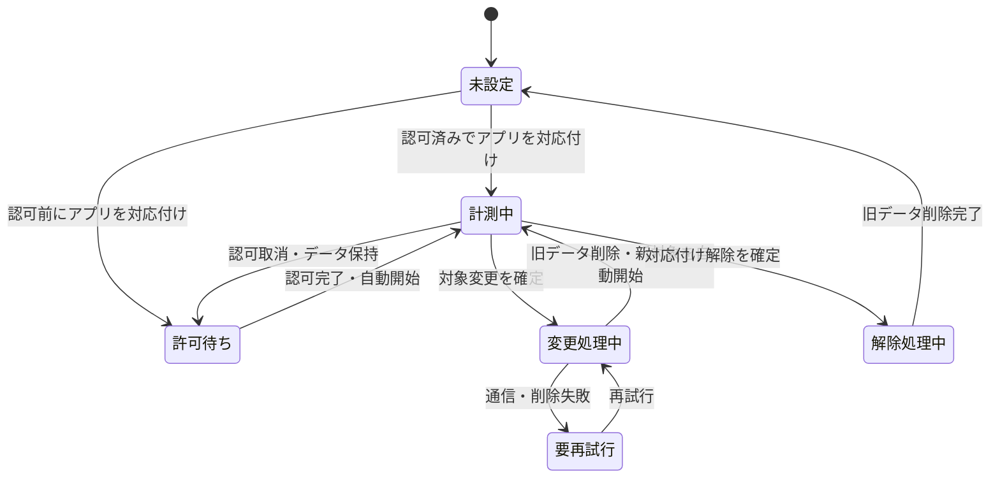

# 設計 — Screen Time計測ライフサイクルの自動化

## 実装アプローチ

### 1. 計測状態を条件から導出する

利用者が変更できる独立した`isMonitoring`設定は持たない。監視すべき状態を次の条件から導出し、実際の`DeviceActivityCenter.activities`との差分を照合する。

```text
監視すべき = Screen Time認可済み
            AND 契約が有効
            AND 計測対象アプリが1つ対応付いている
            AND 対象変更・解除処理中ではない
```
画面の「計測中」は保存フラグではなく、この期待状態と実際の監視登録が一致した結果として表示する。手動の開始・停止ボタンは削除し、「計測対象を選ぶ」「計測対象を変更」「対応付けを解除」だけを提供する。

### 2. 状態照合を冪等にする

`MeasurementSession.reconcileCurrentConfiguration()`が`MeasurementPolicy`で期待状態を判定し、アプリ起動、フォアグラウンド復帰、認可完了、契約一覧更新、対象変更・解除完了後に照合する。

- 監視すべき契約が未監視なら開始する。
- 監視すべきでない契約が監視中なら、その契約の監視だけを停止する。
- 保存された対応表がない孤立監視と、削除済み契約の対応表・未送信集計を整理する。
- 認可拒否・制限・取消では監視不能として表示するが、対応表と過去集計は削除しない。
- 同じ入力で繰り返しても状態とデータを壊さない。

### 3. 対象変更・解除を中断可能な一連の処理として扱う

対象変更と解除は、端末とクラウドをまたぐため単一DBトランザクションにはできない。App Groupに契約単位の`measurementMutation`を保存し、途中終了後も再開できる処理にする。

1. 新対象が1アプリであり、別契約と重複しないことを確認する。解除では新対象を持たない。
2. 削除範囲を表示し、利用者の確定を得る。
3. `measurementMutation`へ操作種別、旧Activity ID、変更時の新しい選択データを保存し、その契約の同期を保留する。
4. 旧対象の監視を停止する。
5. 認証・所有権を確認する計測データ削除APIを冪等に呼び、同期済み日別集計と見直しスナップショットを削除する。
6. 端末内の旧対応表、未送信集計、集計値を対象Activity IDに限定して削除する。
7. 変更の場合は新対応表を保存して監視を開始し、解除の場合は対応表なしで完了する。
8. 見直しを利用量なしで再計算し、完了後に`measurementMutation`を削除する。

削除APIが失敗した場合は新対象を開始せず、旧対象の同期も再開しない。「変更を完了できませんでした」と再試行を示す。API成功後に端末処理で失敗しても、冪等APIと保存済み処理状態から安全に再開する。

### 4. クラウドAPIを追加する

`DELETE /api/subscriptions/{id}/usage`を追加する。認証済み主体と`subscriptions.user_id`の一致を確認し、対象契約の`ios_usage_daily_summaries`と`recommendation_snapshots`をDBトランザクションで削除する。対象が既に空でも成功する冪等操作とする。

成功後は既存の見直し再計算処理を利用量なしで実行する。削除と再計算の間に失敗した場合も、次回再試行で古いスナップショットを復活させず収束できるようにする。API応答には削除対象の機微な明細を含めない。

### 5. 契約削除と認可取消を区別する

- 契約削除は既存`DELETE /api/subscriptions/{id}`の関連データ削除を正とし、成功後に端末内の対象監視・対応表・未送信集計を削除する。
- 認可取消は利用者による削除指示ではないため、対応表と過去集計を保持する。再認可後、状態照合により自動再開する。
- サインアウト、端末失効、完全退会の削除意味は既存設計を維持し、本変更で拡張しない。

## 変更するコンポーネント

| コンポーネント / ファイル | 変更内容 | 対応する受け入れ条件 |
|---|---|---|
| `apps/ios/SubBuddyApp/App/MeasurementSession.swift` | 手動開始・停止前提を除き、選択・変更・解除と導出状態へ再構成 | AC-1〜AC-9 |
| `apps/ios/SubBuddyApp/App/MonitorScheduler.swift` | 契約単位の冪等な開始・停止を状態照合から利用 | AC-1, AC-2, AC-8, AC-9 |
| `apps/ios/SubBuddyApp/App/MappingStore.swift` / `Shared/MeasurementMutationStore.swift` | 対応表と中断可能な`measurementMutation`をそれぞれ保存 | AC-5, AC-6, AC-9 |
| `apps/ios/SubBuddyApp/App/SubscriptionViews.swift` | 開始・停止ボタンを対象選択・変更・解除と確認表示へ置換 | AC-3〜AC-8 |
| iOSの同期処理 | 処理中契約の旧集計を送らず、完了後に通常同期へ戻す | AC-5, AC-6, AC-9 |
| `apps/web/src/app/api/subscriptions/[id]/usage/route.ts` | 所有権検証付きの冪等な計測データ削除APIを追加 | AC-5, AC-6, AC-10, AC-11 |
| `apps/web/src/repositories/measurement-data.ts` | 対象契約の集計値と見直し結果をトランザクション削除 | AC-5, AC-6, AC-10, AC-11 |
| iOS・Webテスト | 状態遷移、削除範囲、認可、再試行、テナント境界を合成データで検証 | AC-1〜AC-12 |
| `docs/product-requirements.md` / `docs/functional-design.md` / `docs/glossary.md` | 計測開始・変更・解除・削除の製品仕様と用語を同期 | AC-3〜AC-8, AC-11 |

## データ構造の変更

### 端末内

App Groupへ契約単位の処理状態を追加する。選択トークンと同様に端末外へ送らない。

```swift
struct MeasurementMutation: Codable {
    let subscriptionId: String
    let oldActivityName: String
    let replacementSelection: Data?
    let operation: Operation // replace / unlink
}
```

処理は削除APIの冪等性を利用して先頭から安全に再試行する。完了するまでmutationを残し、同期処理はその契約を除外する。

### サーバー

DBスキーマの追加は不要。既存の`ios_usage_daily_summaries.subscription_id`と`recommendation_snapshots.subscription_id`を対象に削除する。新しいAPI RouteとRepository操作を追加する。

## 影響範囲の分析

- `docs/` への影響: PRDの自動取得体験、機能設計の計測設定・削除状態、用語集の計測対象選択を更新する。
- 既存iOSへの影響: 手動開始・停止UI、計測中の選択変更拒否、`MeasurementSession`の状態復元、同期キュー整理を変更する。
- 既存Web/APIへの影響: 契約を残したまま計測データだけを削除する認証付きAPIを追加する。既存APIの応答は変更しない。
- 見直しへの影響: 旧利用量を根拠とするスナップショットを削除し、利用量なしで再計算する。
- 後方互換: 既存の有効な対応表は起動時照合で自動監視へ移行する。手動停止中だった対応表も自動開始するため、更新後の初回表示で説明する。DBマイグレーションは不要。

## 設計上の前提

- 1契約に対応付ける計測対象は1アプリであり、同じアプリを複数契約へ重複させない。
- 対象変更時に旧利用量を保持する世代管理は行わず、対象契約のScreen Time利用量を全期間削除する。
- 対応付け解除も、停止状態を残さず対象契約のScreen Time利用量を削除する操作とする。
- 詳細ログと選択トークンは端末外へ送らず、クラウドには日別集計だけを保存する。
- 認可取消はデータ削除指示とはみなさない。
- localとcloudで認証方法は異なっても、所有契約だけを削除できる境界は共通にする。

## 状態遷移


