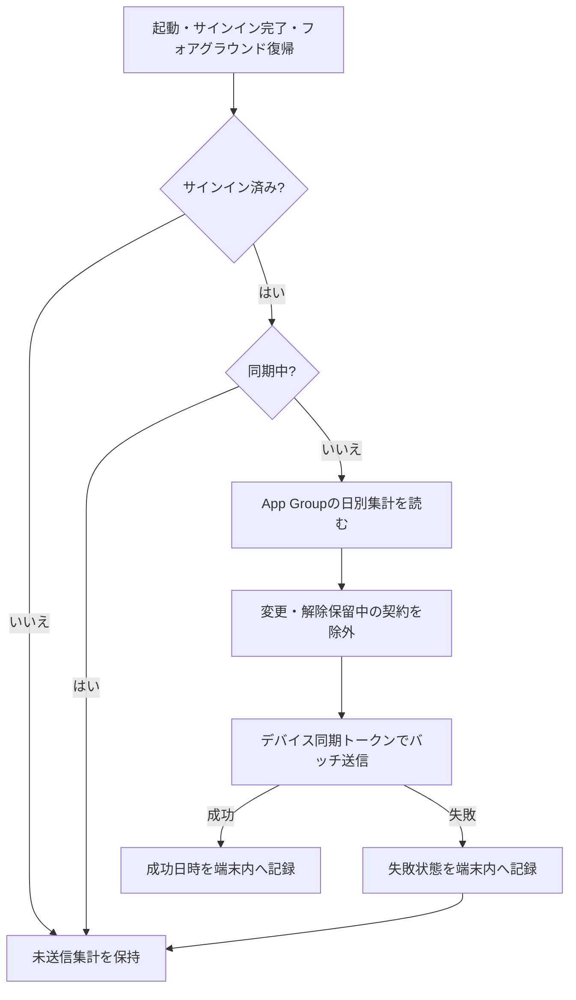

# 設計 — 利用量集計の自動同期

## 実装アプローチ

本体アプリに`UsageAutoSyncCoordinator`を置き、SwiftUIのライフサイクルから同期契機を渡す。Coordinatorはサインイン状態と同期中状態を確認して`UsageSyncService.syncAll()`を呼び、結果を`UserDefaults`へ最小限保存する。

同期契機は次の3つとする。

1. `ContentView`の初回表示。保存済みセッションで起動した場合を扱う。
2. `AuthSession.isSignedIn`が`true`へ変化したとき。Appleサインイン直後を扱う。
3. `scenePhase`が`.active`へ変化したとき。別アプリ利用後や通信復旧後の復帰を扱う。

CoordinatorはMain Actor上で`isSyncing`を管理し、同期中の追加要求を`skippedInProgress`として終了する。同期失敗は画面を妨げるアラートにせず、端末内集計を保持して状態だけ記録する。

BGTaskSchedulerは実行時刻を保証できず、Capability・Info.plist・実機運用の追加検証が必要になるため今回追加しない。「アプリを開かなくても即時同期」とは表示せず、起動・復帰時の自動同期として説明する。

## 同期フロー

## 変更するコンポーネント

| コンポーネント / ファイル | 変更内容 | 対応する受け入れ条件 |
|---|---|---|
| `UsageSyncService.swift` | 同期プロトコル、Coordinator、結果状態、端末内状態保存を追加 | AC-1〜AC-7, AC-9 |
| `ContentView.swift` | 起動・サインイン・フォアグラウンド復帰から自動同期を呼ぶ | AC-1〜AC-4 |
| `MeasurementSession.swift` | 手動同期も同じ状態保存へ反映 | AC-5, AC-7, AC-8 |
| `ReviewSettingsViews.swift` | 自動同期、最終同期確認、失敗・再試行表示 | AC-7, AC-8 |
| `ProductUITests.swift` | Coordinatorの合成テストを追加 | AC-1〜AC-5, AC-7, AC-11 |
| 既存`UsageSyncService`テスト補助 | 変更保留除外・日別集計限定を維持 | AC-6, AC-9, AC-10, AC-11 |
| `docs/*` | 自動同期契機、保証範囲、手動再試行を恒久仕様へ反映 | AC-1〜AC-10 |
| `manuals/*` | Mac自動テストとiPhone実機の確認手順を更新 | AC-11 |

## データ構造の変更

DBスキーマ、API形式、App Groupの利用集計形式は変更しない。

端末標準`UserDefaults`へ次の非機微な状態だけを保存する。

| キー | 内容 |
|---|---|
| `usage_sync_last_success_at` | 最後に同期要求が成功した日時 |
| `usage_sync_last_attempt_at` | 最後に自動・手動同期を試した日時 |
| `usage_sync_last_failed` | 最後の同期が失敗したか |

エラー本文、認証情報、契約ID、利用量、選択アプリは保存しない。

## 影響範囲の分析

- `docs/`への影響: `product-requirements.md`、`functional-design.md`、`architecture.md`へ自動同期を追加する。
- 既存コードへの影響: iOS本体のライフサイクルと同期設定画面。Monitor Extension、Web API、DBは変更しない。
- 後方互換: 既存の未送信レコードをそのまま自動送信できる。移行処理は不要。
- 通信量: アプリ起動・復帰ごとに同期を試すが、空の場合は通信しない。同日分の再送は既存upsertで単調更新される。
- 失敗時: レコードを削除せず、画面をブロックせず、次の契機で再試行する。

## 設計上の前提

- DeviceActivity Monitor ExtensionはApp Groupへ集計を書くだけで通信しない。
- `UsageSyncService`は変更・解除保留中の契約を既に除外している。この境界を自動同期でも再利用する。
- 今日の集計は後続しきい値で更新されるため、成功後も端末内に残し再送可能にする。
- サーバーは`(subscriptionId, usageDate)`単位で冪等・単調upsertする。
- 日付境界の集計意味は今回変更しない。
- 自動同期の責務は日別集計のDB保存までとする。通常同期後の見直し再計算は現行どおり利用者の明示操作とし、本変更では自動化しない。

## 代替案と不採用理由

| 代替案 | 不採用理由 |
|---|---|
| Monitor Extensionから直接送信 | 認証情報をApp Groupへ置く必要が生じ、Extensionの短い実行時間と失敗復旧にも適さない |
| 手動同期だけ維持 | 同期忘れと画面説明の不一致を解消できない |
| BGTaskSchedulerまで同時導入 | 実行時刻を保証できず、追加Capabilityと実機検証が必要。起動・復帰同期の価値検証と分離する |
| 同期失敗を毎回アラート表示 | 通信断のたびに主要操作を妨げる。設定画面の状態表示と自動再試行で扱う |
