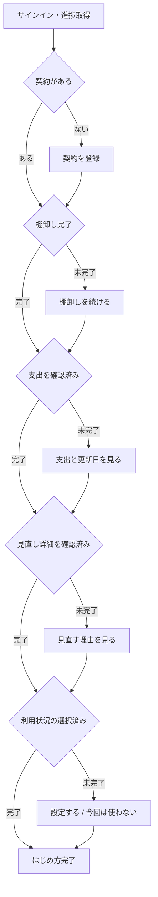

# 設計 — 初回利用後の使い方ガイド

## 実装アプローチ

### 1. 説明ツアーではなく、実際の次の操作を示す

案内の中心を「機能一覧の説明」ではなく、次の4段階とする。

1. 契約の棚卸しを進める
2. 支出と更新日を確認する
3. 見直しの理由を確認する
4. 必要な場合だけ利用状況の計測を設定する、または今回は使わないと選ぶ

各段階は該当画面への操作ボタンを持つ。連続ポップアップや画面上の部品を指す吹き出しは採用しない。中断、再開、アクセシビリティ、画面改修への追従が難しく、説明を閉じること自体が目的になりやすいためである。

### 2. iPhoneとWebで表示量を変え、進捗の意味は共通化する

iPhoneは既存ホームの「次に確認すること」を再利用し、未完了の1項目だけを表示する。通常の見直し候補より案内を優先するのは案内未完了時だけとし、完了後は現在の見直し候補へ戻す。全体の4項目は設定内の「使い方」で確認する。

Webはダッシュボードに4項目をまとめて表示できる。契約0件時は最初の登録を主操作にした短い初回表示、既存契約ありでは現在のチェックリストを表示する。完了後は折りたたみ、サイドバーの「使い方」から開ける。

表示は異なるが、段階名、完了条件、次の項目の決定はAPIの共通応答を使う。

### 3. iPhoneの既存初回導線を維持し、順序を価値優先へ整える

既存の初回説明、Appleサインイン、最初の契約、支出表示、棚卸し、見直し、利用状況説明を残す。料金と更新日だけで得られる価値を先に理解できるよう、利用状況の説明と選択は最初の見直し後に置く。

サインイン前のデータ説明確認は端末内に保存する。サインイン後は、サーバーの案内進捗と保存済み契約から開始位置を決める。Webですでに契約・確認を済ませた利用者には、完了済みの入力や説明を強制しない。

### 4. 事実から導ける状態と、明示操作が必要な状態を分ける

契約の存在は`subscriptions`から導出する。画面を実際に確認したこと、棚卸しを終えたこと、計測を今回は使わない選択はデータだけでは分からないため、固定イベントとして保存する。

| 段階 | 完了条件 | 保存方法 |
|---|---|---|
| 棚卸し | 契約が1件以上あり、利用者が「棚卸しを終える」を実行 | 契約件数は導出、完了日時だけ保存 |
| 支出・更新日 | 支出画面を実際に表示 | 初回表示日時を保存 |
| 見直し | 見直し詳細を実際に表示 | 初回表示日時を保存 |
| 利用状況 | iPhoneで計測設定済み、または「今回は使わない」を選択 | 選択状態を保存。Webは変更不可 |

画面を開かずにチェックだけ付けるAPIは設けない。契約追加後の登録完了、画面表示、計測設定という実操作に結び付けて更新する。

### 5. 案内進捗モデルとAPI

`UserGuidanceProgress`を利用者と1対1で追加する。

| フィールド | 意味 |
|---|---|
| `user_id` | 所有利用者。主キー兼外部キー |
| `inventory_completed_at` | 棚卸しを終えた初回日時 |
| `spending_viewed_at` | 支出画面を初めて表示した日時 |
| `review_viewed_at` | 見直し詳細を初めて表示した日時 |
| `measurement_choice` | `pending` / `configured` / `skipped` |
| `completed_at` | 4段階を満たした初回日時 |
| `created_at` / `updated_at` | 作成・更新日時 |

進捗には契約名、金額、更新日、利用時間、メール、Apple識別情報を保存しない。契約が削除されて0件になった場合は、過去の閲覧履歴を消さず、応答上の棚卸し段階を未着手へ戻して次の契約登録を案内する。`completed_at`は履歴として保持するが、現在の`isComplete`は契約の存在を含めて再計算する。

APIは次の2つとする。

- `GET /api/guidance-progress`: 認証済み利用者の保存状態、契約の存在、解決済み4段階、`nextStep`、`isComplete`を返す。
- `PATCH /api/guidance-progress`: `inventory_completed`、`spending_viewed`、`review_viewed`、`measurement_configured`、`measurement_skipped`、`measurement_reset`の固定イベントだけを受ける。

日時イベントは最初の値を保持し、同じイベントの再送を成功扱いにする。利用状況の状態だけは、設定・解除・見送りに応じて遷移できる。認証済み主体から`user_id`を解決し、クライアント指定の利用者IDは受け取らない。Zodでイベント値と空でないJSONオブジェクトだけを検証する。

### 6. オフラインと競合

iPhoneは送信前の固定イベントと最後に取得した解決済み進捗を端末内へ保存する。通信失敗時も画面遷移を妨げず、次回起動・フォアグラウンド復帰・サインイン完了時に再送する。

- 日時イベントは単調に完了へ進み、サーバー側で最初の日時を保持する。
- 同じイベントは冪等に処理する。
- `measurement_choice`は端末内の実際の対応付けを優先し、設定解除時は`measurement_reset`を送る。
- iPhoneとWebが同時に画面を開いても、完了状態を未完了へ戻さない。
- サインアウト時は端末内の解決済み進捗と未送信イベントを消し、別アカウントへ引き継がない。

### 7. 画面ごとの案内

| クライアント | 場所 | 表示 |
|---|---|---|
| iPhone | ホーム「次に確認すること」 | `はじめ方 n/4`、次の1項目、短い理由、対象画面へのボタン |
| iPhone | 設定 > 使い方 | 全4項目、現在の状態、各機能の短い説明、対象画面への入口 |
| Web | ダッシュボード | 4項目チェックリスト。契約0件時は最初の登録を強調 |
| Web | サイドバー > 使い方 | 完了後も開けるガイドページ |

主要画面の初回説明は進捗APIと分離し、クライアント・説明版ごとのローカル設定に保存する。iPhoneとWebでは画面構成が異なるため、既読状態を共有しない。説明文を変更したときだけ版番号を上げ、再表示できるようにする。

| 画面 | 初回説明の要点 |
|---|---|
| 契約 | 登録した契約だけが支出と見直しの対象になる |
| 支出 | 登録済み契約を月額・年額へ換算した目安である |
| 見直し | 解約を決める画面ではなく、事実・不足情報・選択肢を確認する |
| 更新間近 | 更新日が登録されている契約だけを表示する |

初回説明は画面内の閉じられる情報枠とし、操作を覆うモーダルにはしない。以後は「この画面について」から同じ内容を再表示する。

### 8. 利用者向け名称の統一

Webの表示名「レコメンド」を「見直し」へ変更する。既存URL`/recommendations`、API`/api/recommendations`、内部型名は互換性のため変更しない。iPhoneとWebの主な名称は「ホーム」「契約」「支出」「見直し」「更新間近」「設定」にそろえる。

## 変更するコンポーネント

| コンポーネント / ファイル | 変更内容 | 対応する受け入れ条件 |
|---|---|---|
| `docs/product-requirements.md` | 初回利用後の案内、任意計測、成功体験、最小進捗保存を要求へ追加 | AC-1〜AC-12 |
| `docs/functional-design.md` | 案内機能、データモデル、API、iPhone/Web表示、画面名を追加 | AC-1〜AC-11 |
| `docs/glossary.md` | 「はじめ方」「案内進捗」「この画面について」を定義 | AC-3〜AC-10 |
| `apps/web/prisma/schema.prisma` / migration | `UserGuidanceProgress`と利用状況選択enumを追加 | AC-6, AC-7, AC-11 |
| `apps/web/src/schemas/guidance-progress.ts` | 固定イベントの入力検証 | AC-6, AC-11 |
| `apps/web/src/services/guidance-progress.ts` | 進捗解決、冪等更新、次項目決定 | AC-4〜AC-8, AC-11 |
| `apps/web/src/app/api/guidance-progress/route.ts` | 本人の進捗取得・更新API | AC-6, AC-7, AC-11 |
| `apps/web/src/app/(dashboard)/page.tsx` | データ状態別のWebチェックリスト | AC-4, AC-5 |
| `apps/web/src/app/(dashboard)/getting-started/page.tsx` | 完了後も開ける「使い方」ページ | AC-5, AC-8, AC-10 |
| `apps/web/src/components/SidebarNav.tsx` | 「見直し」への名称変更と「使い方」入口 | AC-5, AC-9 |
| Webの契約・支出・見直し・更新画面 | 初回説明、進捗イベント送信 | AC-6, AC-9, AC-10 |
| `apps/ios/SubBuddyApp/App/ContentView.swift` | 既存初回導線の再開、価値優先の順序、任意計測 | AC-1, AC-2, AC-8 |
| `apps/ios/SubBuddyApp/App/MainViews.swift` | 既存カードを使う次の1項目表示と遷移 | AC-3, AC-6 |
| `apps/ios/SubBuddyApp/App/ReviewSettingsViews.swift` | 設定内「使い方」、見直し初回説明 | AC-3, AC-8, AC-10 |
| iOSの契約・支出・更新画面 | 初回説明と進捗イベント送信 | AC-6, AC-10 |
| `apps/ios/SubBuddyApp/App/ProductAPI.swift` | 案内進捗DTOとGET/PATCH | AC-6, AC-7, AC-11 |
| `apps/ios/SubBuddyApp/App/ProductStore.swift` | 解決済み進捗、次項目、送信失敗時の保持 | AC-2, AC-3, AC-6, AC-7 |
| iOS共有ストア | 未送信イベント、既読説明版、サインアウト時消去 | AC-2, AC-7, AC-10, AC-11 |
| Web/iOSテスト | 状態分岐、再開、冪等性、表示量、アクセシビリティ、回帰 | AC-1〜AC-12 |

## データ構造の変更

- PostgreSQLに`user_guidance_progress`を追加する。`user_id`を主キー兼外部キーとし、利用者削除時に連鎖削除する。
- `measurement_choice`はDB enumで`pending / configured / skipped`に限定する。
- 既存利用者の行は作らず、GET時は未完了の既定値として扱い、最初のPATCHでupsertする。
- 既存の契約、利用量、見直し、認証テーブルとAPI応答は変更しない。
- migrationのseedやテストには合成利用者だけを使う。

## 影響範囲の分析

- `docs/`への影響: `product-requirements.md`、`functional-design.md`、`glossary.md`を更新する。技術スタックや配置原則は変わらないため`architecture.md`と`repository-structure.md`の更新は不要。
- 既存コード・既存機能への影響: iPhone初回導線の順序・再開、ホームの最優先カード、設定、主要画面の説明、Webダッシュボード・サイドバー・主要画面、API、Prismaへ影響する。契約・支出・見直しの計算結果は変えない。
- 後方互換: 進捗行がない既存利用者は、既存契約の有無を反映した未完了状態から始める。Webの内部URLとAPI名は維持する。iPhoneの既存`AppStorage`値は初回同期時の補助入力として使い、サーバー状態へ安全に移行後も古い版への戻しに備えて直ちに削除しない。
- マイグレーション: 追加テーブルだけで既存データを書き換えない。失敗時は案内が未完了表示になるだけで、契約・支出・見直しの利用を妨げない。

## 設計上の前提

- iPhoneの既存初回導線は製品の信頼説明として残す。
- 案内未完了でも、通常の契約・支出・見直し操作を禁止しない。
- 進捗は案内表示のための最小状態であり、詳細な利用分析基盤にはしない。
- Screen Timeは任意であり、設定・見送りのどちらでも案内を完了できる。
- iPhoneとWebは同じアカウントのPostgreSQLデータを参照できる。local modeは固定ローカル利用者で同じAPIを使う。
- 1アカウントの主計測iPhoneは1台という既存方針を前提に、利用状況選択をアカウント単位で扱う。
- 画面説明の既読はクライアント固有であり、アカウント間では共有しない。

## 状態遷移

