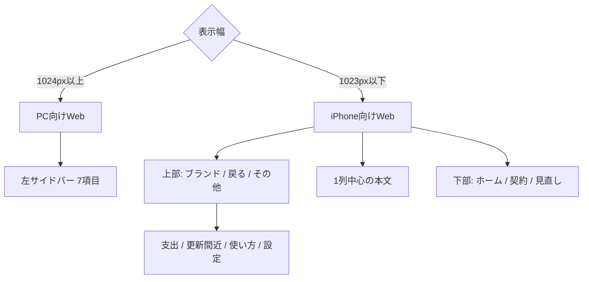

# 設計 — iPhoneで快適に使えるWeb UI

## 実装アプローチ

同じNext.js画面とデータを使い、CSSの画面幅で広幅シェルとコンパクトシェルを切り替える。1023px以下はiPhone横向きを含むコンパクトシェル、1024px以上は現行サイドバーとする。User-Agent判定やモデル別CSSは使わない。

操作構造はiPhoneアプリの「ホーム・契約・見直し」に揃えるが、色・書体・余白・中立トーンはWebのブランドを維持する。既存ADR 0013の具体化であり、新しい不可逆な技術判断ではないため新規ADRは作らない。

## レイアウト構造

- DOMの読み上げ順をモバイルの優先順にし、CSSの`order`だけで意味順を入れ替えない。
- 下部ナビ分の本文余白へ`env(safe-area-inset-bottom)`を加える。
- 上部バーは`env(safe-area-inset-top)`を使い、固定要素はSafariの表示領域変化で本文を隠さない。
- 入力画面では下部ナビを隠す。閲覧画面では詳細・補助画面を含めて表示する。

## 画面別設計

| 画面 | iPhone向けWeb | PC向けWeb |
|---|---|---|
| ホーム | 支出→次の操作→更新・見直し→詳しい概況 | 現行の広幅構成を維持 |
| 契約一覧 | 1列カード、右上「＋追加」、0件時主ボタン | 2列カードとサイドバー登録ボタンを維持 |
| 支出 | 概要1〜2列、月次は縦リスト、カテゴリは横棒 | 現行棒グラフを維持 |
| 見直し・更新 | 名称・判定・金額を縦方向へ再配置 | 現行行リストを維持 |
| 契約詳細 | 概要と各節を1列、編集は上部、削除は末尾 | 現行2列情報を維持 |
| 追加・編集 | 1列フォーム、末尾全幅保存、下部ナビなし | 現行フォーム幅を維持 |
| 画面説明 | 初回説明と再表示ボタンを排他表示 | 同じ状態規則を使う |
| ログイン・ダイアログ | 画面幅内、44px操作、キーボード対応 | 現行中央表示を維持 |

## 共通コンポーネント

| コンポーネント / ファイル | 変更内容 | 対応AC |
|---|---|---|
| `app/(dashboard)/layout.tsx` | PCサイドバー、モバイル上部バー、下部ナビ、本文余白を共通シェル化 | AC-2〜AC-5 |
| `components/SidebarNav.tsx` | ナビ定義を共用し、主要画面と補助画面の現在地を解決 | AC-2, AC-3, AC-5 |
| 新規モバイルナビ部品 | 下部3項目、「その他」シート、フォーカス移動・復帰・Escape・背景スクロール抑止 | AC-3〜AC-5, AC-13 |
| `app/globals.css` | 幅、safe area、1列化、折り返し、タッチ領域、縮尺、固定要素のレスポンシブ規則 | AC-1〜AC-15 |
| ホーム画面 | DOM順序を価値優先へ変更し、広幅表示も破綻させない | AC-6 |
| 契約一覧・カード | 1列カード、長文・金額、追加操作 | AC-7, AC-9, AC-14 |
| 支出画面 | 同じ6か月データからPC棒グラフとモバイル縦リストを表示 | AC-8 |
| 見直し・更新画面 | 行をカードへ変形し、金額と理由の重なりを解消 | AC-9, AC-14 |
| 契約詳細 | 1列化、長文折返し、編集・削除の優先度変更 | AC-10, AC-14 |
| `SubscriptionForm`ほか入力部品 | 1列、16px、44px、項目別エラー、末尾保存 | AC-4, AC-11, AC-13 |
| `ScreenIntro` | 排他表示、端末内既読、状態維持の回帰 | AC-12 |
| サインイン・各ダイアログ | 320px、文字拡大、キーボード、フォーカス対応 | AC-4, AC-13 |
| E2E・手動確認手順 | 代表幅、PC、長文、200件、Safari・Chrome実機回帰 | AC-1〜AC-16 |

## 「その他」メニュー

- 右上ボタンは歯車だけでなく「その他」と認識できるラベルを持つ。
- 下から出るシートに、支出の内訳、更新間近、使い方、設定を並べる。
- 開いた時は先頭項目へフォーカスし、閉じた時は起点へ戻す。
- Escape、背景選択、閉じる操作へ対応し、シート背面は操作できない。
- 補助画面では対応する項目を現在地として示す。下部ナビは関連する主要画面を示し、支出・更新間近・使い方・設定はホーム系として扱う。

## 長い内容と大量データ

- `overflow-wrap:anywhere`を長い英数字名へ適用する。
- 一覧の名称・理由は2行までとし、詳細では全文を表示する。
- 金額は省略せず、桁数に応じた範囲内の`clamp()`で調整する。
- 契約200件でもDOMの意味、下部余白、固定ナビを維持する。仮想化は今回導入しない。
- ページ全体の`overflow-x:auto`で問題を隠さない。横スクロールが必要な部品は今回作らない。

## データ構造・APIの変更

なし。サーバーコンポーネントの取得、API、DB、認証Cookie、CSRF、見直し計算は維持する。クライアント状態は「その他」メニューの開閉と既存画面説明の既読だけである。

## 検証設計

- Playwright: 320、375、390、430、844×390相当の横向き、1024以上のPCで全到達画面を巡回し、`scrollWidth <= clientWidth`を確認。
- E2E: 下部ナビ、その他メニュー、追加、戻る、保存失敗、説明の開閉、ダイアログのフォーカスを確認。
- 合成境界: 長い英数字名、大きな金額、長い理由・メモ、0件、200件。
- アクセシビリティ: 44px、キーボード、フォーカス可視化、200%相当、VoiceOver。
- 実機: 現行iPhoneのSafari・Chromeで縦横、キーボード、安全領域、固定ナビを確認。
- PC回帰: 既存E2E、型、lint、buildと主要画面の目視。

## 影響範囲

- `docs/product-requirements.md`: WebをiPhoneブラウザでも正式利用できる要求と受け入れ条件を追加。
- `docs/functional-design.md`: コンパクトシェル、画面遷移、画面別再配置を追加。
- `docs/development-guidelines.md`: モデル別分岐禁止、代表幅、安全領域、44px、横はみ出し検査を追加。
- `docs/glossary.md`: iPhone向けWeb、PC向けWeb、主要画面、補助画面を追加。
- `DESIGN.md`: Webブランドを維持したモバイル配置規則を追加。
- DB、API、iOSコード、WBS: 実装中は変更しない。完了後にWBSへ実績反映する場合は別同期とする。

## 参考試作

- [支出画面HTML](./mobile-spending-prototype.html)
- [契約フォームHTML](./mobile-contract-form-prototype.html)
- [契約フォーム390px](./mobile-contract-form-390.png)
- [契約フォーム320px](./mobile-contract-form-320.png)
