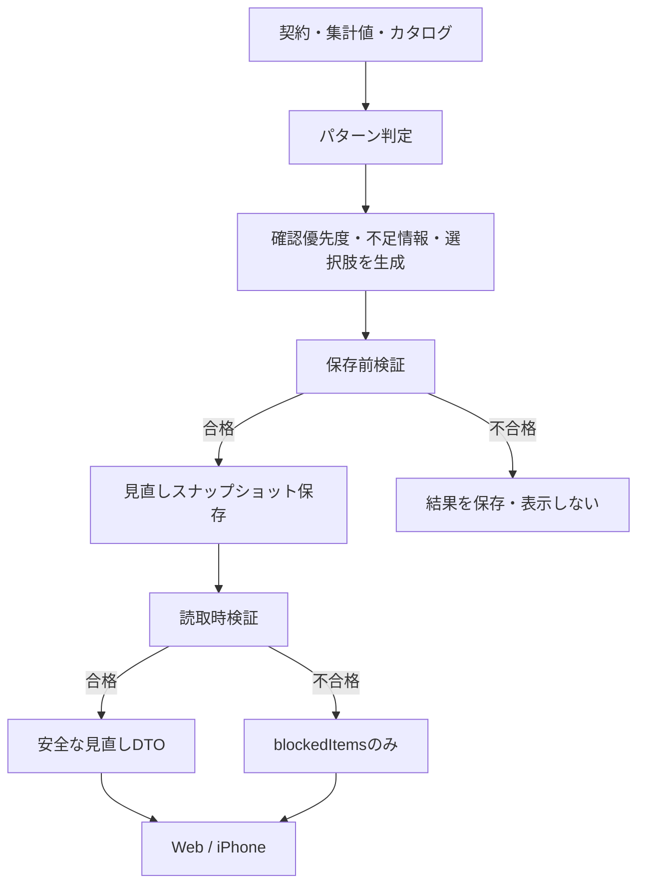

# 設計 — 見直し機能の全出力と安全な確認優先度

## 実装アプローチ

既存のパターン判定と`decision`は内部互換のため残し、その出力から利用者向けの`reviewPriority`、不足情報、選択肢を生成する。画面は`decision`を参照せず、新しい構造化出力だけを使う。

表示前に安全検査を設ける。スナップショット作成時の検査に加え、読取時にも契約の更新時刻、所有者、料金情報の鮮度、節約額の計算整合を検査する。失敗した結果は一覧から除外し、契約IDと再計算案内だけを別の`blockedItems`として返す。

この方式により、古いクライアント向けのDB互換値を一度に削除せず、利用者向け表示だけを安全な新仕様へ移行できる。

## 確認優先度の決定

優先度は設定可能なしきい値と構造化された根拠から、次の順で一意に決める。

1. **今確認したい**
   - 同カテゴリの重複と料金差がある
   - 90日以内に確認された下位プランまたは代替サービスがある
   - 高額かつ長期継続という契約事実がある
   - 利用0日だけではこの区分にしない
2. **更新前に確認したい**
   - 「今確認したい」に該当せず、設定日数以内に更新する
3. **情報が不足している**
   - 観測中、利用計測範囲が不足、容量未確認、または候補情報が期限切れで、判断材料の不足を明示する必要がある
4. **現時点では急いで確認する材料が少ない**
   - 上記に該当しない
   - 継続推奨を意味しない

最近の利用記録がないという根拠は、事実と不足情報には含めるが、単独では優先度を上げない。

## 構造化出力

### Prisma

`RecommendationSnapshot`へ次を追加する。

| フィールド | 型 | 用途 |
|---|---|---|
| `reviewPriority` | `ReviewPriority?` | 4つの利用者向け確認優先度。既存行はnull |
| `reviewUnknowns` | `Json?` | 不足情報の配列 |
| `reviewOptions` | `Json?` | 継続、確認、下位プラン、代替、解約条件等の選択肢 |
| `annualSavingsIfCancelled` | `Int?` | 登録金額を基にした解約時の年額目安 |
| `annualSavingsIfDowngraded` | `Int?` | 確認済み下位プランとの差額 |
| `annualSavingsIfSwitched` | `Int?` | 確認済み代替サービスとの差額 |
| `sourceSubscriptionUpdatedAt` | `DateTime?` | 再計算時に使った契約版の検証 |

`ReviewPriority`は`now`、`before_renewal`、`missing_information`、`low_urgency`の4値とする。

`ServicePlan.sourceUrl`は必須条件として扱い、`verifiedAt`をカタログ同期時の現在日時で上書きしない。既存DBで出典を保証できない行は、移行後に未確認として扱う。

`ServiceAlternative`へ`verifiedAt`と`sourceUrl`を追加する。関係と代替先プランの双方が90日以内で、出典を持つ場合だけ代替候補に使う。

公式手続きページをカタログから提供する場合に備え、`ServiceCatalog`へ`cancellationUrlVerifiedAt`と`cancellationUrlSourceUrl`を追加する。確認できない既存URLは公式と表示しない。

### JSONスキーマ

JSONはZodで保存時と読取時に検証し、`schemaVersion: 1`を持たせる。

```ts
type ReviewUnknown = {
  code:
    | "usage_scope"
    | "observation_incomplete"
    | "capacity_missing"
    | "capacity_stale"
    | "catalog_stale";
  message: string;
};

type ReviewOption = {
  kind:
    | "continue"
    | "check_usage"
    | "check_overlap"
    | "check_plan"
    | "downgrade"
    | "switch"
    | "check_cancellation";
  title: string;
  detail: string;
  targetName?: string;
  currentMonthlyAmount?: number;
  targetMonthlyAmount?: number;
  annualSavings?: number;
  calculation?: string;
  sourceUrl?: string;
  verifiedAt?: string;
};
```

内部パターン番号はAPI互換データに残せるが、利用者向け本文には表示しない。

## 情報鮮度

- `knowledgeBaseFreshnessDays`を90日とし、従来の180日と`staleConfidenceMultiplier`を廃止する。
- 期限切れ料金へ係数を掛けた疑似価格を作らない。
- `verifiedAt`は公式情報を人が確認した日であり、アプリの起動、DB seed、配備、カタログ同期では更新しない。
- カタログJSONに`sourceUrl`と`verifiedAt`を明記する。両方がない行は契約候補として利用できても、節約額と確認優先度には使わない。
- 期限切れ候補が存在した事実は候補名や古い金額を出さず、「料金情報を再確認できていません」という不足情報へ変換する。
- ユーザーの登録金額は鮮度判定の対象外であり、本人が更新するまで事実として保持する。

## 重大情報エラーの表示停止

`validateReviewForDisplay`を純関数として実装し、次を検査する。

| エラー | 検出方法 | 表示時の扱い |
|---|---|---|
| 別ユーザー情報 | スナップショット、契約、要求ユーザーの所有者一致 | 結果本文を返さない |
| 登録事実との不一致 | `sourceSubscriptionUpdatedAt`、月額・年額・更新日の再計算一致 | 結果本文を返さない |
| 期限切れ情報 | 選択肢の`verifiedAt`と設定日数、`sourceUrl` | 結果本文を返さない |
| 利用0日だけの優先度上昇 | 優先度の根拠集合 | 結果本文を返さない |
| 情報不足の隠蔽 | 観測・計測範囲・容量状態と`reviewUnknowns`の対応 | 結果本文を返さない |
| 誤った公式導線 | カタログ由来、確認日、http/https、出典の一致 | 公式導線を返さない。結果依存時は結果本文も停止 |
| 節約額の取り違え | 現在月額、比較月額、年換算、選択肢種別の再計算 | 結果本文を返さない |
| 継続推奨への誤変換 | `low_urgency`の表示文を固定 | 禁止文言を表示しない |

`GET /api/recommendations`は次を返す。

```json
{
  "items": ["表示可能な見直し結果"],
  "blockedItems": [
    {
      "subscriptionId": "synthetic-subscription-id",
      "message": "見直し情報を安全に表示できません。再計算してください。"
    }
  ]
}
```

`blockedItems`には契約名、金額、根拠、内部エラーコードを含めない。サーバーログにも契約内容を出さない。

## 再計算と古い結果の無効化

- 契約登録・編集では、保存した契約に属する既存スナップショットを無効化してから、その契約だけを再計算する。
- 利用量同期と容量更新でも、その契約だけを再計算する。
- 再計算失敗時は契約保存または利用量保存を巻き戻さない。古い見直しは表示せず、画面から再計算できるようにする。
- 手動の全件再計算は維持する。
- 新しい構造を持たない既存スナップショットは表示検査で停止し、再計算後の新しい行だけを表示する。

## Web UI

- 見直し一覧は`ReviewPriority`順にグループ化し、古い`Decision`ラベルと色を使わない。
- 一覧カードは確認優先度、契約名、短い根拠、月額だけに絞る。
- 詳細は「分かっていること」「確認の根拠」「まだ分からないこと」「確認できる選択肢」の順に表示する。
- 節約額は「現在の登録金額 − 確認済み比較金額 × 12」等の条件と確認日を隣接表示する。
- 表示停止中は金額や古い根拠を出さず、再計算ボタンを表示する。
- 320px以上では1列、1024px以上では既存のPCシェルを維持する。

## iPhone UI

- `RecommendationDecision.label`を画面から外し、`ReviewPriority`の固定ラベルと色を使う。
- 一覧は情報量を増やさず、優先度、契約名、短い根拠だけを表示する。
- 詳細は既存のカード構成を再利用し、構造化された不足情報と選択肢を必要な時だけ読めるようにする。
- `blockedItems`は対象契約の見直しを「再計算が必要」と表示し、結果本文を表示しない。
- VoiceOverでは優先度、契約名、根拠の順で読み、節約額は比較条件と一緒に読む。

## 変更するコンポーネント

| コンポーネント / ファイル | 変更内容 | 対応AC |
|---|---|---|
| `apps/web/prisma/schema.prisma`、migration | 確認優先度、構造化出力、鮮度メタデータを追加 | AC-3〜AC-6、AC-10 |
| `apps/web/prisma/seed/service-catalog.json`、bootstrap | 出典・確認日を静的管理し、配備時更新を廃止 | AC-5、AC-6 |
| `apps/web/src/config/scoring.ts` | 90日鮮度へ変更し疑似価格係数を削除 | AC-5、AC-6 |
| `apps/web/src/domain/scoring/*` | 優先度、不足情報、選択肢、節約額を純関数で生成 | AC-1〜AC-5 |
| `apps/web/src/domain/review/*` | Zod検証、表示前安全検査、固定表示文 | AC-3、AC-7、AC-8、AC-11 |
| `apps/web/src/services/recompute.ts` | 新出力生成、単件再計算、古い結果無効化 | AC-3〜AC-10 |
| recommendations API / repository / queries | 安全なDTOと`blockedItems`を返す | AC-7、AC-10、AC-11 |
| subscription / usage API | 保存後の単件再計算を接続 | AC-9 |
| Web見直し一覧・詳細・表示部品 | 4区分と全出力へ移行 | AC-1、AC-3、AC-4、AC-8、AC-13 |
| iOS API model / store / review views | 新DTO、4区分、全出力、停止状態へ対応 | AC-1〜AC-4、AC-8、AC-10〜AC-12 |
| Web / iOS tests | 計算、8エラー、API、表示、アクセシビリティ回帰 | AC-2、AC-4〜AC-14 |
| `docs/`、移植表、監査台帳 | 実装状態と試験結果を反映 | AC-14、AC-15 |

## 影響範囲

- `docs/`: product requirements、functional design、architecture、glossaryを完成状態へ更新する。
- DB: 追加マイグレーションが必要。既存スナップショットは保持するが、新しい表示には使用しない。
- API: `/api/recommendations`へ`blockedItems`を追加する。`items`の既存フィールドは維持し、新フィールドを追加する。
- Web: 見直し一覧、契約詳細、ホームの見直し件数・ラベルに影響する。
- iOS: APIモデル、見直し一覧・詳細、ホームの見直しカードに影響する。
- seed / catalog sync: 出典と確認日がないカタログ情報は比較へ使用しなくなる。
- 通知: 今回は未実装。将来、通知文でも`decision`を使わず`reviewPriority`を使う。

## 設計上の前提

- 4つの確認優先度と90日鮮度は承認済みの基本方針である。
- カタログ候補が表示されないことより、古い・出典不明の候補を表示しないことを優先する。
- 内部`decision`の削除は別マイグレーションとし、本作業では後方互換用に残す。
- 重大情報エラーの詳細は利用者へ見せず、合成データ試験と安全な内部コードだけで確認する。
- 実在の契約や本番DBを移行確認に使わない。

## 処理フロー


