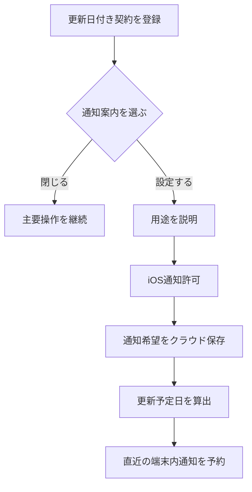
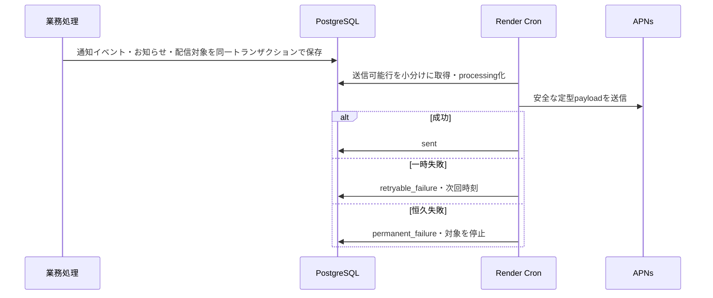

# 設計 — 初回版通知配信

> 2026-07-24変更: SESメール通知と重要連絡先メールの登録・確認・保存を取りやめた。重要連絡はAPNsとアプリ内のお知らせで提供する。
>
> 2026-07-25照合: APNs送信待ちと通知イベントのトランザクションは実装済みだが、業務処理と通知作成は同一トランザクションではない。通常のサーバー通知を9〜20時へ制限する処理も未接続である。両方を完成前の残タスクとする。

## 実装アプローチ

通知を「端末内通知」「サーバー通知」「アプリ内のお知らせ」の3経路へ分ける。契約情報と同期失敗はiPhone内で判定し、別端末の出来事と運営上の重要連絡だけをサーバーへ送る。これにより、更新日前通知のために契約名・金額・更新日を外部配信基盤へ渡さず、OS通知拒否時も重要連絡を確認できる。

完成時のサーバー通知は、業務イベントと通知作成の間で通知を失わないアウトボックス方式とする。現行コードは、通知イベント・アプリ内のお知らせ・配信対象を1つのDBトランザクションで保存するが、認証などの業務処理が成功した後に別処理として呼び出している。通知作成に失敗した場合の再実行を追加し、障害時にも通知を失わない状態を完成条件とする。Render Cronが5分ごとに送信可能な行を小分けに取得し、APNsへ送信する。イベントID・経路・対象の一意制約で重複を防ぎ、失敗は上限付き指数バックオフで再試行する。Redisと常時稼働Workerは初回版では追加しない。

### 実装段階

1. 端末内通知: 更新予定日、更新前、同期失敗、通知許可、状態表示。
2. サーバー通知: 通知希望、お知らせ、新規サインイン、APNs、Web画面。
3. 重要連絡: 削除予定、アプリ内のお知らせ、安全配信コマンド、Render Cron。

本番の通知機能フラグは全段階と配備確認が完了するまでオフとする。画面の一部だけを先行して利用可能にはしない。

### 採用しない方式

- 全通知のサーバー配信: 更新日と同期状態を外部へ広げ、オフライン動作と費用面で不利なため採用しない。
- 全通知の端末内処理: 新規サインイン、削除予定、安全通知を別端末や運営から届けられないため採用しない。
- Web Push: ブラウザ別購読と重複通知の複雑さに対し、初回版の価値が小さいため採用しない。
- メール通知: 通知用PII、確認導線、AWS運用を増やさず、初回版はAPNsとアプリ内のお知らせへ集中するため採用しない。
- 監視から利用者への完全自動一斉配信: 誤報と不適切な説明の影響が大きいため採用しない。
- Redis・常時Worker: 20〜50人のTestFlight規模では運用費と故障点が増えるため採用しない。

## 変更するコンポーネント

| コンポーネント / ファイル                                                                | 変更内容                                                                                 | 対応する受け入れ条件                   |
| ---------------------------------------------------------------------------------------- | ---------------------------------------------------------------------------------------- | -------------------------------------- |
| `apps/web/prisma/schema.prisma`・migration                                               | 通知希望、お知らせ、通知イベント、配信対象、端末APNs情報を追加。更新基準日の意味を明確化 | AC-3, AC-7〜AC-18                      |
| `apps/web/src/config/notifications.ts`                                                   | 日数、時刻、保持、再試行、機能フラグ、資格情報の検証を集約                               | AC-1〜AC-4, AC-12, AC-15〜AC-19        |
| `apps/web/src/domain/notifications/`                                                     | 更新予定日、通知対象、文面、冪等キー、保持判定の純粋ロジック                             | AC-1〜AC-4, AC-9〜AC-18                |
| `apps/web/src/services/notifications.ts`                                                 | テナント境界付き通知データ操作、イベント・お知らせ・配信対象の作成                       | AC-7〜AC-18, AC-21                     |
| `apps/web/src/services/notification-delivery/`                                           | APNs HTTP/2、再試行、無効トークン・恒久失敗処理                                          | AC-10, AC-14〜AC-18                    |
| `apps/web/src/app/api/notification-preferences/`・`notices/`・`devices/[id]/push-token/` | 設定、お知らせ、既読、端末APNs登録API                                                    | AC-6〜AC-11, AC-14, AC-16, AC-18       |
| Apple認証・端末登録・セッション処理                                                      | 新規サインインイベントを初回・更新と区別して作成。失敗時の再実行はT-25で追加             | AC-9, AC-10, AC-15                     |
| アカウント削除・保持処理                                                                 | 削除予定イベント、取消、削除時の通知データ連鎖削除                                       | AC-12, AC-16, AC-18                    |
| `apps/web/scripts/process-notification-deliveries.ts`・`create-safety-notification.ts`   | Cron送信、安全通知のdry-run/apply管理コマンド                                            | AC-13, AC-15, AC-18                    |
| Web設定・ホーム                                                                          | 通知希望、お知らせ、未読重要連絡。Web Pushとメール登録は置かない                         | AC-7, AC-8, AC-11, AC-14, AC-20        |
| iOS通知サービス                                                                          | `UNUserNotificationCenter`許可、端末内予約、取消、APNs登録、deep link                    | AC-2〜AC-7, AC-10, AC-16〜AC-21        |
| iOS設定・ホーム・更新間近・同期                                                          | 状態表示、一度限りの通知案内、お知らせ、重要未読表示                                     | AC-2〜AC-8, AC-10, AC-11, AC-17, AC-20 |
| Render Dashboard設定・運用手順                                                           | 5分Cron、秘密・環境分離、APNs設定、ロールバック                                          | AC-13〜AC-19, AC-21                    |
| `docs/`・`manuals/`・WBS・監査台帳                                                       | 恒久仕様、用語、配備・実機手順、進捗を同期                                               | AC-1〜AC-21                            |

## データ構造の変更

### 既存データ

- `subscriptions.next_renewal_date`は、利用者が入力した更新基準日として扱う。公開済みAPIとの互換期間は`nextRenewalDate`を入力別名として受け、出力に`renewalAnchorDate`と算出済み`upcomingRenewalDate`を追加する。
- 外部配布前にWeb・iOSを新契約へ移行した後、古い別名の削除可否を再判断する。
- 既存`devices`へAPNs情報を追加するが、利用量同期用`token_hash`と混同しない。

### 新しい列挙

```text
NotificationKind
  renewal_reminder | sync_failure | new_sign_in
  account_deletion_scheduled | safety_incident

NotificationChannel
  apns | in_app

NotificationDeliveryStatus
  pending | processing | sent | retryable_failure
  permanent_failure | canceled

NotificationClientState
  not_configured | requesting | active | os_disabled
  preparing | temporary_failure | disabled_on_device
```

`NotificationClientState`はiOSの表示用型であり、DBの単一オン・オフへ潰さない。

### 新規・拡張モデル

| モデル                   | 主な項目                                                                                                              | 目的                                                                                                           |
| ------------------------ | --------------------------------------------------------------------------------------------------------------------- | -------------------------------------------------------------------------------------------------------------- |
| `NotificationPreference` | `userId`, 年額/月額/同期希望, `newSignInPushEnabled`, `updatedAt`                                                     | 利用者単位の希望                                                                                               |
| `Device`拡張             | `pushTokenCiphertext`, `pushTokenFingerprint`, `pushEnvironment`, `notificationDeliveryEnabled`, `pushTokenUpdatedAt` | 端末単位のAPNs配信。平文トークンをログ・レスポンスへ出さない。T-24で配信時間判定用のIANAタイムゾーンを追加する |
| `NotificationNotice`     | `id`, `userId`, `kind`, `templateKey`, 安全な表示引数, `eventAt`, `readAt`, `expiresAt`, `resolvedAt`                 | アプリ内のお知らせ                                                                                             |
| `NotificationEvent`      | `id`, `userId?`, `kind`, `idempotencyKey`, `templateKey`, 安全な引数, `availableAt`, `createdAt`                      | 配信の原因と重複防止                                                                                           |
| `NotificationDelivery`   | `eventId`, `channel`, `targetKey`, `deviceId?`, `status`, `attemptCount`, `nextAttemptAt`, `errorClass`, `sentAt`     | 経路・対象ごとの送信待ちと30日証跡                                                                             |
| `SafetyBroadcast`        | `incidentId`, `templateKey`, `status`, `previewedAt`, `confirmedAt`, `completedAt`                                    | 管理者確認と一斉配信の重複防止                                                                                 |

`targetKey`は端末IDから作る内部値で、APNsトークンを含めない。各配信は`(eventId, channel, targetKey)`を一意にする。ユーザーに紐づく表は完全退会時に連鎖削除する。

### API

- `GET/PATCH /api/notification-preferences`: 機能フラグと利用者単位の希望。秘密値を返さない。
- `PUT/DELETE /api/devices/{id}/push-token`: 認証済み本人端末のAPNs登録・解除。APNs環境とbundle IDをサーバー側設定で固定する。
- `GET /api/notices`: 90日以内の本人のお知らせだけ。
- `POST /api/notices/{id}/read`: 本人のお知らせだけを冪等に既読化。

全変更APIは既存のCSRF・認証・テナント認可を使い、Zodで未知キーを拒否する。

## 主要フロー





## 配信規則

- 年額: 更新予定日の7日前10時。月額: 利用者が追加で有効にした場合だけ1日前10時。
- iOS予約上限を超えないよう、現在時刻に近い最大60件を予約し、契約同期、契約変更、アプリ復帰、タイムゾーン変更時に全件を決定的に再構築する。SubBuddy以外の予約には触れない。
- 同期失敗時は24時間後を仮予約し、成功時に取消。同じ未解決期間は安定したIDで1回だけにする。
- 完成時は通常通知を端末現地時刻9〜20時へ繰り下げ、新規サインインと安全通知だけを即時とする。現行の端末モデルにはタイムゾーンがなく、サーバー配信処理にも時間帯判定が未接続である。T-24でiPhoneのIANAタイムゾーンを端末単位に登録・更新し、配信可能時刻を判定する。
- APNs payloadは種類ごとの定型文だけとし、契約名、金額、更新日、利用量、見直し内容、IP、場所を含めない。
- APNsは発生端末を除く通知対象端末へ送る。重要連絡はAPNsとアプリ内のお知らせを併用する。
- APNsの無効トークン応答は再試行せず停止する。429・5xx・通信失敗は上限付き指数バックオフ、`Retry-After`があれば優先する。
- Cronは失効した`processing`行を再取得できるリース方式とし、途中終了後も送信待ちを失わない。

## 安全通知管理コマンド

1. `--dry-run --incident-id ... --template ...`で対象件数・経路・文面を表示する。
2. 定型テンプレート以外の自由文と、個別ユーザー指定を初回版では受け付けない。
3. 管理者が確認後、同じ引数に`--apply`を付けてイベントを作成する。
4. `incidentId`の一意制約で再実行を安全にする。
5. 出力へユーザーID、端末トークン、契約情報を出さない。

## セキュリティ・プライバシー

- APNsトークンはAES-256-GCMで暗号化し、鍵バージョンを持たせる。検索・重複確認にはHMAC-SHA-256のfingerprintを使う。
- APNs秘密鍵と暗号鍵はRenderの秘密環境変数に置き、リポジトリ、DB、ログへ置かない。
- APNs・Renderへ渡る情報をプライバシー説明へ追加する。通知用メールアドレスは取得・保存しない。
- 配信試行記録は30日後、お知らせは原則90日後に削除する。未解決の削除予定・安全通知は解消まで表示を維持する。

## 影響範囲の分析

### `docs/`更新案

- `product-requirements.md`: 通知5種類の完成条件、初期状態、経路、非スコープ、現行状態を更新。
- `functional-design.md`: ER図・モデル、通知フロー、画面、API、保持、削除、更新予定日の意味を追加。
- `architecture.md`: APNs、Render Cron、アウトボックス、暗号鍵、環境分離、費用を追加。
- `development-guidelines.md`: 通知payload・テンプレート・合成データ・配信コマンドの禁止事項と試験規約を追加。
- `glossary.md`: `CONTEXT.md`で確定した通知用語を同期。
- `repository-structure.md`: 新しいdomain、service、script、iOS通知サービスの配置を反映。

### 既存コード・機能

- 既存のiOS通知設定は無効状態から状態機械へ置き換わる。
- 契約保存・同期成功・アプリ復帰・タイムゾーン変更で通知予約を再構築する。
- Apple認証と端末登録は、新規サインインイベント作成を伴う。認証失敗時は通知イベントを作らない。
- サインアウト・端末失効・完全退会はAPNs資格情報と送信待ちを安全に取消する。
- Webの設定・ホームへ通知項目を追加するが、iPhone向けWebの主要3タブは増やさない。

### 後方互換・マイグレーション

- 新規表と列は既定値またはnullableで追加し、既存ユーザーへ通知を自動で有効化しない。
- `newSignInPushEnabled`は要求上初期オンだが、OS許可と通知対象端末登録がなければ配信されない。既存利用者には用途説明後に端末登録する。
- 契約日のAPIは互換別名を1リリース維持し、Web・iOS更新後に除去可否を判断する。
- 機能フラグをオフに戻すと新しいイベント作成・配信を停止し、既存データ閲覧と退会を妨げない。

## 設計上の前提

- iPhoneが主製品で、Webは正式クライアントだがWeb Pushは初回版に含めない。
- RenderとApple管理のAPNsを利用し、メール配信サービスは使わない。
- TestFlightは20〜50人で、5分以内のサーバー通知遅延を許容する。
- 更新日は利用者入力であり、SubBuddyが請求事業者から確定情報を取得するものではない。
- APNsは到達を保証しないため、重要連絡はアプリ内表示を正本とする。
- 通知上の判断操作、トライアル、月次ダイジェストは後続版であり、本作業に混ぜない。

## 関連ADR

- `docs/adr/0014-ship-basic-renewal-reminders-in-initial-release.md`
- `docs/adr/0015-split-local-and-server-notification-responsibilities.md`
- `docs/adr/0016-request-notification-permission-in-context.md`
- `docs/adr/0017-derive-renewal-dates-without-overwriting-user-input.md`
- `docs/adr/0018-keep-server-notices-in-a-minimal-in-app-inbox.md`
- `docs/adr/0020-require-human-confirmation-for-safety-broadcasts.md`
- `docs/adr/0021-defer-web-push-notifications.md`
- `docs/adr/0022-separate-user-notification-preferences-from-device-delivery.md`
- `docs/adr/0024-minimize-notification-delivery-records.md`
