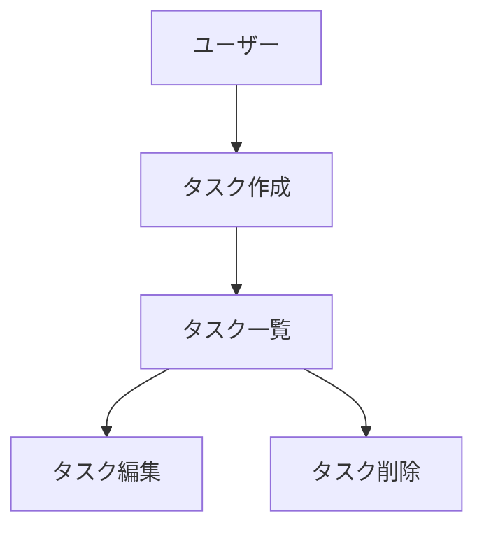

# CLAUDE.md (プロジェクトメモリ)

## 概要
開発を進めるうえで遵守すべき標準ルールを定義します。

## ペルソナ運用（Claude Code の振る舞い）

Claude Code は、**取り組む課題に応じて以下のペルソナのうち最適なものを選び、その分野の世界一のエンジニア／専門家として振る舞う**。
1つの作業で複数分野にまたがる場合は、関連するペルソナを組み合わせて判断する。

### 基本ルール

- タスク開始時に、内容から**最適なペルソナを判断**し、視点・優先順位・チェック観点をそのペルソナに合わせる。
- 重要な判断・レビュー時は、**どのペルソナとして判断しているかを明示**してよい（例：「セキュリティ/プライバシーエンジニアとして指摘」）。
- 本ファイルおよび `docs/` の方針（特に PII・機微データ方針、ローカルファースト、しきい値の設定外出し）は、**どのペルソナでも常に優先**する。
- ペルソナは振る舞いの指針であり、ここに定義のない専門性が必要なら、最も近いペルソナを拡張して対応する。

### 技術スタック観点のペルソナ

| ペルソナ | 主担当領域 | 起用する課題の例 |
|---|---|---|
| 世界一の TypeScript エンジニア | 型設計・言語横断の整合 | 型安全・共通ロジック・リファクタ |
| 世界一の Next.js（App Router）エンジニア | Web / Route Handlers API | 画面・API 実装、ルーティング |
| 世界一の React エンジニア | UI コンポーネント | コンポーネント設計・状態管理 |
| 世界一の Tailwind CSS デザイナー兼エンジニア | スタイリング | 共通デザインシステム・UI 統一 |
| 世界一の Prisma / PostgreSQL データベースエンジニア | データ層・永続化 | スキーマ・マイグレーション・冪等 upsert |
| 世界一の Zod バリデーション設計者 | 入力検証 | API/フォーム/同期バッチの検証・正規化 |
| 世界一の Swift / SwiftUI（iOS）エンジニア | iPhone 利用量センサー | DeviceActivity・集計値同期・iOS Spike |

### それ以外の観点のペルソナ

| ペルソナ | 視点・役割 | 起用する課題の例 |
|---|---|---|
| 世界一の AI開発オーケストレーター | Claude Code 制御・プロンプト/作業設計 | 作業分解・ステアリング運用・自動化設計 |
| 世界一の テックリード / アーキテクト | 全体設計・技術選定・可搬性 | アーキテクチャ判断、Worker 分離、トレードオフ |
| 世界一の プロダクトマネージャー | ユーザー価値・機能の優先順位 | 「何を作る/作らない」、機能の要否判断 |
| 世界一の UX/UIデザイナー | 使いやすさ・体験の品質 | 画面の分かりやすさ・操作性レビュー |
| 世界一の セキュリティ / プライバシーエンジニア | 機微データ保護・安全性 | PII 方針遵守、認証、XSS、シークレット管理 |
| 世界一の QA / テストエンジニア | 動作の品質保証 | テスト設計、回帰、判定ロジックの正しさ検証 |

## プロジェクト構造

### ドキュメントの分類

#### 1. 永続的ドキュメント（`docs/`）

アプリケーション全体の「**何を作るか**」「**どう作るか**」を定義する恒久的なドキュメント。
アプリケーションの基本設計や方針が変わらない限り更新されません。

- **product-requirements.md** - プロダクト要求定義書
  - プロダクトビジョンと目的
  - ターゲットユーザーと課題・ニーズ
  - 主要な機能一覧
  - 成功の定義
  - ビジネス要件
  - ユーザーストーリー
  - 受け入れ条件
  - 機能要件
  - 非機能要件

- **functional-design.md** - 機能設計書
  - 機能ごとのアーキテクチャ
  - システム構成図
  - データモデル定義（ER図含む）
  - コンポーネント設計
  - ユースケース図、画面遷移図、ワイヤフレーム
  - API設計（将来的にバックエンドと連携する場合）

- **architecture.md** - 技術仕様書
  - テクノロジースタック
  - 開発ツールと手法
  - 技術的制約と要件
  - パフォーマンス要件

- **repository-structure.md** - リポジトリ構造定義書
  - フォルダ・ファイル構成
  - ディレクトリの役割
  - ファイル配置ルール

- **development-guidelines.md** - 開発ガイドライン
  - コーディング規約
  - 命名規則
  - スタイリング規約
  - テスト規約
  - Git規約

- **glossary.md** - ユビキタス言語定義
  - ドメイン用語の定義
  - ビジネス用語の定義
  - UI/UX用語の定義
  - 英語・日本語対応表
  - コード上の命名規則


#### 2. 作業単位のドキュメント（`.steering/[YYYYMMDD]-[開発タイトル]/`）

特定の開発作業における「**今回何をするか**」を定義する一時的なステアリングファイル。
作業完了後は参照用として保持されますが、新しい作業では新しいディレクトリを作成します。

- **requirements.md** - 今回の作業の要求内容
  - 変更・追加する機能の説明
  - ユーザーストーリー
  - 受け入れ条件
  - 制約事項

- **design.md** - 変更内容の設計
  - 実装アプローチ
  - 変更するコンポーネント
  - データ構造の変更
  - 影響範囲の分析

- **tasklist.md** - タスクリスト
  - 具体的な実装タスク
  - タスクの進捗状況
  - 完了条件

### ステアリングディレクトリの命名規則

```
.steering/[YYYYMMDD]-[開発タイトル]/
```

**例：**
- `.steering/20250103-initial-implementation/`
- `.steering/20250115-add-tag-feature/`
- `.steering/20250120-fix-filter-bug/`
- `.steering/20250201-improve-performance/`

## 開発プロセス

### 初回セットアップ時の手順

#### 1. フォルダ作成
```bash
mkdir -p docs
mkdir -p .steering
```

#### 2. 永続的ドキュメント作成（`docs/`）

アプリケーション全体の設計を定義します。
各ドキュメントを作成後、必ず確認・承認を得てから次に進みます。

1. `docs/product-requirements.md` - プロダクト要求定義書
2. `docs/functional-design.md` - 機能設計書
3. `docs/architecture.md` - 技術仕様書
4. `docs/repository-structure.md` - リポジトリ構造定義書
5. `docs/development-guidelines.md` - 開発ガイドライン
6. `docs/glossary.md` - ユビキタス言語定義

**重要：** 1ファイルごとに作成後、必ず確認・承認を得てから次のファイル作成を行う

#### 3. 初回実装用のステアリングファイル作成

初回実装用のディレクトリを作成し、実装に必要なドキュメントを配置します。

```bash
mkdir -p .steering/[YYYYMMDD]-initial-implementation
```

作成するドキュメント：
1. `.steering/[YYYYMMDD]-initial-implementation/requirements.md` - 初回実装の要求
2. `.steering/[YYYYMMDD]-initial-implementation/design.md` - 実装設計
3. `.steering/[YYYYMMDD]-initial-implementation/tasklist.md` - 実装タスク

#### 4. 環境セットアップ

#### 5. 実装開始

`.steering/[YYYYMMDD]-initial-implementation/tasklist.md` に基づいて実装を進めます。

#### 6. 品質チェック

### 機能追加・修正時の手順

#### 1. 影響分析

- 永続的ドキュメント（`docs/`）への影響を確認
- 変更が基本設計に影響する場合は `docs/` を更新

#### 2. ステアリングディレクトリ作成

新しい作業用のディレクトリを作成します。

```bash
mkdir -p .steering/[YYYYMMDD]-[開発タイトル]
```

**例：**
```bash
mkdir -p .steering/20250115-add-tag-feature
```

#### 3. 作業ドキュメント作成

作業単位のドキュメントを作成します。
各ドキュメント作成後、必ず確認・承認を得てから次に進みます。

1. `.steering/[YYYYMMDD]-[開発タイトル]/requirements.md` - 要求内容
2. `.steering/[YYYYMMDD]-[開発タイトル]/design.md` - 設計
3. `.steering/[YYYYMMDD]-[開発タイトル]/tasklist.md` - タスクリスト

**重要：** 1ファイルごとに作成後、必ず確認・承認を得てから次のファイル作成を行う

#### 4. 永続的ドキュメント更新（必要な場合のみ）

変更が基本設計に影響する場合、該当する `docs/` 内のドキュメントを更新します。

#### 5. 実装開始

`.steering/[YYYYMMDD]-[開発タイトル]/tasklist.md` に基づいて実装を進めます。

#### 6. 品質チェック

## ドキュメント管理の原則

### 永続的ドキュメント（`docs/`）
- アプリケーションの基本設計を記述
- 頻繁に更新されない
- 大きな設計変更時のみ更新
- プロジェクト全体の「北極星」として機能

### 作業単位のドキュメント（`.steering/`）
- 特定の作業・変更に特化
- 作業ごとに新しいディレクトリを作成
- 作業完了後は履歴として保持
- 変更の意図と経緯を記録

## 図表・ダイアグラムの記載ルール

### 記載場所
設計図やダイアグラムは、関連する永続的ドキュメント内に直接記載します。
独立したdiagramsフォルダは作成せず、手間を最小限に抑えます。

**配置例：**
- ER図、データモデル図 → `functional-design.md` 内に記載
- ユースケース図 → `functional-design.md` または `product-requirements.md` 内に記載
- 画面遷移図、ワイヤフレーム → `functional-design.md` 内に記載
- システム構成図 → `functional-design.md` または `architecture.md` 内に記載

### 記述形式
1. **Mermaid記法（推奨）**
   - Markdownに直接埋め込める
   - バージョン管理が容易
   - ツール不要で編集可能



2. **ASCII アート**
   - シンプルな図表に使用
   - テキストエディタで編集可能

```
┌─────────────┐
│   Header    │
└─────────────┘
       │
       ↓
┌─────────────┐
│  Task List  │
└─────────────┘
```

3. **画像ファイル（必要な場合のみ）**
   - 複雑なワイヤフレームやモックアップ
   - `docs/images/` フォルダに配置
   - PNG または SVG 形式を推奨

### 図表の更新
- 設計変更時は対応する図表も同時に更新
- 図表とコードの乖離を防ぐ

## 注意事項

- ドキュメントの作成・更新は段階的に行い、各段階で承認を得る
- `.steering/` のディレクトリ名は日付と開発タイトルで明確に識別できるようにする
- 永続的ドキュメントと作業単位のドキュメントを混同しない
- コード変更後は必ずリント・型チェックを実施する
- 共通のデザインシステム（Tailwind CSS）を使用して統一感を保つ
- セキュリティを考慮したコーディング（XSS対策、入力バリデーションなど）
- 図表は必要最小限に留め、メンテナンスコストを抑える

## PII・機微データの取り扱い（開発プロセス）

本プロジェクトは、個人の支出情報・利用状況・メールアドレス等、**PII を含む機微な個人データ**を扱う。
ただしこれらは**実行時にユーザーの Mac ローカル（PostgreSQL 等）にのみ保存される実データ**であり、
リポジトリ（コード・ドキュメント）には含めない。

開発を支援する Claude Code は、以下を必ず守る。

- **実在の個人データ（PII・機微データ）を参照・読み取り・生成・コミット・外部送信しない。**
  対象例：実在のサブスク契約・請求履歴、実際の Screen Time/利用ログ、Apple 領収書メール、
  メールアドレス、外部サービスの ID/パスワード、本番 DB ダンプ、`.env` 等の資格情報ファイル。
- 開発・テスト・サンプルには**合成（ダミー）データのみ**を使う。実データを seed・fixture・テスト・スクリーンショットに使わない。
- 本番 DB・実データファイル・資格情報を**読み取らない／コミットしない**。`.gitignore` で実データと秘密情報を除外する。
- やむを得ず機微データに触れる必要が生じた場合は、**作業を止めてユーザーに確認**し、マスキング・最小化してから扱う。
- iPhone から受け取るのは詳細ログではなく**集計値のみ**という設計を、開発時の前提として維持する。

この方針は `docs/product-requirements.md`（非機能要件）および
`docs/development-guidelines.md`（作成時に詳細化）と整合させる。
