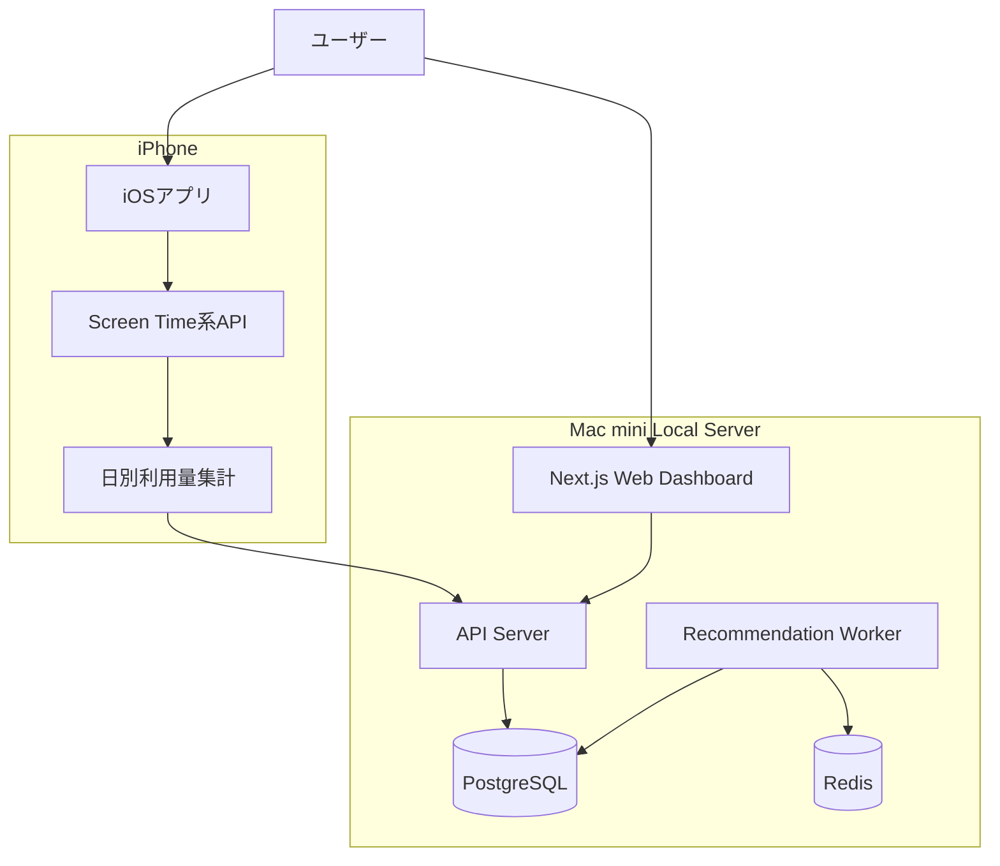
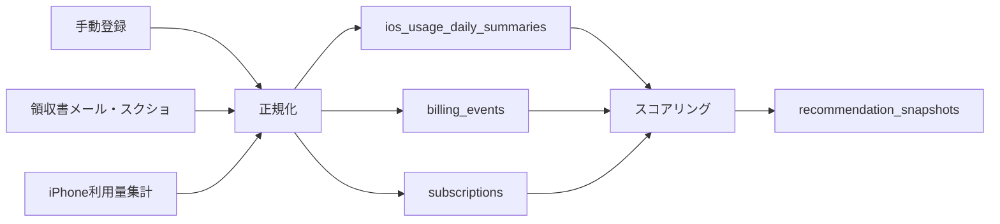

# Claude Code 引き継ぎ書：サブスクリプション利用量モニタリング・解約判断支援アプリ

## 0. この引き継ぎ書の目的

この文書は、Claude Code に新規プロジェクトとして開発を引き継ぐための初期資料である。

重要な前提として、以前作成した Codex 向け資材は使用しない。Claude Code に以下の方針で、プロジェクト文書と実装を新規作成してもらう。

- Claude Code 用の `CLAUDE.md` の運用方針に従う
- まず `docs/` に永続的ドキュメントを作る
- 次に `.steering/[YYYYMMDD]-initial-implementation/` に作業単位ドキュメントを作る
- 各ドキュメントを作成したら、ユーザーの確認・承認を得てから次へ進む
- いきなり実装せず、要求定義・設計・タスクリストを明確化してから実装する

---

## 1. プロダクト概要

### 1.1 アプリ名（仮）

候補：

- Subscription Watch
- サブスク棚卸しAI
- 使ってる？サブスク

開発上の仮称は **Subscription Watch** とする。

### 1.2 一文説明

インターネット経由で契約しているサブスクリプションについて、料金・更新日・利用量をもとに、継続・解約検討・ダウングレード検討・様子見を提案するローカルファーストの個人用アプリ。

### 1.3 解決したい課題

ユーザーは、以下のような問題を抱えている。

- 契約中のサブスクリプションを把握しきれない
- 使っていないサブスクに支払い続けている
- 無料体験後の課金や年額更新に気づきにくい
- 月額では安く見えても、年換算では大きな支出になっている
- 類似サービスが重複している
- 解約すべきか、継続すべきか、判断材料が足りない
- iPhoneアプリの課金やWeb経由のサブスクを横断して見直したい

### 1.4 プロダクトの価値

このアプリの価値は、単なるサブスク一覧管理ではない。

中心価値は次の一点である。

> 払っている金額に対して、実際に使っているかを可視化し、次回更新前に判断を促す。

---

## 2. プロダクト思想

### 2.1 ローカルファースト

このアプリは、まず個人利用のローカルファーストアプリとして設計する。

理由：

- サブスク情報は個人の支出情報であり機微性が高い
- iPhone上の利用傾向はプライバシー性が高い
- 初期MVPではSaaS化する必要がない
- Mac miniを所有しており、ローカルサーバーとして利用できる
- クラウドに支出・利用履歴を預けずに開始できる

基本方針：

```text
iPhone:
  利用量を取得・集計するセンサー

Mac mini:
  DB、API、Webダッシュボード、レコメンドWorker

クラウド:
  最初は使わない
  必要になった部分だけ後から追加
```

### 2.2 完全自動化ではなく半自動から始める

最初からすべてのサブスクを完全自動取得する設計にはしない。

理由：

- Apple ID配下の全サブスク一覧を第三者アプリが横断取得する前提は非現実的
- Amazon、新聞、動画、音楽、AIツールなど、サービスごとに取得制約が異なる
- スクレイピングや自動ログインはセキュリティ・規約・保守性の問題が大きい
- 初期価値は、手動登録と利用量推定だけでも出せる

MVPでは以下を優先する。

```text
1. 手動登録
2. 更新日管理
3. iPhone利用量の自動・半自動取得
4. 利用日数・利用バケットの集計
5. 1利用日あたり単価
6. 解約候補ランキング
7. 更新日前レビュー
```

### 2.3 AIは判断の主役にしない

解約判断をAIに丸投げしない。

判断は、ルールベースのスコアリングで行う。

AIは、以下の補助用途に限定する。

- レコメンド理由文の自然文生成
- 月次レポート文面の生成
- 領収書メールやスクリーンショットからの情報抽出
- サービス名の表記揺れ正規化

初期MVPではAI連携なしでも成立するようにする。

### 2.4 自動解約はしない

このアプリは解約代行アプリではない。

やること：

- 解約検討を提案する
- 公式の解約導線をメモ・表示する
- 更新日前に判断を促す

やらないこと：

- ユーザーの代わりに自動で解約する
- Apple ID、Amazonアカウント、各種サービスのID/パスワードを保存する
- 自動ログインして解約処理を実行する

---

## 3. 対象ユースケース

### 3.1 対象にするサブスクリプション

インターネット経由で契約・登録しているサブスクリプションを対象とする。

例：

- iPhoneアプリのApp Store課金
- Amazon Music
- Amazon Prime
- 日経新聞電子版
- 動画配信サービス
- AIツール
- クラウドストレージ
- 学習サービス
- Todo / メモ / 家計簿などの有料アプリ
- Web経由で契約したSaaS
- 有料ニュースレター
- 電子書籍・雑誌読み放題サービス

### 3.2 対象外にするもの

以下はプロダクト方針上、対象外または後回しとする。

- ニュース、ブログ、SNSのキュレーション
- 自動解約代行
- サービスへの自動ログイン
- 銀行APIやクレジットカードAPIの本格連携
- Apple IDからの全サブスク横断取得
- App Store Server APIによるユーザー全体の課金取得
- Amazonアカウントのスクレイピング
- 詳細なiPhone Screen Timeデータの外部送信
- 家族全員のサブスク統合管理
- SaaSとしての多ユーザー公開

---

## 4. Apple関連サービスの扱い

ユーザーはiPhoneユーザーであり、Mac miniも所有している。ただし、以下のAppleサービスは利用しないため、設計から外す。

### 4.1 明示的に対象外

以下は設計・実装・サンプル・レコメンド対象に含めない。

```text
対象外:
  - Apple Music
  - Apple TV+
  - Apple Arcade
  - Apple One
```

補足：

- 音楽はApple Musicではなく Amazon Music を利用する
- Apple TV+、Apple Arcade、Apple Oneは利用しない
- MusicKit連携は不要
- Apple TV+視聴履歴推定は不要
- Apple Arcade横断集計は不要
- Apple Oneの分解評価は不要

### 4.2 Apple関連で対象に残すもの

Apple関連をすべて外すわけではない。

以下は対象に残す。

```text
対象:
  - App Store経由の個別アプリ課金
  - iPhone上で利用しているサブスクアプリ
  - iCloud+ ※契約がある場合のみ
  - Apple領収書メール ※App Store個別アプリ課金の請求検出用途
```

### 4.3 iCloud+の扱い

iCloud+はScreen Timeでは価値判断できない。

iCloud+は、利用時間ではなく以下で判断する。

- 契約プラン
- 使用容量
- 無料枠との差分
- 家族共有の有無
- バックアップ利用の有無
- 下位プランで足りるか

取得方法は、初期MVPでは手動入力またはスクリーンショット読取を想定する。

---

## 5. iPhone利用量取得の設計方針

### 5.1 目的

iPhone上で使っているサブスクアプリについて、利用日数・利用量の概算・最終利用日を取得し、解約判断の材料にする。

### 5.2 重要な制約

iOSでは、Androidのように全アプリの詳細利用ログを自由に読み取る設計はできない。

したがって、以下の方針を取る。

```text
正しい設計:
  iPhone上で対象アプリ・Webドメインをユーザーが選択する
  Screen Time系APIで日別・バケット単位の利用量を推定する
  Mac miniには集計値だけ送信する

避ける設計:
  詳細なScreen TimeデータをMac miniへ丸ごと送る
  全アプリ一覧・全利用ログを自由取得できる前提にする
  Appleサービス内部の視聴履歴・再生履歴を勝手に取得する
```

### 5.3 利用する可能性のあるiOS API

iOS側では、以下のAppleフレームワークを検討する。

- FamilyControls
- FamilyActivityPicker
- DeviceActivity
- DeviceActivityMonitor Extension
- DeviceActivityReport Extension
- ManagedSettings（初期MVPでは原則不要）

ただし、初期実装前に必ずSpikeを行う。

### 5.4 取得するデータ粒度

Mac miniへ送信するデータは、詳細ログではなく集計値とする。

例：

```json
{
  "subscriptionId": "sub_amazon_music",
  "date": "2026-05-30",
  "used": true,
  "usageBucket": "30m_plus",
  "estimatedMinutesMin": 30,
  "estimatedMinutesMax": 59,
  "source": "ios_device_activity"
}
```

利用バケット例：

```text
none
1m_plus
5m_plus
15m_plus
30m_plus
60m_plus
120m_plus
```

### 5.5 iOS Spikeで確認すること

iOS実装に入る前に、以下を検証する。

- Family Controls entitlementの取得可否
- iPhone実機でのindividual authorization
- FamilyActivityPickerで対象アプリ・Webドメインを選択できるか
- DeviceActivityMonitor Extensionが発火するか
- 1分、5分、15分などのしきい値イベントが動くか
- 端末再起動後・アプリ再起動後の挙動
- DeviceActivityReport Extensionの表示可否
- Mac miniへ送るべき集計値の粒度
- App Review上問題がない用途説明になっているか

---

## 6. 実行環境方針

### 6.1 主開発環境

主開発環境はMac miniとする。

```text
Mac mini:
  - macOS
  - VS Code
  - Claude Code
  - Docker / Dev Container ※必要なら
  - Xcode
  - iOS実機検証
```

Codexは利用しない。

Claude Codeに新規作成してもらう。

### 6.2 Apple ID分離方針

Mac miniではOpenClawも利用しており、セキュリティ上の理由で通常ユーザーにApple IDを入れていない。

そのため、Apple IDを使う場合は以下の方針にする。

```text
推奨:
  今回アプリ専用のmacOS標準ユーザーを作る
  そのユーザーでXcodeだけにApple IDを登録する

非推奨:
  通常ユーザーにApple IDを入れる
  OpenClawとApple IDを同じユーザー空間で混ぜる
  /Users/Shared に作業フォルダを置く
```

構成例：

```text
Mac mini
  ├─ main ユーザー
  │   ├─ OpenClaw
  │   └─ Apple IDなし
  │
  └─ subwatch-dev ユーザー
      ├─ Claude Code
      ├─ VS Code
      ├─ Xcode
      ├─ Docker / Dev Container
      └─ XcodeにだけApple IDを登録
```

### 6.3 実行環境

初期MVPはローカルファーストで実行する。

```text
Mac mini:
  - Webダッシュボード
  - APIサーバー
  - Worker
  - PostgreSQL
  - Redis

iPhone:
  - iOSアプリ
  - 利用量のオンデバイス集計
  - Mac miniへの集計値同期
```

クラウドは初期MVPでは不要。

必要になったら以下を検討する。

- Tailscale
- Cloudflare Tunnel
- CloudKit
- APNs
- LLM API
- クラウドDB / クラウドAPI

---

## 7. 技術スタック案

### 7.1 Web / Backend

推奨スタック：

```text
言語:
  TypeScript

Web:
  Next.js App Router

UI:
  React
  Tailwind CSS
  shadcn/ui ※必要に応じて

API:
  Next.js Route Handlers
  または Fastify
  MVPではNext.js内にまとめてもよい

DB:
  PostgreSQL

ORM:
  Prisma

Queue / Worker:
  BullMQ + Redis
  またはMVPではnode-cronから開始

認証:
  個人利用MVPではローカル認証または簡易認証
  将来はAuth.js / Clerk / Supabase Auth等を検討

テスト:
  Vitest
  Testing Library
  Playwright ※E2Eが必要になった段階で追加
```

### 7.2 iOS

```text
言語:
  Swift

UI:
  SwiftUI

利用量取得:
  FamilyControls
  DeviceActivity
  DeviceActivityMonitor Extension
  DeviceActivityReport Extension

ローカル保存:
  SwiftData
  またはSQLite

同期:
  Mac mini APIへHTTPS送信
  もしくは将来的にCloudKit
```

### 7.3 Mac miniローカル実行

```text
Container:
  Docker / Docker Compose ※必要に応じて

DB:
  PostgreSQL

Cache / Queue:
  Redis

Worker:
  Node.js Worker

Local URL:
  http://localhost:3000
  http://localhost:3001
```

### 7.4 将来のAI利用

初期MVPではAI不要。

将来追加する場合：

- レコメンド理由文生成
- 領収書メール解析
- スクリーンショット読取結果の正規化
- 月次レポート生成

ただし、機微情報をLLMに送る場合は最小化する。

---

## 8. アーキテクチャ案

### 8.1 全体構成



### 8.2 データ取得方針



---

## 9. 主要データモデル

### 9.1 subscriptions

サブスク本体。

主な項目：

- id
- user_id
- name
- normalized_name
- category
- amount
- currency
- billing_cycle
- next_renewal_date
- signup_channel
- status
- importance
- cancellation_url
- notes
- created_at
- updated_at

### 9.2 billing_events

請求イベント。

主な項目：

- id
- user_id
- subscription_id
- service_name_raw
- amount
- currency
- charged_at
- billing_cycle
- source
- confidence
- raw_reference
- created_at

### 9.3 ios_usage_daily_summaries

iPhoneから送る日別利用量サマリ。

主な項目：

- id
- user_id
- subscription_id
- usage_date
- used
- usage_bucket
- estimated_minutes_min
- estimated_minutes_max
- source
- confidence
- created_at

### 9.4 recommendation_snapshots

レコメンド結果の履歴。

主な項目：

- id
- user_id
- subscription_id
- decision
- cancel_score
- monthly_amount
- yearly_amount
- usage_days_30d
- usage_minutes_30d
- days_since_last_use
- days_until_renewal
- cost_per_usage_day
- has_overlap
- reason
- generated_at

### 9.5 service_catalog

サービス名の正規化辞書。

主な項目：

- id
- canonical_name
- category
- domains
- app_bundle_ids
- common_aliases
- cancellation_url
- is_supported
- is_excluded
- notes

---

## 10. レコメンドエンジン

### 10.1 基本方針

解約判断はルールベースで行う。

AIは初期MVPでは使わない。

### 10.2 判定カテゴリ

```text
keep:
  継続

review:
  様子見

consider_downgrade:
  ダウングレード検討

consider_cancel:
  解約検討

strong_cancel_candidate:
  強い解約候補
```

### 10.3 スコア要素

- 未使用日数
- 過去30日の利用日数
- 過去30日の利用バケット
- 月額料金
- 年換算料金
- 更新日までの日数
- 年額更新かどうか
- 同カテゴリ重複の有無
- ユーザー設定の重要度
- iCloud+のような容量ベース評価の有無

### 10.4 例

```text
30日以上未使用 + 月額1,000円以上:
  解約検討

60日以上未使用:
  強い解約候補

同カテゴリに複数サービスがあり、片方が低利用:
  低利用側を解約検討

利用は少ないが重要度が高い:
  様子見

容量が余っているiCloud+:
  ダウングレード検討
```

---

## 11. MVPスコープ

### 11.1 初期MVPで作るもの

- サブスク手動登録
- サブスク一覧
- 月額・年額合計
- 更新日管理
- 利用イベントまたは日別利用サマリの手動入力
- 解約候補スコア
- レコメンド結果表示
- 更新日前レビュー
- 1利用日あたり単価
- 対象外Appleサービスを登録候補に出さない
- Amazon Musicを音楽カテゴリの実利用サービスとして扱う
- App Store個別アプリ課金を対象にする
- iCloud+は契約がある場合のみ手動管理

### 11.2 初期MVPで作らないもの

- Apple Music連携
- MusicKit連携
- Apple TV+視聴履歴推定
- Apple Arcade横断集計
- Apple One分解評価
- 自動解約
- Apple IDからの全サブスク一覧取得
- Amazon自動ログイン
- 銀行API / クレカAPI連携
- Gmail本格連携
- iOS Screen Time本実装
- 家族共有
- SaaS公開

### 11.3 iOSはSpikeから始める

iOSのScreen Time連携は初期MVP本体に混ぜず、別ステアリングでSpikeする。

例：

```text
.steering/[YYYYMMDD]-ios-screen-time-spike/
  requirements.md
  design.md
  tasklist.md
```

---

## 12. 推奨リポジトリ構成

Claude Codeに最初に作ってほしい構成例。

```text
subscription-watch/
  CLAUDE.md

  docs/
    product-requirements.md
    functional-design.md
    architecture.md
    repository-structure.md
    development-guidelines.md
    glossary.md

  .steering/
    [YYYYMMDD]-initial-implementation/
      requirements.md
      design.md
      tasklist.md

  apps/
    web/
    api/
    worker/
    ios/

  packages/
    db/
    scoring/
    shared/
    ai/

  prisma/
    schema.prisma

  scripts/
  tests/
  .env.example
  package.json
  pnpm-workspace.yaml
```

MVPでは `apps/api` と `apps/worker` を分けず、Next.js内で始めてもよい。  
ただし、将来Workerを分離しやすい構造にする。

---

## 13. Claude Codeへの初回指示

Claude Codeには、まず以下を依頼する。

```text
このプロジェクトは、サブスクリプション利用量モニタリング・解約判断支援アプリです。

以前のCodex向け資材は使いません。
この引き継ぎ書とCLAUDE.mdの運用方針に従って、新規にプロジェクト文書と実装を作成してください。

最初にやること:
1. CLAUDE.md の運用方針を読む
2. docs/ 配下の永続的ドキュメントを作成する
3. 1ファイル作成するごとに、私の確認・承認を待つ
4. docs/ が揃ったら .steering/[YYYYMMDD]-initial-implementation/ を作成する
5. requirements.md、design.md、tasklist.md を順に作る
6. それぞれ私の承認を得てから実装に進む

必ず守ること:
- いきなり実装しない
- Codex向け資材は使わない
- Apple Music / Apple TV+ / Apple Arcade / Apple One は対象外にする
- 音楽カテゴリは Amazon Music を実利用サービスとして扱う
- App Store個別アプリ課金は対象にする
- iCloud+ は契約がある場合のみ手動・容量ベースで扱う
- iPhone利用量は詳細ログではなく日別・バケット単位の集計値として扱う
- 自動解約機能は作らない
- 外部サービスのID/パスワードを保存しない
- 初期MVPはローカルファーストで設計する
```

---

## 14. Claude Codeに最初に作らせる `docs/product-requirements.md` の期待内容

最初に作る永続的ドキュメントは `docs/product-requirements.md` とする。

含めるべき内容：

- プロダクトビジョン
- 解決する課題
- ターゲットユーザー
- 対象サブスクリプション
- 対象外サブスクリプション
- Appleサービス対象外リスト
- ユーザーストーリー
- MVPスコープ
- 非MVPスコープ
- 成功条件
- 受け入れ条件

作成後、Claudeは実装に進まず、ユーザーの承認を待つ。

---

## 15. セキュリティ・プライバシー方針

### 15.1 基本方針

- 個人利用を前提に、ローカルファーストで作る
- 支出情報・利用情報はMac miniローカルに保存する
- iPhoneから送るのは詳細ログではなく集計値だけにする
- 外部アカウントのID/パスワードは保存しない
- 自動解約しない
- Apple IDは専用macOSユーザーのXcodeにだけ登録する運用を推奨する

### 15.2 保存しない情報

- Apple IDのパスワード
- AmazonのID/パスワード
- Gmailのメール全文
- iPhoneの詳細Screen Timeログ
- 全ブラウザ履歴
- 他プロジェクトや個人ファイル

### 15.3 将来の外部連携時の注意

将来GmailやLLMを使う場合は、以下を守る。

- 最小権限
- 明示的同意
- 抽出済み構造化データのみ保存
- メール全文の長期保存を避ける
- LLMに送る情報を最小化する

---

## 16. 開発の進め方

### 16.1 初回

1. `CLAUDE.md` を作成または既存のClaude運用ファイルを置く
2. この引き継ぎ書をClaudeに渡す
3. `docs/product-requirements.md` を作成
4. ユーザー確認
5. `docs/functional-design.md` を作成
6. ユーザー確認
7. `docs/architecture.md` を作成
8. ユーザー確認
9. `docs/repository-structure.md` を作成
10. ユーザー確認
11. `docs/development-guidelines.md` を作成
12. ユーザー確認
13. `docs/glossary.md` を作成
14. ユーザー確認
15. `.steering/[YYYYMMDD]-initial-implementation/requirements.md` を作成
16. ユーザー確認
17. `.steering/[YYYYMMDD]-initial-implementation/design.md` を作成
18. ユーザー確認
19. `.steering/[YYYYMMDD]-initial-implementation/tasklist.md` を作成
20. ユーザー確認
21. 実装開始

### 16.2 実装時

- 変更前に対象ファイルと方針を説明する
- 小さな単位で実装する
- 実装後にlint、typecheck、testを実行する
- 結果を報告する
- 仕様変更があれば `docs/` または `.steering/` を更新する

---

## 17. 成功条件

初期MVPの成功条件：

- サブスクを手動登録できる
- 月額・年額の合計が見える
- 更新日が管理できる
- 利用日数または日別利用サマリを登録できる
- 1利用日あたり単価が表示される
- 解約候補スコアが計算される
- 継続・様子見・ダウングレード検討・解約検討・強い解約候補を表示できる
- Apple Music / Apple TV+ / Apple Arcade / Apple One が対象外として扱われる
- Amazon Musicが音楽カテゴリの実利用サービスとして扱われる
- App Store個別アプリ課金が対象として扱われる
- iCloud+は利用している場合のみ容量ベースで扱える
- データはMac miniローカルに保存される
- 自動解約や外部アカウントのパスワード保存を行わない

---

## 18. 最重要注意点

Claude Codeは、以下を必ず守る。

```text
1. いきなり実装しない
2. docs/ を先に作る
3. 1ファイルごとにユーザー承認を待つ
4. .steering/ を作ってから実装する
5. Codex向け資材は使わない
6. Apple Music / Apple TV+ / Apple Arcade / Apple One を設計に入れない
7. iPhone利用量は詳細ログではなく集計値で扱う
8. 自動解約機能は作らない
9. 外部サービスのパスワードは保存しない
10. 初期MVPはローカルファーストで作る
```
