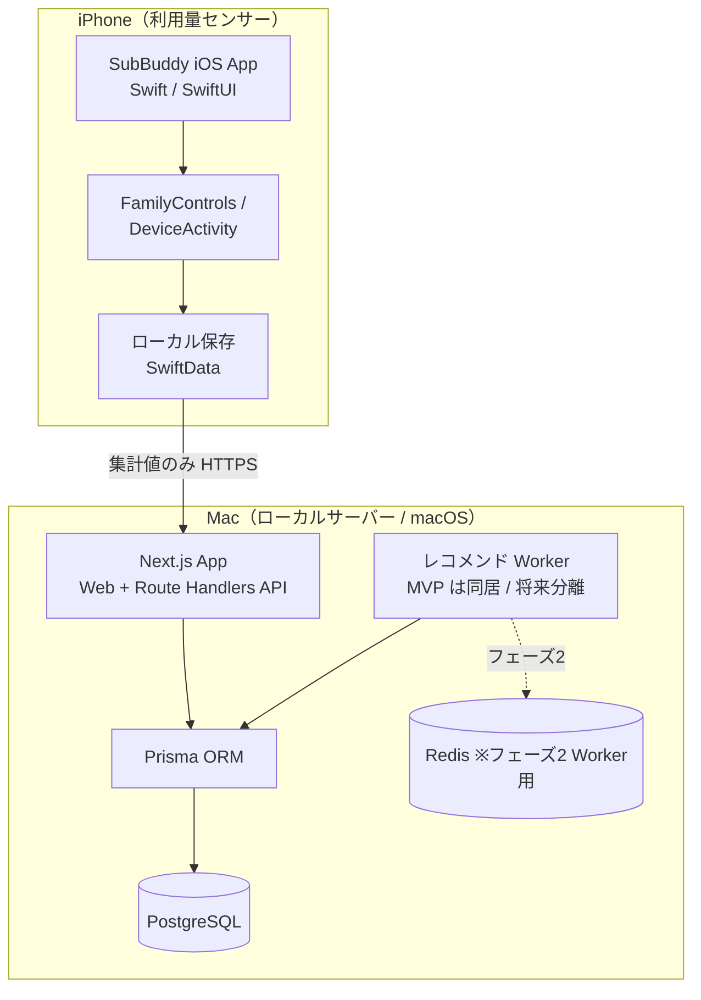
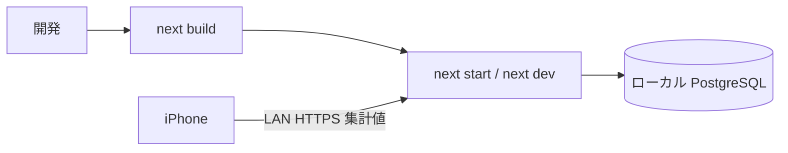
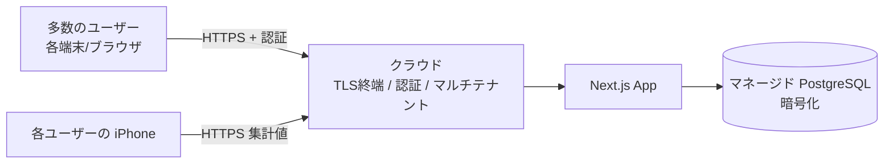

# 技術仕様書（Architecture）

> プロジェクト名 / アプリ名：**SubBuddy**
> ドキュメント種別：永続的ドキュメント（`docs/`）
> 最終更新：2026-06-02
> 関連：`product-requirements.md`（要求）、`functional-design.md`（機能設計）、`repository-structure.md`（構成）、`development-guidelines.md`（開発規約）、`glossary.md`（用語）

---

## 1. 本書の位置づけ

本書は SubBuddy を「**どの技術で・どう動かすか**」を定義する。
`product-requirements.md`（何を作るか）と `functional-design.md`（機能としてどう作るか）の決定事項を前提に、
テクノロジースタック・開発ツール・技術的制約・パフォーマンス要件・非機能要件の技術的実現方法を規定する。

設計上の最重要前提（要求・機能設計から継承）：

- **ローカルファースト**：DB・API・Web・Worker は Mac ローカルで動作。クラウドは初期は使わない。
- **iPhone は利用量センサー（補助）**：Screen Time（DeviceActivity）/ Shortcuts の集計値を Mac へ同期する。P1（使っていない）パターンの判定手段であり、能動前面/背景利用のサブスクに限定して適用する。
- **AI もクラウドも使わずに MVP を成立させる**：判断はパターンマッチング（P1〜P7）。利用量なしでも P2〜P6 のレコメンドが出る。
- **秘密情報非保存**：外部サービスの ID/PW を保存しない。自動ログイン・スクレイピングをしない。
- **PII・機微データ**：実データは実行時に Mac ローカルにのみ保存。リポジトリには合成データのみ（`CLAUDE.md` 準拠）。

> **ロードマップ**：MVP は上記のローカルファースト（Mac mini・単一ユーザー）。**ポストMVP はクラウド多ユーザーの商品版としてリリース**する（§4.2、要求 §3・§10.0。「商品化レベルの開発技術の習得」も目的）。本書は**両デプロイ先（Mac mini / クラウド）を同一コードベースで賄える構造**を前提に設計する。

---

## 2. アーキテクチャ概観

- MVP は **Next.js 1 プロセス**で Web・API・スコアリングを完結させる（Worker は API 内処理として同居）。
- 将来の負荷・定期実行ニーズに備え、Worker をプロセス分離できる構造を保つ（セクション7）。
- 利用量・請求の取り込みは、**単一の取り込み API ＋ ソース別コネクタ（Adapter）** で一元化する（セクション5.1）。

---

## 3. テクノロジースタック

### 3.1 Mac 側（Web / API / DB / Worker）

| 領域 | 採用技術 | 採用理由 |
|---|---|---|
| 言語 | TypeScript | 型安全。Web/API/ドメインを単一言語で統一 |
| Web フレームワーク | Next.js（App Router） | Web ダッシュボードと Route Handlers API を 1 アプリで提供。ローカル単体起動が容易 |
| UI | React + Tailwind CSS | 共通デザインシステムで統一感（要求 14・機能設計 6.1） |
| API | Next.js Route Handlers | 別サーバー不要。`/api/*` をローカル提供（機能設計 10） |
| ORM | Prisma | スキーマ駆動・マイグレーション・型生成。リポジトリ層を薄く保つ |
| DB | PostgreSQL | ローカル常設。集計・履歴・将来拡張に耐える |
| ジョブ/Worker | MVP: アプリ内処理 / フェーズ2: BullMQ + Redis | MVP は同期計算で十分。将来の定期実行・分離に備える |
| バリデーション | Zod | API 入力・フォーム入力のスキーマ検証。型と単一ソース化 |
| テスト | Vitest（単体）/ Playwright（E2E 任意） | スコアリング等のドメインロジックを単体テスト中心で担保 |
| Lint / Format | ESLint + Prettier | `development-guidelines.md` の規約を機械的に強制 |

> バージョンの具体値（Node / Next / Postgres 等）は `repository-structure.md` または `package.json` / `.tool-versions` を一次情報とし、本書では固定しない（陳腐化防止）。

### 3.2 iPhone 側（利用量センサー）

| 領域 | 採用技術 | 用途 |
|---|---|---|
| 言語 / UI | Swift / SwiftUI | iOS アプリ本体 |
| 利用量計測 | FamilyControls / DeviceActivity / ManagedSettings | Screen Time のしきい値イベント取得（要 entitlement） |
| 対象選択 | FamilyActivityPicker | 計測対象アプリ/Webドメインの選択（UC-09） |
| 集計イベント | DeviceActivityMonitor Extension | しきい値（1m/5m/15m/30m/60m/120m）超過イベントを受信し日別集計 |
| ローカル保存 | SwiftData（または SQLite） | オンデバイス集計の保持 |
| 同期 | URLSession（HTTPS） | Mac API へ**集計値のみ**送信 |

> iOS 連携は entitlement・実機挙動の不確実性が高いため、**実装前に iOS Spike を必須**とする（要求 10.3 / 機能設計 11）。Spike 結果次第で計測方式を再評価する。

### 3.3 採用しない技術（スコープ外）

- 外部サービスのスクレイピング・自動ログインライブラリ（恒久的に対象外）
- 銀行/クレカ連携 SDK、Apple ID 全サブスク横断 API、App Store Server API のユーザー横断利用
- MusicKit / Apple TV+ 等の Apple サービス連携（要求 6）
- クラウドマネージド DB / 認証基盤（MVP では不使用。フェーズ2 で必要部分のみ検討）
- **自作 MCP サーバによる利用量取得の一元化（取り込み窓口としては不採用）**

#### 検討メモ：利用量取得を MCP サーバで一元化する案（不採用）

- **検討内容**：使用量取得の「窓口」を自作 MCP（Model Context Protocol）サーバで一元化できないか。
- **結論**：取り込み（インジェスト）窓口としては**不採用**。一元化は内部のアダプタ層で行う。
- **理由（要点）**：
  1. MCP は「実行時に LLM がツール／データを呼ぶ」ための標準。MVP は**ルールベースで実行時 LLM が不在**（センサー → Mac API → DB → 判定）のため、取り込み経路に MCP を置くのは過剰。
  2. 取得源の正規化（time / capacity / visit / 金額）は **Route Handler ＋ ソース別コネクタ（Adapter）** と Zod 正規化で達成でき、MCP 不要。
  3. MCP は**インターフェースを標準化するだけで、データ可用性・アクセス権は解決しない**。API 不在の源（エニタイム等）は MCP 化しても結局スクレイピング／自動ログイン（恒久禁止 TC-2）か近似に帰着し、結論は変わらない。
  4. MCP で利用量を LLM クライアントに渡す設計は **PII 最小化方針と衝突**しうる。
- **MCP が活きうる範囲（将来・別レイヤ）**：開発支援（合成データでの DB 分析）／ポストMVP の「AI アドバイザー」機能で**判定済み集計値のみ**を渡す用途。→ §13 参照。

---

## 4. 実行環境とデプロイ（段階的）

SubBuddy は **MVP をローカルファースト（localhost）で始め、ポストMVP で Web サーバ＋認証により到達性を広げる**、という段階構成をとる。
これは要求 8.1「クラウドに預けずに開始でき、必要になった部分だけ後から追加する」と整合する。

### 4.1 MVP：ローカル運用（localhost）

- **稼働ホスト**：macOS が動作する Mac（要求の「Mac mini」は検証環境の具体例であり、機種要件ではない）。
- **起動形態（MVP）**：開発者モードでの `next dev`、または `next build && next start` によるローカル常駐。
- **DB**：ローカル PostgreSQL（Homebrew もしくは Docker いずれか。`repository-structure.md` / README で一次定義）。
- **ネットワーク**：
  - Web ダッシュボードは Mac 上の `localhost` でアクセス。
  - iPhone → Mac の同期は**同一 LAN 内の HTTPS**（自己署名証明書 or ローカル CA）。公開ポートは開けない。
- **クラウド非依存**：外部ホスティング・外部 DB・外部キューに依存せず単体起動できることを **MVP の制約**とする。

### 4.2 ポストMVP：クラウド多ユーザー（商品化リリース）

MVP 後は、**クラウド上で多くのユーザーがアクセスできるアプリとして商品化・リリースする**ことを目標とする
（要求 §3・§10.0。「商品化レベルの開発技術の習得」も目的）。個人運用は引き続き **Mac mini を常時稼働サーバ**として継続でき、
**同一コードベースをローカル（Mac mini・単一ユーザー）とクラウド（多ユーザー）双方へデプロイできる構造**を保つ（§7 可搬性）。

- **マルチテナント**：データモデルは既に `users` / `user_id` を持ち多ユーザー対応可能（`functional-design.md` 5）。
  **行レベルでテナント分離**し、テナント越えアクセスを構造的に防ぐ。
- **公開形態**：クラウド（Linux）ホスティング + マネージド PostgreSQL を基本とする。
  Mac mini は個人運用および **iOS アプリのビルド/CI** に活用する（多ユーザーのバックエンドの器にはしない）。
- **認証（必須）**：多ユーザー前提の正式な認証（§8.1.2）。
- **TLS（正規証明書）**：公開到達点に適した証明書。
- **PII 保護（最重要）**：機微な金融 PII を多人数ぶん預かるため、保存時暗号化・可能なら **E2E（運営者も中身を見られない）**・
  最小データ収集（iPhone は集計値のみ）・個情法/GDPR 配慮を行う。
- **運用**：クラウドデプロイ・監視・スケール・バックアップ/DR。これらの習得自体が商品化フェーズの目的でもある。
- **段階移行**：MVP のドメインロジック／リポジトリ抽象（§7）を保ち、ローカル → クラウドを最小変更で移行できるようにする。

---

## 5. データ層・永続化

- **ORM**：Prisma。スキーマ（`schema.prisma`）を単一ソースとし、マイグレーションで DB を管理。
- **テーブル**：`users / subscriptions / billing_events / ios_usage_daily_summaries / recommendation_snapshots / service_catalog`（定義は `functional-design.md` 5）。
- **冪等同期**：`ios_usage_daily_summaries` は `(subscription_id, usage_date)` を一意キーに upsert（機能設計 4.1 / 10.1）。
- **履歴保持**：`recommendation_snapshots` はスコアリング結果を追記（履歴）として保存し、判定の推移を追える。
- **金額の扱い**：金額は**整数（最小通貨単位）**で保持し浮動小数の誤差を避ける。通貨は既定 JPY。
- **seed/fixture**：合成データのみ。実 PII を seed・テスト・スクショに使わない（`CLAUDE.md` PII 方針）。

### 5.1 利用量の取り込み：Ingestion API + ソース別コネクタ（採用）

取得源（Screen Time＝利用時間 / iCloud+＝容量 / ジム＝来館 / 請求メール＝金額 …）は**性質が異なり、今後も増える**。
これを扱うため、**単一の取り込み API（Route Handler）＋ ソースごとのコネクタ（Adapter パターン）** を採用する。

- **採用理由**：新しい取得源は**コネクタを 1 個追加するだけ**で対応でき、コア（判定・DB）を改修しない（加算的拡張）。
  入力検証（Zod）・PII 最小化・冪等 upsert を**取り込み窓口 1 箇所**に集約でき、`CLAUDE.md` の方針を機械的に担保できる。
- **二層保存（情報を捨てない）**：コネクタが取得した**原本（生データ）を保持**したうえで、判定用の**正規化値**を持つ。
  共通の形（利用日数・容量・来館日数など）への正規化は**読み出し側／遅延**で行い、入口で原本を捨てない。
  → 後から「時間帯別」等の新メトリクスが必要になっても、原本から再構築できる。
- **薄く始める**：MVP は汎用プラグイン機構を作り込まず、具体コネクタを 2〜3 個ベタ書きで動かし、
  共通点が 2 回現れてから interface を抽出する（rule of three）。
- **金額系と利用量系はテーブルを分ける**（`billing_events` ↔ 利用量系）。異種を 1 モデルへ無理に畳まない（leaky abstraction 回避）。

#### 限界（コネクタで解決しないこと）

- コネクタは**取得インターフェースを揃えるだけ**で、**データの可用性は解決しない**。
  公式 API・取得手段が無い源は、コネクタを作っても取得できない（スクレイピング／自動ログインは**恒久禁止** TC-2）。
- よって**取得できるメトリクスの幅の上限は、各サービス側の公開有無で決まる**。
  「どのサービスから・どう取れるか」の取得源マッピングは別途調査が必要（例：`.steering/20260601-anytime-fitness-visit-usage/`）。
- 取り込み**窓口**としては MCP を採用しない（§3.3 検討メモ）。

---

## 6. スコアリング設定の外出し（調整可能性）

`functional-design.md` 8.3 のルールしきい値は、コードに直書きせず**設定値として外出し**する。

- 設定項目（例）：未使用日数しきい値（強解約/解約検討）、金額しきい値、重複判定の対象カテゴリ、
  iCloud+ 容量余剰の判定閾、`importance` による補正係数、更新日接近の日数、
  **確定に必要な最小観測日数（`minObservationDays`）**（段階的な情報提供＝`functional-design.md` §8.5）。
- 形式：型付き設定（TypeScript + Zod 検証）として 1 箇所に集約し、将来 UI からの調整余地を残す。
- 目的：要求 14「ルールベースのスコアリングは設定値として外出しし、調整可能にする」を技術的に担保。
- ルール変更時は `recommendation_snapshots` に履歴が残るため、しきい値変更前後の判定差分を追跡できる。

---

## 7. Worker 分離の可搬性（MVP 同居 → 将来分離）

- **MVP**：スコアリングは API リクエスト処理または明示再計算エンドポイント（`POST /api/recommendations/recompute`）で同期実行。
- **設計上の分離点**：スコアリング/集計の**ドメインロジックを API・Web から独立したモジュール**として実装し、
  入出力をリポジトリ経由に限定する。これにより Worker プロセスへの切り出しがコード変更最小で可能。
- **フェーズ2**：BullMQ + Redis による非同期ジョブ（定期再計算・更新日接近トリガー）へ移行可能とする。
- **禁止事項**：UI/API レイヤーにスコアリングのビジネスルールを散在させない（分離を妨げるため）。

---

## 8. 認証・セキュリティ（技術仕様）

認証は**段階的**に強化する。MVP はローカル簡易認証、**ポストMVP は Web 公開に耐える正式な認証を必須**とする（セクション 4.2）。

### 8.1 認証（段階的に強化）

#### 8.1.1 MVP：ローカル簡易認証

- 単一ユーザー・ローカル前提のため、MVP は**ローカル簡易認証**とする。
  - iOS → Mac 同期 API：事前共有トークン（ローカル生成）を HTTPS ヘッダで検証。
  - Web ダッシュボード：localhost アクセスを基本とし、必要に応じてローカルパスコード。
- トークン/パスコードは**環境変数・ローカル設定**で管理し、リポジトリにコミットしない（`.env` は `.gitignore`）。
- MVP では過剰実装しない（localhost 前提のため）。

#### 8.1.2 ポストMVP：正式な認証（必須）

Web サーバ経由でアクセスできるようにする以上、認証機能は**任意ではなく必須**とする。

- **ユーザー認証**：ログイン（パスワード + 可能なら 2 要素）によるセッション管理。多ユーザー前提で各ユーザーのアカウントを分離する。
- **API 認証**：iOS 同期・Web API ともに、推測困難なトークン／セッションで保護（事前共有トークンから昇格）。
- **セッション/トークン管理**：有効期限・失効・再発行を備える。秘密値は環境変数／シークレットストアで管理しコミットしない。
- **総当たり対策**：ログイン試行のレート制限・ロックアウト。
- **採用技術**：実装時に決定（例：NextAuth/Auth.js 等のフレームワーク、または最小自前実装）。本書では「Web 公開に耐える正式認証が必須」という要件のみ固定する。
- **PII 保護**：機微データを Web 経由で扱うため、認証に加えて TLS・アクセス制御・必要に応じた保存時暗号化を伴う（セクション 4.2 / 8.2）。

### 8.2 機微データ・秘密情報

- **外部サービスの ID/PW を入力させない・保存しない**（恒久制約）。
- iPhone → Mac は**集計値のみ**送信。詳細 Screen Time ログ・全アプリ一覧は端末内に留める。
- 実データはローカル DB のみ。ログ・エラー出力・スクショに実 PII を残さない。
- 秘密情報（トークン・DB 接続情報）は `.env` 等で管理し、コミット前にシークレットスキャンを行う
  （`pre-commit-secret-scan` 運用、`development-guidelines.md` で詳細化）。

### 8.3 入力検証・XSS

- すべての外部入力（フォーム・API・iOS 同期バッチ）を Zod で検証。
- 表示時はフレームワークのエスケープを基本とし、ユーザー入力（名称・メモ）の XSS を防ぐ。
- 金額・日付・列挙値（`billing_cycle` / `decision` / `usage_bucket` 等）は型・範囲・列挙で厳格に検証。

### 8.4 通信

- iOS ⇄ Mac は LAN 内 HTTPS。外部公開ポートは設けない。
- CORS・許可ホストを最小化し、ローカル用途以外からのアクセスを受け付けない。

---

## 9. 技術的制約

| # | 制約 | 根拠 |
|---|---|---|
| TC-1 | クラウド・外部 DB に依存せず単体起動できること | ローカルファースト（要求 8.1） |
| TC-2 | 外部サービスの ID/PW を保存しない／自動ログインしない | 要求 7・8.4 |
| TC-3 | iPhone から受け取るのは集計値のみ（詳細ログ不可） | 要求 14 / 機能設計 12 |
| TC-4 | iOS 計測は entitlement 依存。Spike なしに本実装へ進まない | 要求 10.3 |
| TC-5 | スコアリングのしきい値はコード直書きせず設定外出し | 要求 14 / 本書 6 |
| TC-6 | 金額は整数（最小通貨単位）で保持 | 計算誤差防止（本書 5） |
| TC-7 | Apple Music/TV+/Arcade/One を実装・サンプル・レコメンドに含めない | 要求 5・6 |
| TC-8 | 実 PII を開発成果物（コード/seed/fixture/ログ/スクショ）に含めない | `CLAUDE.md` PII 方針 |

---

## 10. パフォーマンス要件

個人・単一ユーザー・ローカル運用が前提のため、スループットより**応答性と正確性**を重視する。

| 指標 | 目標（MVP） | 備考 |
|---|---|---|
| ダッシュボード初期表示 | 体感即時（ローカルで概ね 1 秒未満） | 登録サブスク数は数十件規模を想定 |
| 一覧・集計（月額/年額/単価） | 即時 | DB 件数が小規模のため単純集計で十分 |
| スコアリング再計算（全件） | 数百ms〜1秒程度 | 全サブスク × 直近30日サマリの線形処理 |
| iOS 同期 API（日別バッチ upsert） | 1 バッチ即時応答 | `(subscription_id, usage_date)` upsert、冪等 |
| データ規模想定 | サブスク数十件 / 利用サマリ 数千行/年 | インデックス：`subscription_id`・`usage_date`・`next_renewal_date` |

- 大規模分散・高 QPS は要件外。早すぎる最適化は行わない。
- 集計クエリが増えた場合に備え、利用サマリの日付・サブスク ID にインデックスを張る。

---

## 11. 非機能要件（技術的実現）

| 区分 | 要件 | 実現方法 |
|---|---|---|
| プライバシー | 支出・利用情報を外部に出さない | ローカル DB のみ・集計値同期・LAN 限定 |
| セキュリティ | ID/PW 非保存・入力検証・XSS 対策 | Zod 検証・エスケープ・`.env` 管理・シークレットスキャン |
| 可搬性 | Worker 分離・将来のクラウド連携余地 | ドメインロジック独立・リポジトリ抽象（本書 7） |
| 保守性 | しきい値調整・ルール変更容易 | 設定外出し（本書 6）・履歴保存 |
| 信頼性 | 同期の冪等性・データ整合 | upsert・一意制約・マイグレーション管理 |
| 統一性（UI） | デザイン統一 | Tailwind CSS 共通デザインシステム |
| 品質 | 変更後の検証 | Lint・型チェック・テストを必須（`development-guidelines.md`） |

---

## 12. 技術リスクと対応方針

| リスク | 影響 | 対応 |
|---|---|---|
| Family Controls entitlement 取得不可 | P1 パターン（使っていない）の判定が能動前面サブスクで成立しない | 先行 Spike（要求 10.3）。不成立時は Shortcuts 起動記録で代替、または P2〜P6 のみで判定 |
| DeviceActivity の実機イベント挙動の不確実性 | 利用バケットの精度低下 | Spike で発火・再起動後挙動を確認。バケット粒度で吸収 |
| iOS ⇄ Mac の LAN HTTPS / 証明書運用 | 同期失敗 | ローカル CA / 自己署名 + トークン検証。手順を README 化 |
| スコアリングしきい値の妥当性 | 判定が体感とずれる | 設定外出し + 履歴比較で調整（本書 6） |
| ローカル運用ゆえのバックアップ欠如 | データ消失 | ローカルバックアップ手順を運用で定義（実 PII を外部に出さない範囲で） |

---

## 13. 将来拡張（技術的な余地）

- 請求イベント自動化：領収書メール/スクショからの抽出（`source`/`confidence` を既に保持、機能設計 13）。
- AI 補助：`recommendation_snapshots.reason` を AI 生成文へ差し替え可能な構造を維持。AI アドバイザー機能を載せる段階では、**判定済み集計値のみ**を渡す自作 MCP サーバの採用余地あり（取り込み窓口としては不採用＝§3.3 検討メモ）。
- Worker 分離：BullMQ + Redis による定期実行・非同期化（本書 7）。
- 公式 OAuth API：トークンベースの利用量補完（PW 保存型自動ログインとは区別、将来検討）。
- **クラウド多ユーザー化（商品化リリース・ポストMVP の確定方針）**：クラウド上で多くのユーザーが利用できる商品版として公開する（§4.2 / §8.1.2）。マルチテナント・正式認証・PII 保護を伴う。個人運用は Mac mini で継続。

> クラウド多ユーザー化（商品化）は**ポストMVP の確定方針**であり、任意の拡張ではない（要求 §3・§10.0）。それ以外（請求自動化・AI 補助・Worker 分離・OAuth 補完）は MVP では実装せず、段階的拡張余地として保持する。**「自動解約しない／外部 ID・PW を保存しない／iPhone は集計値のみ」という不変条件は、クラウド商品版でも維持する。**
