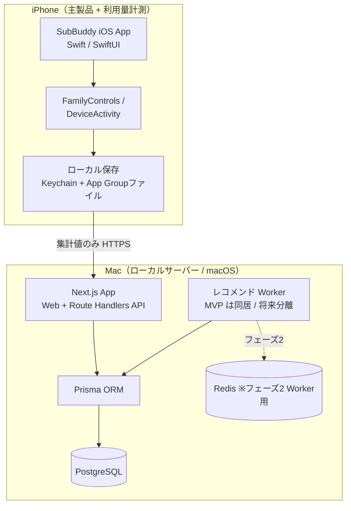
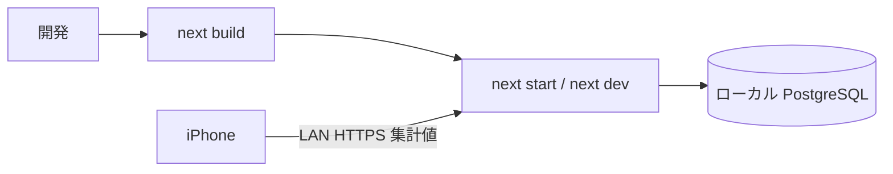
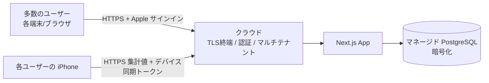

# 技術仕様書（Architecture）

> プロジェクト名 / アプリ名：**SubBuddy**
> ドキュメント種別：永続的ドキュメント（`docs/`）
> 最終更新：2026-07-17（iPhone主製品UI、認証セッション、iOS検証境界を反映）
> 関連：`product-requirements.md`（要求）、`functional-design.md`（機能設計）、`repository-structure.md`（構成）、`development-guidelines.md`（開発規約）、`glossary.md`（用語）

---

## 1. 本書の位置づけ

本書は SubBuddy を「**どの技術で・どう動かすか**」を定義する。
`product-requirements.md`（何を作るか）と `functional-design.md`（機能としてどう作るか）の決定事項を前提に、
テクノロジースタック・開発ツール・技術的制約・パフォーマンス要件・非機能要件の技術的実現方法を規定する。

設計上の最重要前提（要求・機能設計から継承）：

- **local mode を維持**：DB・API・Web・Worker を Mac ローカルで動かす個人運用は残す。ただし本番と別構成にせず、同一コードベースの実行モードとして扱う。
- **小規模検証版はフルクラウド**：30人募集・有効参加者20人以上・上限50人のTestFlight検証版では、Web/API/DBをRenderシンガポールに置き、iPhoneアプリはクラウドAPIへ直接集計値を送る。
- **iPhone は主製品**：契約・支出・見直し・更新・設定・削除を完結させる。Screen Time（DeviceActivity）による集計値取得は、確認優先度を支える補助機能として組み込む。
- **AI もクラウドも使わずにMVPを成立させる**：判断は6つの検出パターン（P1〜P6）と該当なしのフォールバック。利用量なしでもP2〜P6のレコメンドが出る。
- **秘密情報非保存**：外部サービスの ID/PW を保存しない。自動ログイン・スクレイピングをしない。
- **PII・機微データ**：実データは実行モードに応じて local DB またはクラウド DB に保存する。どちらの場合もリポジトリには合成データのみ（`AGENTS.md` 準拠）。

> **ロードマップ**：MVPはローカル単一ユーザーで成立済み。次にTestFlight小規模検証版をフルクラウドで配布し、その後にproduction modeとして一般公開へ進む。本書は**local mode / cloud-testflight mode / production modeを同一コードベースで賄う構造**を前提に設計する。

---

## 2. アーキテクチャ概観



- MVP は **Next.js 1 プロセス**で Web・API・スコアリングを完結させる（Worker は API 内処理として同居）。
- 将来の負荷・定期実行ニーズに備え、Worker をプロセス分離できる構造を保つ（セクション7）。
- 利用量・請求の取り込みは、**単一の取り込み API ＋ ソース別コネクタ（Adapter）** で一元化する（セクション5.1）。

---

## 3. テクノロジースタック

### 3.1 Mac 側（Web / API / DB / Worker）

| 領域 | 採用技術 | 採用理由 |
|---|---|---|
| 言語 | TypeScript | 型安全。Web/API/ドメインを単一言語で統一 |
| Web フレームワーク | Next.js（App Router） | Web ダッシュボードと Route Handlers API を 1 アプリで提供。ローカル単体起動が容易 |
| UI | React + Tailwind CSS | 共通デザインシステムで統一感（要求 14・機能設計 6.1） |
| API | Next.js Route Handlers | 別サーバー不要。`/api/*` をローカル提供（機能設計 10） |
| ORM | Prisma | スキーマ駆動・マイグレーション・型生成。リポジトリ層を薄く保つ |
| DB | PostgreSQL | ローカル常設。集計・履歴・将来拡張に耐える |
| ジョブ/Worker | MVP: アプリ内処理 / フェーズ2: BullMQ + Redis | MVP は同期計算で十分。将来の定期実行・分離に備える |
| バリデーション | Zod | API 入力・フォーム入力のスキーマ検証。型と単一ソース化 |
| テスト | Vitest（単体）/ Playwright（E2E 任意） | スコアリング等のドメインロジックを単体テスト中心で担保 |
| Lint / Format | ESLint + Prettier | `development-guidelines.md` の規約を機械的に強制 |

> バージョンの具体値（Node / Next / Postgres 等）は `repository-structure.md` または `package.json` / `.tool-versions` を一次情報とし、本書では固定しない（陳腐化防止）。

### 3.2 iPhone 側（主製品UI・利用量センサー）

| 領域 | 採用技術 | 用途 |
|---|---|---|
| 言語 / UI | Swift / SwiftUI | iOS アプリ本体 |
| 利用量計測 | FamilyControls / DeviceActivity / ManagedSettings | Screen Time のしきい値イベント取得（要 entitlement） |
| 対象選択 | FamilyActivityPicker | 計測対象アプリ/Webドメインの選択（UC-09） |
| 集計イベント | DeviceActivityMonitor Extension | しきい値（1m/5m/15m/30m/60m/120m）超過イベントを受信し日別集計 |
| 秘密情報の保存 | Keychain（ThisDeviceOnly） | 更新トークン、セッションID、デバイス同期トークン、端末内生成ID |
| 計測データの共有 | App Group内JSONファイル | 本体とMonitor Extension間の対応表・日別バケット集計。詳細ログは保持しない |
| 同期 | URLSession（HTTPS） | SubBuddy API へ**集計値のみ**送信 |

> iOS Spikeと開発実機で、FamilyControls認可、Picker、Monitor Extension、App Group集計、Render同期まで確認済み。現行認証セッション基盤でのWeb・iPhone実機再確認も完了した。7日連続計測とArchive/codesignは未完了であり、外部TestFlight前のゲートに残る。

### 3.3 採用しない技術（スコープ外）

- 外部サービスのスクレイピング・自動ログインライブラリ（恒久的に対象外）
- 銀行/クレカ連携 SDK、Apple ID 全サブスク横断 API、App Store Server API のユーザー横断利用
- MusicKit / Apple TV+ 等の Apple サービス連携（要求 6）
- クラウドマネージド DB / 認証基盤（MVP では不使用。ただし cloud-testflight mode 以降では採用する）
- **自作 MCP サーバによる利用量取得の一元化（取り込み窓口としては不採用）**

#### 検討メモ：利用量取得を MCP サーバで一元化する案（不採用）

- **検討内容**：使用量取得の「窓口」を自作 MCP（Model Context Protocol）サーバで一元化できないか。
- **結論**：取り込み（インジェスト）窓口としては**不採用**。一元化は内部のアダプタ層で行う。
- **理由（要点）**：
  1. MCP は「実行時に LLM がツール／データを呼ぶ」ための標準。MVP は**ルールベースで実行時 LLM が不在**（センサー → SubBuddy API → DB → 判定）のため、取り込み経路に MCP を置くのは過剰。
  2. 取得源の正規化（time / capacity / visit / 金額）は **Route Handler ＋ ソース別コネクタ（Adapter）** と Zod 正規化で達成でき、MCP 不要。
  3. MCP は**インターフェースを標準化するだけで、データ可用性・アクセス権は解決しない**。API 不在の源（エニタイム等）は MCP 化しても結局スクレイピング／自動ログイン（恒久禁止 TC-2）か近似に帰着し、結論は変わらない。
  4. MCP で利用量を LLM クライアントに渡す設計は **PII 最小化方針と衝突**しうる。
- **MCP が活きうる範囲（将来・別レイヤ）**：開発支援（合成データでの DB 分析）／ポストMVP の「AI アドバイザー」機能で**判定済み集計値のみ**を渡す用途。→ §13 参照。

---

## 4. 実行環境とデプロイ（段階的）

SubBuddy は **同一コードベースを実行モードで切り替える**。ローカル版は残すが、本番と別構成にしない。

| 実行モード | 主な用途 | API/DB | 認証 | iPhone 同期 |
|---|---|---|---|---|
| `local mode` | 開発者・個人運用 | ローカル Next.js + ローカル PostgreSQL | ローカル簡易認証 | `USAGE_SYNC_TOKEN` による互換同期 |
| `cloud-testflight mode` | TestFlight小規模検証版 | Renderシンガポール + マネージド PostgreSQL | Apple サインイン + 認証セッション | デバイス同期トークン |
| `production mode` | 将来の一般公開版 | クラウド本番環境 | Apple サインイン | デバイス同期トークン |

実行モードは `SUBBUDDY_MODE` で切り替える。値は `local` / `cloud-testflight` / `production` のいずれかとする。`local` では `USAGE_SYNC_TOKEN` による互換同期を使い、`cloud-testflight` / `production` では Apple サインインとデバイス同期トークンを使う。

現行認証ランタイムはAppleの許可クライアントID、WebクライアントID、リダイレクトURI、Apple subjectのハッシュ用salt、SubBuddyのトークン署名鍵、Cookie名、許可Origin、各期限を環境変数で受け取る。Apple認可取消など、後続機能で必要になる秘密鍵はその機能の実装時に追加する。秘密はRenderのsecret storeまたはローカル`.env`に置き、TestFlightとproductionでDB・鍵・Cookie名・Apple設定を共有せず、実値をリポジトリにコミットしない。

### 4.1 local mode：ローカル運用（localhost）

- **稼働ホスト**：macOS が動作する Mac（要求の「Mac mini」は検証環境の具体例であり、機種要件ではない）。
- **起動形態**：開発者モードでの `next dev`、または `next build && next start` によるローカル常駐。
- **DB**：ローカル PostgreSQL（Homebrew もしくは Docker いずれか。`repository-structure.md` / README で一次定義）。
- **ネットワーク**：
  - Web ダッシュボードは Mac 上の `localhost` でアクセス。
  - iPhone → Mac の同期は同一 LAN 内の HTTPS（自己署名証明書 or ローカル CA）。公開ポートは開けない。
- **クラウド非依存**：外部ホスティング・外部 DB・外部キューに依存せず単体起動できることを `local mode` の制約とする。
- **共通化**：API 契約、Prisma schema、Zod schema、ドメインロジック、スコアリング、iPhone から送る payload はクラウド版と揃える。



### 4.2 cloud-testflight mode：小規模検証版（フルクラウド）

MVP後の最初の配布版は、**30人募集・有効参加者20人以上・上限50人のTestFlight小規模検証版**とする。この段階はフルクラウドで動かす。
各ユーザーに Mac ローカルサーバーを求めず、iPhone アプリはクラウド API へ直接集計値を送信する。

- **マルチテナント**：データモデルは `users` / `user_id` で複数ユーザーを分離する。行レベルでテナント分離し、テナント越えアクセスを構造的に防ぐ。
- **公開形態**：Web/APIとPostgreSQLをRenderシンガポールで運用する。TestFlightとproductionはDB・秘密・Cookie・トークンを分離する。
- **認証（必須）**：Apple サインイン（§8.1.2）。
- **デバイス同期**：iPhone はログイン後にデバイス登録し、デバイス同期トークンで `POST /api/usage/daily` を呼ぶ。
- **TLS（正規証明書）**：公開到達点に適した証明書。
- **PII 保護（最重要）**：機微な金融 PII を多人数ぶん預かるため、保存時暗号化・可能なら E2E（運営者も中身を見られない）・最小データ収集（iPhone は集計値のみ）・個情法/GDPR 配慮を行う。
- **プライバシー説明の実態一致**：`cloud-testflight mode` では iPhone から SubBuddy が運用するクラウド API へ集計値を送る。配布文面・プライバシーポリシー・App Privacy・Family Controls 説明では「Mac にだけ送る」と書かず、クラウド送信であることを明示する。Mac 限定表現は `local mode` の説明に限定する。
- **運用**：クラウドデプロイ・監視・スケール・バックアップ/DR。
- **配布前ゲート**：配布用 entitlement、TestFlight、クラウド送信の一気通貫を必須ゲートにする。



### 4.3 production mode：一般公開版

`production mode` は `cloud-testflight mode` を基礎に、監視、障害対応、削除導線、プライバシーポリシー、サポート体制、法務確認を強化した一般公開版である。
この段階でも、外部 ID/PW を保存しない、詳細ログを送らない、自動解約しない、という制約は維持する。

---

## 5. データ層・永続化

- **ORM**：Prisma。スキーマ（`schema.prisma`）を単一ソースとし、マイグレーションで DB を管理。
- **テーブル**：`users / devices / auth_sessions / subscriptions / billing_events / ios_usage_daily_summaries / recommendation_snapshots / service_catalog / service_plans / service_alternatives`（定義は `functional-design.md` 5）。
- **冪等同期**：`ios_usage_daily_summaries` は `(subscription_id, usage_date)` を一意キーに upsert（機能設計 4.1 / 10.1）。
- **履歴保持**：`recommendation_snapshots` はスコアリング結果を追記（履歴）として保存し、判定の推移を追える。
- **金額の扱い**：金額は**整数（最小通貨単位）**で保持し浮動小数の誤差を避ける。通貨は既定 JPY。
- **seed/fixture**：合成データのみ。実 PII を seed・テスト・スクショに使わない（`AGENTS.md` PII 方針）。

### 5.1 利用量の取り込み：Ingestion API + ソース別コネクタ（採用）

取得源（Screen Time＝利用時間 / iCloud+＝容量 / 将来候補の請求情報等）は性質が異なる。
入力ごとに検証・最小化の境界を置き、共通化は実装が複数現れてから行う。現時点の実装は`POST /api/usage/daily`と容量フィールドであり、汎用コネクタ基盤はまだ作らない。

- **データ最小化**：取得源ごとに必要最小限の入力だけを受け付ける。Screen Timeは日別バケットと概算時間範囲だけを保存し、詳細ログ、全アプリ一覧、`FamilyActivityToken`、bundleIdをサーバーへ送らない。
- **検証と冪等性**：Route Handlerの入力をZodで検証し、利用量は`subscription_id × usage_date`へ最大バケットで収束させる。認証済みユーザーの所有権確認と保存は同一transactionで行う。
- **薄く始める**：汎用プラグイン機構を先に作らず、共通点が複数現れてからinterfaceを抽出する。
- **金額系と利用量系はテーブルを分ける**（`billing_events` ↔ 利用量系）。異種を 1 モデルへ無理に畳まない（leaky abstraction 回避）。

#### 限界（コネクタで解決しないこと）

- コネクタは**取得インターフェースを揃えるだけ**で、**データの可用性は解決しない**。
  公式 API・取得手段が無い源は、コネクタを作っても取得できない（スクレイピング／自動ログインは**恒久禁止** TC-2）。
- よって**取得できるメトリクスの幅の上限は、各サービス側の公開有無で決まる**。
  「どのサービスから・どう取れるか」の取得源マッピングは別途調査が必要（例：`.steering/20260601-anytime-fitness-visit-usage/`）。
- 取り込み**窓口**としては MCP を採用しない（§3.3 検討メモ）。

---

## 6. スコアリング設定の外出し（調整可能性）

`functional-design.md` 8.3 のルールしきい値は、コードに直書きせず**設定値として外出し**する。

- 設定項目（例）：未使用日数しきい値（強解約/解約検討）、金額しきい値、重複判定の対象カテゴリ、
  iCloud+ 容量余剰の判定閾、`importance` による補正係数、更新日接近の日数、
  **確定に必要な最小観測日数（`minObservationDays`）**（段階的な情報提供＝`functional-design.md` §8.5）。
- 形式：型付き設定（TypeScript + Zod 検証）として 1 箇所に集約し、将来 UI からの調整余地を残す。
- 目的：要求 14「ルールベースのスコアリングは設定値として外出しし、調整可能にする」を技術的に担保。
- ルール変更時は `recommendation_snapshots` に履歴が残るため、しきい値変更前後の判定差分を追跡できる。

---

## 7. Worker 分離の可搬性（MVP 同居 → 将来分離）

- **MVP**：スコアリングは API リクエスト処理または明示再計算エンドポイント（`POST /api/recommendations/recompute`）で同期実行。
- **設計上の分離点**：スコアリング/集計の**ドメインロジックを API・Web から独立したモジュール**として実装し、
  入出力をリポジトリ経由に限定する。これにより Worker プロセスへの切り出しがコード変更最小で可能。
- **フェーズ2**：BullMQ + Redis による非同期ジョブ（定期再計算・更新日接近トリガー）へ移行可能とする。
- **禁止事項**：UI/API レイヤーにスコアリングのビジネスルールを散在させない（分離を妨げるため）。

---

## 8. 認証・セキュリティ（技術仕様）

認証は**段階的**に強化する。MVP はローカル簡易認証、**ポストMVP は Web 公開に耐える正式な認証を必須**とする（セクション 4.2）。

### 8.1 認証（実行モード別）

Route Handler 以降の内部処理は、認証方式の違いを直接扱わず、認証済み主体を `AuthenticatedActor` 相当の内部モデルへ正規化する。

```ts
type AuthenticatedActor =
  | { kind: "user"; userId: string; authProvider: "local" | "apple" }
  | { kind: "device"; userId: string; deviceId: string; authProvider: "device_token" };
```

#### 8.1.1 local mode：ローカル簡易認証

- Web ダッシュボード：localhost 前提の簡易セッション、または固定ローカルユーザー。
- iPhone 同期 API：環境変数 `USAGE_SYNC_TOKEN` を `Authorization: Bearer` ヘッダで検証する。
- `USAGE_SYNC_TOKEN` は local mode 用の互換手段であり、クラウド配布版の主認証には使わない。
- トークン/パスコードは環境変数・ローカル設定で管理し、リポジトリにコミットしない。

#### 8.1.2 cloud-testflight / production：Apple サインイン

- クラウド配布版のユーザー認証はAppleサインインだけを使う。
- iOS はネイティブ Sign in with Apple（`ASAuthorizationAppleIDProvider`）、Web は Services ID を使う。identity token の `aud` は iOS＝アプリ Bundle ID（`com.subbuddy.app`）、Web＝Services ID（`com.subbuddy.web`）と値が変わる。
- サーバーの Apple token 検証は、署名検証・`iss = https://appleid.apple.com` に加えて `aud ∈ { com.subbuddy.web, com.subbuddy.app }` を許可リストで検証する。許可リスト外の `aud` は拒否する（ADR 0004）。
- iOS 用はネイティブ検証専用エンドポイント（`POST /api/auth/apple/native`）を設け、Web リダイレクト用コールバック（`POST /api/auth/apple/callback`）と処理を分離する。
- Apple の stable identifier と SubBuddy の `users.id` を紐付ける。メールアドレスは変更・非公開があり得るため、必須識別子にしない。
- Apple identity tokenは初回ログインと再認証だけで検証する。成功後は15分の署名付きアクセストークンと、一度だけ使える更新トークンへ交換する。
- 更新トークンはローテーションし、使用済みトークンが再提示された場合は同じトークン系列を失効する。サーバーにはSHA-256ハッシュだけを保存する。
- Webはアクセストークンと更新トークンを`HttpOnly`・`Secure`・`SameSite=Lax` Cookieへ保存する。変更操作は許可Originの完全一致とCSRF tokenの同値確認を必須にする。
- iPhoneは更新トークンとセッションIDを`ThisDeviceOnly`のKeychainへ保存し、アクセストークンはメモリだけに置く。401時は更新処理を1つにまとめ、元の操作を1回だけ再試行する。
- セッションは最大10件とし、一覧、個別失効、現在のサインアウト、全サインアウトを提供する。セッションに紐づく端末を失効した場合はデバイス同期トークンも失効する。
- Appleサインイン障害時は運用者が環境別の障害開始時刻を設定する。新規ログインを停止し、障害前から存在するトークン系列だけを元の期限内かつ開始から最大72時間まで継続する。復旧後は障害開始時刻を解除する。
- Web/API は有効なセッションから `AuthenticatedActor.kind = "user"` を解決する。`cloud-testflight`と`production`では認証失敗時に固定ユーザーへ戻らない。
- ユーザー操作 API は、クライアント指定の `userId` を信じず、認証済み `userId` で DB 操作する。

#### 8.1.3 デバイス同期トークン

- iPhone は Apple サインイン後にデバイス登録し、サーバーからデバイス同期トークンを受け取る。
- iOS は端末内で生成した `clientDeviceId`（UUID）を Keychain に保存し、デバイス登録時に送る。サーバーは `(userId, clientDeviceId)` で upsert し、同じ端末を1レコードへ収束させる。
- 同期 API は `Authorization: Bearer <device sync token>` で認証する。
- トークンは平文保存せず、ハッシュ化して `devices.tokenHash` に保存する。
- iOS 側の平文トークンは Keychain に保存する。App Group の共有 JSON / UserDefaults / ログには置かない。
- トークンは失効・再発行でき、`revokedAt` と `lastSyncedAt` を持つ。
- `POST /api/usage/daily` は token から `userId` / `deviceId` を解決し、request body の `userId` は受け付けない。

### 8.2 機微データ・秘密情報

- **外部サービスの ID/PW を入力させない・保存しない**（恒久制約）。
- iPhone からサーバーへ送るのは **集計値のみ**。詳細 Screen Time ログ・全アプリ一覧は端末内に留める。
- `cloud-testflight mode` / `production mode` では、集計値の送信先は SubBuddy のクラウド API である。App Store Connect やプライバシーポリシーでは、送信先を実態どおりクラウドとして説明する（「ユーザー自身の Mac にだけ送る」は `local mode` 限定）。
- 実データは実行モードに応じて local DB またはクラウド DB に保存する。ログ・エラー出力・スクショに実 PII を残さない。
- 秘密情報（トークン・DB接続情報）は`.env`またはRenderのsecret storeで扱い、コミット前にシークレットスキャンを行う
  （`pre-commit-secret-scan` 運用、`development-guidelines.md` で詳細化）。
- デバイス同期トークンはハッシュ保存し、平文を DB・ログ・エラー出力に残さない。
- 外部 ID/PW、Apple ID 資格情報、Screen Time 詳細ログ、全アプリ一覧、メール本文、クレカ/銀行明細生データ、位置情報生ログは保存しない。

### 8.3 入力検証・XSS

- すべての外部入力（フォーム・API・iOS 同期バッチ）を Zod で検証。
- 表示時はフレームワークのエスケープを基本とし、ユーザー入力（名称・メモ）の XSS を防ぐ。
- 金額・日付・列挙値（`billing_cycle` / `decision` / `usage_bucket` 等）は型・範囲・列挙で厳格に検証。

### 8.4 通信

- `local mode` の iOS ⇄ Mac は LAN 内 HTTPS。外部公開ポートは設けない。
- `cloud-testflight mode` / `production mode` は正規 TLS と認証済み API のみを公開する。
- CORS・許可ホストを最小化し、想定外の origin からのアクセスを受け付けない。

---

## 9. 技術的制約

| # | 制約 | 根拠 |
|---|---|---|
| TC-1 | `local mode` はクラウド・外部 DB に依存せず単体起動できること | ローカルファースト（要求 8.1） |
| TC-2 | 外部サービスの ID/PW を保存しない／自動ログインしない | 要求 7・8.4 |
| TC-3 | iPhone から受け取るのは集計値のみ（詳細ログ不可） | 要求 14 / 機能設計 12 |
| TC-4 | iOS 計測は entitlement 依存。配布用 entitlement と TestFlight 検証なしに配布版へ進まない | 要求 10.3 |
| TC-5 | スコアリングのしきい値はコード直書きせず設定外出し | 要求 14 / 本書 6 |
| TC-6 | 金額は整数（最小通貨単位）で保持 | 計算誤差防止（本書 5） |
| TC-7 | Apple Music/TV+/Arcade/One を実装・サンプル・レコメンドに含めない | 要求 5・6 |
| TC-8 | 実 PII を開発成果物（コード/seed/fixture/ログ/スクショ）に含めない | `AGENTS.md` PII 方針 |

---

## 10. パフォーマンス要件

local modeは個人・単一ユーザー規模、cloud-testflight modeは上限50人が前提である。大規模処理より**応答性・正確性・テナント分離**を重視する。

| 指標 | 目標（MVP） | 備考 |
|---|---|---|
| ダッシュボード初期表示 | 体感即時（ローカルで概ね 1 秒未満） | 登録サブスク数は数十件規模を想定 |
| 一覧・集計（月額/年額/単価） | 即時 | DB 件数が小規模のため単純集計で十分 |
| スコアリング再計算（全件） | 数百ms〜1秒程度 | 全サブスク × 直近30日サマリの線形処理 |
| iOS 同期 API（日別バッチ upsert） | 1 バッチ即時応答 | `(subscription_id, usage_date)` upsert、冪等 |
| データ規模想定 | local modeはサブスク数十件、cloud-testflight modeは最大50人・1人200契約 | インデックス：`user_id`・`subscription_id`・`usage_date`・`next_renewal_date` |

- 大規模分散・高 QPS は要件外。早すぎる最適化は行わない。
- 集計クエリが増えた場合に備え、利用サマリの日付・サブスク ID にインデックスを張る。

---

## 11. 非機能要件（技術的実現）

| 区分 | 要件 | 実現方法 |
|---|---|---|
| プライバシー | 実行モードごとに保存先を明確化し、詳細ログを外に出さない | local DB またはクラウド DB・集計値同期・保存時暗号化 |
| セキュリティ | ID/PW 非保存・入力検証・XSS 対策 | Zod 検証・エスケープ・`.env` 管理・シークレットスキャン |
| 可搬性 | local mode と cloud mode を同一コードベースで扱う | ドメインロジック独立・リポジトリ抽象・認証境界の正規化 |
| 保守性 | しきい値調整・ルール変更容易 | 設定外出し（本書 6）・履歴保存 |
| 信頼性 | 同期の冪等性・データ整合 | upsert・一意制約・マイグレーション管理 |
| 統一性（UI） | デザイン統一 | Tailwind CSS 共通デザインシステム |
| 品質 | 変更後の検証 | Lint・型チェック・テストを必須（`development-guidelines.md`） |

---

## 12. 技術リスクと対応方針

| リスク | 影響 | 対応 |
|---|---|---|
| Family Controls entitlement 取得不可 | P1 パターン（使っていない）の判定が能動前面サブスクで成立しない | 先行 Spike（要求 10.3）。不成立時は iPhone アプリ内の起動シグナルで補助、または P2〜P6 のみで判定 |
| DeviceActivity の実機イベント挙動の不確実性 | 利用バケットの精度低下 | Spike で発火・再起動後挙動を確認。バケット粒度で吸収 |
| 配布用 Family Controls entitlement 取得不可 | TestFlight 配布版で利用量同期が成立しない | Apple 公式要件を実装前に再確認し、配布用 entitlement / TestFlight / クラウド送信を必須ゲートにする |
| Apple サインイン実装・審査要件の変更 | ログイン導線や審査で手戻り | 実装直前に Apple 公式情報を確認し、メールを必須識別子にしない設計を維持 |
| テナント分離漏れ | 他ユーザーのサブスク・利用量が見える重大事故 | repository / API で認証済み `userId` を必須化し、他ユーザーアクセス拒否のテストを追加 |
| デバイス同期トークン漏えい | 不正な利用量送信 | ハッシュ保存、失効・再発行、ログ出力禁止、レート制限 |
| iOS ⇄ Mac の LAN HTTPS / 証明書運用 | local mode の同期失敗 | ローカル CA / 自己署名 + トークン検証。手順を README 化 |
| スコアリングしきい値の妥当性 | 判定が体感とずれる | 設定外出し + 履歴比較で調整（本書 6） |
| ローカル運用ゆえのバックアップ欠如 | データ消失 | ローカルバックアップ手順を運用で定義（実 PII を外部に出さない範囲で） |

---

## 13. 将来拡張（技術的な余地）

- 請求イベント自動化：領収書メール/スクショからの抽出（`source`/`confidence` を既に保持、機能設計 13）。
- AI 補助：`recommendation_snapshots.reason` を AI 生成文へ差し替え可能な構造を維持。AI アドバイザー機能を載せる段階では、**判定済み集計値のみ**を渡す自作 MCP サーバの採用余地あり（取り込み窓口としては不採用＝§3.3 検討メモ）。
- Worker 分離：BullMQ + Redis による定期実行・非同期化（本書 7）。
- 公式 OAuth API：トークンベースの利用量補完（PW 保存型自動ログインとは区別、将来検討）。
- **小規模検証版（cloud-testflight mode）**：30人募集、20人以上の有効参加者、上限50人で、Appleサインイン、認証セッション、デバイス同期トークン、Renderシンガポール、テナント分離を検証する（§4.2 / §8.1.2）。
- **クラウド多ユーザー化（production mode）**：小規模検証版を基礎に、一般公開版として公開する（§4.3）。マルチテナント・正式認証・PII 保護を伴う。個人運用は local mode で継続。

> 小規模検証版とクラウド多ユーザー化は**ポストMVP の確定方針**であり、任意の拡張ではない（要求 §3・§10.0）。それ以外（請求自動化・AI 補助・Worker 分離・OAuth 補完）は MVP では実装せず、段階的拡張余地として保持する。**「自動解約しない／外部 ID・PW を保存しない／iPhone は集計値のみ」という不変条件は、クラウド商品版でも維持する。**

---

## 14. クラウド配布版の運用アーキテクチャ

### 14.1 配置と環境分離

- API、PostgreSQL、バックアップはRenderシンガポールへ配置する。国内保存とは表示せず、保存国、データ、安全管理、事業者・再委託先の取扱いを説明する。
- `cloud-testflight mode`と`production mode`はDB、秘密、セッション、端末同期トークンを分離する。環境間移行は本人選択型の移行処理だけを使う。
- Family Controls配布用権限はアプリ本体・監視拡張で早期申請する。再申請後も不承認ならScreen Timeを無断で外さず、TestFlight範囲を再承認する。

### 14.2 認証・セッション

- iPhoneとWebはAppleサインインだけを使い、検証済みApple subjectを内部`users.id`へ正規化する。Apple提供の氏名・メールを要求・保存しない。
- 短期アクセストークンとローテーションする更新トークンを使う。iPhoneはKeychain、Webは`HttpOnly`・`Secure`・`SameSite` Cookieへ保存し、`localStorage`へ置かない。
- 配布版では`user_local`と`USAGE_SYNC_TOKEN`へ到達できず、設定不足時は認証を迂回せず停止する。
- Webの保持ログインは初期オフ、オン時は30日未使用または最長90日で再認証する。完全退会、出力、全端末サインアウトは再認証を必須とする。

### 14.3 データ保護・ログ

- TLS、DB・バックアップの保存時暗号化、本番DB直接アクセスの原則禁止、時間制限・監査付き緊急アクセスを必須とする。
- 契約、金額、更新日、利用量、見直し結果をログ、監視、クラッシュ解析、問い合わせ診断へ送らない。
- IPアドレスは不正検知用に仮名化して最長30日、利用者向けセキュリティ履歴は90日保持する。
- TestFlightの8操作イベントは評価専用仮名IDでSubBuddy DBだけに保存し、終了判定後90日以内、退会時は即時削除する。

### 14.4 信頼性・性能・費用

| 項目 | TestFlight | 一般公開 |
|---|---:|---:|
| 許容データ損失 | 24時間 | 1時間 |
| 復旧目標時間 | 24時間 | 8時間 |
| クラッシュなしセッション | 99%以上 | 99.5%以上 |

- TestFlight前に合成データで別環境への復元を行い、一般公開後は月1回復元可能性を確認する。復旧時は削除記録を再適用する。
- iPhoneのキャッシュ表示は2秒以内、Web主要表示は75%以上で2.5秒以内、Web操作反応は75%以上で200ミリ秒以内を目標とする。
- APIは95%以上で読み取り1秒以内、登録・編集2秒以内とする。重い再計算は受付状態を返して非同期処理する。
- TestFlightのクラウド費用上限は月10,000円とし、50%で通知、80%で新規テスター追加停止、100%で重い処理・新規登録を停止する。閲覧、出力、完全退会、安全通知は維持する。
- 認証、変更、同期、再計算、出力に用途別の利用回数制限と重複実行防止を設ける。

### 14.5 対応環境

- iOS 17.4以降、iPhone専用、縦向き。標準画面・大画面、提出時点の最新iOSを回帰対象とする。
- WebはmacOS・iOSのSafari/Chrome最新と1つ前を正式対応、Edge/Firefox最新版を動作確認対象とし、画面幅360px以上を前提とする。
- iPhoneはVoiceOver・最大Dynamic Type・44ポイント操作領域、Webはキーボード・可視フォーカス・200%拡大・通常文字4.5:1以上のコントラストを満たす。
