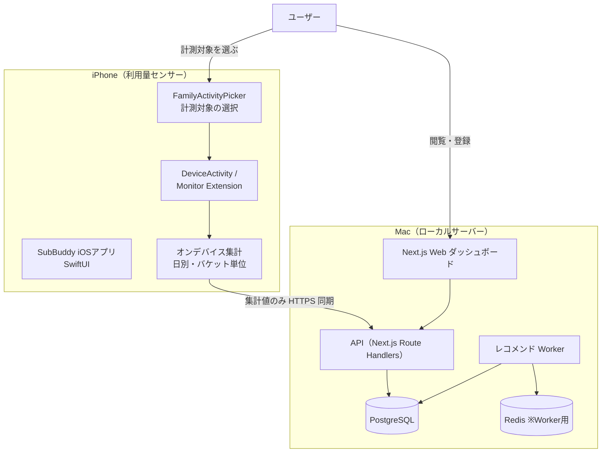
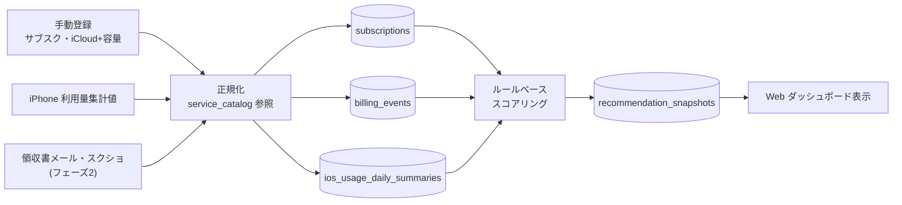
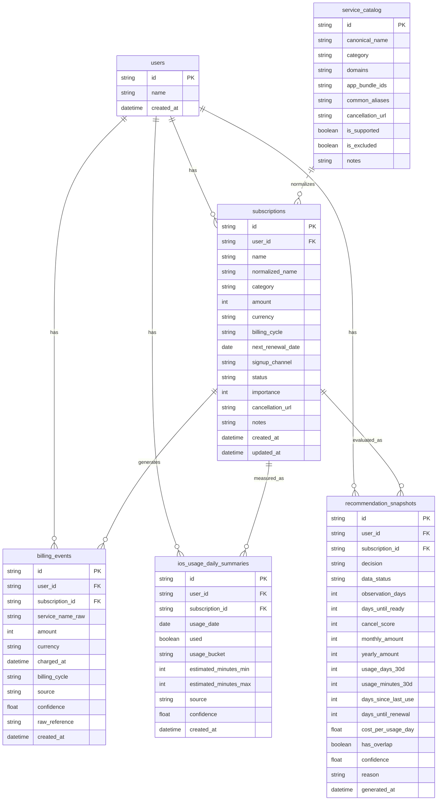
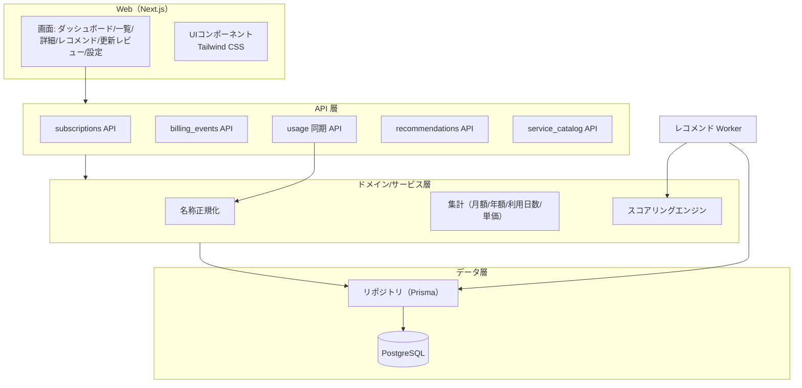
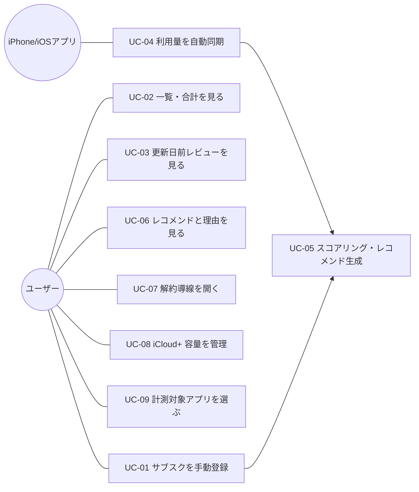
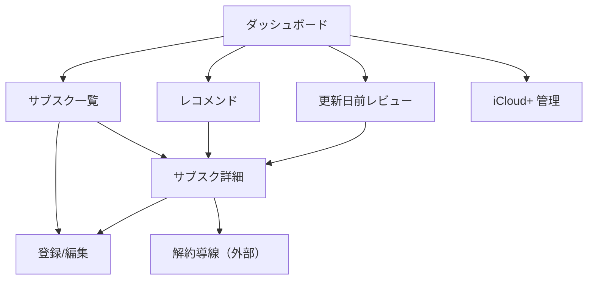
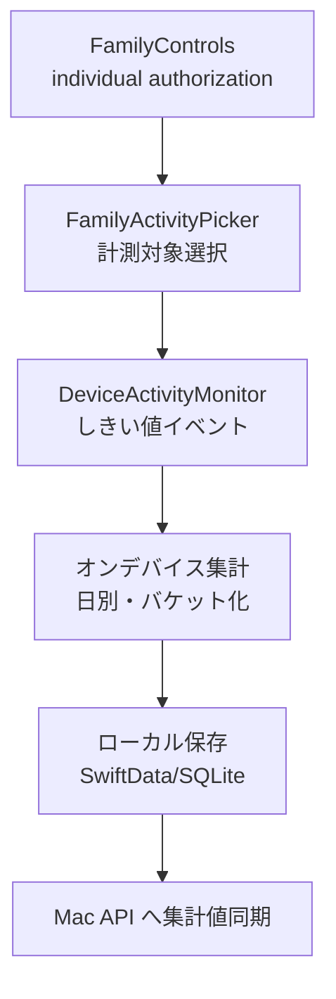

# 機能設計書（Functional Design）

> プロジェクト名 / アプリ名：**SubBuddy**
> ドキュメント種別：永続的ドキュメント（`docs/`）
> 最終更新：2026-05-31
> 関連：`product-requirements.md`（要求）、`architecture.md`（技術仕様）、`glossary.md`（用語）

---

## 1. 本書の位置づけ

本書は「**何を・どう作るか**」のうち、機能面のアーキテクチャ・データモデル・コンポーネント・
ユースケース・画面・API を定義する。技術スタックや非機能の詳細は `architecture.md` に委ねる。

設計の前提（`product-requirements.md` の決定事項）：

- **ローカルファースト**：DB・API・Web・Worker は Mac ローカル、iPhone は利用量センサー。
- **利用量は iPhone Screen Time（DeviceActivity）から自動取得**する。**利用量の手動入力は行わない**。
- サブスクの**登録は手動**（見直したいものをユーザーが登録＝調査対象への指定）。
- 解約判断は**ルールベースのスコアリング**。AI は MVP では使わない。
- **自動解約しない／外部サービスの ID・PW を保存しない／自動ログイン・スクレイピングをしない**。
- Apple Music / TV+ / Arcade / One は対象外。Amazon Music は音楽カテゴリの実利用サービス。iCloud+ は容量ベースで対象。
- iPhone から Mac へ送るのは詳細ログではなく**集計値のみ**。

---

## 2. システム構成図



> MVP では API と Worker を Next.js 内に同居させてよいが、将来 Worker を分離しやすい構造とする（詳細は `architecture.md`）。

---

## 3. データ取得・処理フロー



---

## 4. 機能一覧と機能ごとのアーキテクチャ

| ID | 機能 | フェーズ | 概要 |
|----|------|---------|------|
| F-01 | サブスク管理 | MVP | 登録・編集・削除・一覧（調査対象の管理） |
| F-02 | 金額集計 | MVP | 月額・年額合計、年換算 |
| F-03 | 更新日管理・更新日前レビュー | MVP | 次回更新日の管理と直近更新の抽出 |
| F-04 | 利用量自動取得 | MVP | iPhone Screen Time → 集計値同期 → 日別サマリ保存 |
| F-05 | 単価算出 | MVP | 1利用日あたり単価（料金 ÷ 過去30日利用日数） |
| F-06 | レコメンドエンジン | MVP | ルールベースのスコアリングと5段階判定・理由 |
| F-07 | サービスカタログ | MVP | 名称正規化・対象/対象外フラグ・ドメイン/BundleID 対応 |
| F-08 | iCloud+ 容量管理 | MVP | 容量・プランベースの評価（時間計測の対象外） |
| F-09 | iOS 計測対象選択 | MVP | FamilyActivityPicker による対象アプリ/ドメイン選択 |
| F-10 | 請求イベント自動化 | フェーズ2 | 領収書メール・スクショからの抽出 |
| F-11 | AI 補助 | フェーズ2 | 理由文・月次レポートの自然文生成 |

### 4.1 各機能の責務（MVP 主要機能）

- **F-04 利用量自動取得**：iOS 側が OS の Screen Time を計測し、`used / usage_bucket / 推定時間レンジ` を
  **日別・サブスク単位の集計値**として生成し、API へ同期。Mac 側は `ios_usage_daily_summaries` に保存する。
  詳細ログ・全アプリ一覧は送らない。同期は冪等（同一 `subscription_id × usage_date` は upsert）。
- **F-06 レコメンドエンジン**：Worker（または API 内処理）が、subscriptions・billing_events・
  ios_usage_daily_summaries を入力に `cancel_score` と `decision` を算出し、`recommendation_snapshots` に履歴保存する。

---

## 5. データモデル

### 5.1 ER図



### 5.2 主要テーブル定義

#### subscriptions（サブスク本体＝調査対象）

| 項目 | 説明 |
|---|---|
| id | 主キー |
| user_id | ユーザー（MVPは単一ユーザー） |
| name | 表示名（入力値） |
| normalized_name | 正規化名（service_catalog で表記揺れを吸収） |
| category | カテゴリ（音楽/動画/AIツール/ストレージ 等） |
| amount / currency | 料金・通貨（既定 JPY） |
| billing_cycle | 課金周期（monthly / yearly 等） |
| next_renewal_date | 次回更新日 |
| signup_channel | 契約経路（App Store / Web 等） |
| status | active / canceled / paused 等 |
| importance | ユーザー主観の重要度（スコアリング補正に使用） |
| cancellation_url | 公式の解約導線 URL |
| notes | メモ |

#### billing_events（請求イベント）

請求履歴。MVP は手動、フェーズ2 で領収書メール・スクショ由来。`source`（manual/email/screenshot 等）と
`confidence` で由来と確からしさを保持。`raw_reference` は抽出元参照（**メール全文は保存しない**）。

#### ios_usage_daily_summaries（日別利用量サマリ）

iPhone Screen Time から自動取得した**集計値**。`usage_bucket` は
`none / 1m_plus / 5m_plus / 15m_plus / 30m_plus / 60m_plus / 120m_plus`。
`source` は `ios_device_activity` 等。`subscription_id × usage_date` を一意キーとして upsert。

#### recommendation_snapshots（レコメンド履歴）

スコアリング結果の履歴。判定 `decision` と `cancel_score`、算出根拠（30日利用日数・利用分・最終利用からの日数・
更新日までの日数・単価・重複有無）と `reason`（MVP は定型文、フェーズ2 で AI 生成）を保持。
利用量の集計は **SubBuddy への登録時点（`subscriptions.created_at`）から開始**し、過去には遡らない。
`data_status`（`observing` / `ready`）・`observation_days`（登録からの観測日数）・`days_until_ready`（確定まで残り日数）・
`confidence`（暫定/確定の確からしさ）で、**段階的な情報提供**（§8.5）の状態を表す。

#### service_catalog（正規化辞書）

サービス名の表記揺れ正規化と対象判定。`is_excluded=true` に Apple Music / TV+ / Arcade / One を登録し、
登録候補・レコメンド対象から除外する。`domains` / `app_bundle_ids` は iOS 計測対象との突合に使う。

> 注：実データ（実在のサブスク・請求・利用）は実行時にローカル DB にのみ保存し、リポジトリには含めない。
> seed/fixture は合成データのみ（`CLAUDE.md` PII 方針）。

---

## 6. コンポーネント設計

### 6.1 論理コンポーネント



### 6.2 主なモジュール責務

- **名称正規化（Normalizer）**：入力名・iOS の bundleId/domain を `service_catalog` と突合し `normalized_name` を決定。
- **集計（Aggregator）**：月額/年額換算、過去30日の利用日数・利用分、最終利用日、1利用日あたり単価を算出。
- **スコアリングエンジン（Scoring）**：セクション8のルールで `cancel_score` と `decision`、`reason` を生成。
- **同期（Usage 同期 API）**：iOS からの集計値バッチを冪等 upsert。

---

## 7. ユースケース

### 7.1 ユースケース図



### 7.2 主要ユースケース定義

#### UC-01 サブスクを手動登録する

- **目的**：ユーザーが見直したい（調査・評価したい）サブスクリプションを SubBuddy に登録し、料金・更新日・
  利用量のモニタリング、および解約判断（スコアリング・レコメンド）の**対象として取り込む**。
  登録＝調査対象への指定であり、登録したサブスクのみが集計・利用量記録・単価算出・スコアリング・
  更新日前レビューの対象になる。登録しないサブスクは SubBuddy の評価対象外（全契約の自動取得はしない）。
- **アクター**：ユーザー
- **事前条件**：Mac ローカルのアプリが起動している。
- **入力（必須）**：name / amount / currency / billing_cycle / next_renewal_date
- **入力（任意）**：category / importance / signup_channel / cancellation_url / notes
- **基本フロー**：
  1. 登録フォームを開く
  2. 項目を入力
  3. バリデーション（必須・数値・日付・XSS サニタイズ）
  4. `normalized_name` を生成（service_catalog 参照）
  5. status=active で保存
  6. 一覧へ反映、月額・年額合計を再計算
- **例外**：必須未入力/不正値はエラーで保存しない。対象外 Apple サービスは候補に出さず注意表示。
- **事後条件**：subscriptions に1件追加、以降のモニタリング・スコアリング対象になる。

#### UC-04 利用量を自動同期する（iPhone → Mac）

- **アクター**：iPhone（iOSアプリ）
- **事前条件**：Family Controls の authorization 済み、計測対象が選択済み（UC-09）。
- **基本フロー**：
  1. iOS が Screen Time のしきい値イベントを集計
  2. 日別・サブスク単位で `used / usage_bucket / 推定時間レンジ` を生成
  3. HTTPS で API（usage 同期）へ集計値バッチを送信
  4. API が `subscription_id × usage_date` で upsert 保存
- **制約**：送信は集計値のみ（詳細ログ・全アプリ一覧は送らない）。
- **事後条件**：`ios_usage_daily_summaries` 更新、スコアリングの入力になる。

#### UC-05 スコアリング・レコメンド生成

- **トリガー**：利用量同期後／サブスク更新後／定期実行（更新日接近）
- **基本フロー**：入力（subscriptions・billing_events・usage）→ ルール適用 → `cancel_score`・`decision`・`reason` →
  `recommendation_snapshots` に履歴保存。
- **事後条件**：最新レコメンドが Web に表示可能になる。

#### UC-07 解約導線を開く

- **基本フロー**：解約検討中のサブスク詳細で `cancellation_url` を表示し、外部ブラウザで公式導線を開く。
- **制約**：SubBuddy は**自動解約しない**。導線の提示のみ。

> その他（UC-02 一覧・合計、UC-03 更新日前レビュー、UC-06 レコメンド閲覧、UC-08 iCloud+ 容量、UC-09 計測対象選択）は
> 画面仕様（セクション9）と API（セクション10）に詳細を展開する。

---

## 8. レコメンドエンジン設計（ルールベース）

### 8.1 判定カテゴリ

| decision | 意味 |
|---|---|
| keep | 継続 |
| review | 様子見 |
| consider_downgrade | ダウングレード検討 |
| consider_cancel | 解約検討 |
| strong_cancel_candidate | 強い解約候補 |

### 8.2 パターン判定方式

レコメンドは**具体的な状況パターン（P1〜P7）ごとに判定**する。サブスクの `usage_type`（利用の性質）に応じて適用するパターンを切り替える。

| パターン | 状況 | レコメンド | 適用条件 |
|---|---|---|---|
| P1 | 使っていない（スパン内利用日数＋最終利用経過日数で判定） | 解約検討 | 能動利用（前面/背景）のみ。受動利用・権利保有には適用しない |
| P2 | 同カテゴリに複数あり、こちらの方が高い | 解約検討 | 全サブスク共通 |
| P3 | 同じサービスにもっと安い有料プランがある | ダウングレード検討 | 知識ベースにプラン情報があるサブスク。無料プランは比較対象外 |
| P4 | 同カテゴリにもっと安い有料の競合がある | 乗り換え検討 | 知識ベースに代替情報があるサブスク。無料プランは比較対象外 |
| P5 | 年額更新が7日以内に迫っている | 更新前に見直し | 年額契約のサブスク |
| P6 | 月額¥2,000以上で12ヶ月以上継続 | 本当に必要か確認 | 全サブスク共通 |
| P7 | 上記のどれにも該当しない | 継続 | — |

- 複数パターンが該当する場合は、最も強い Decision を採用し、該当した全パターンの根拠を表示する。
- しきい値は `config/scoring.ts` に外出しし、テストで差し替え可能。
- `reason` はパターン別の定型文で組み立てる。

### 8.3 `usage_type`（利用の性質）

| `usage_type` | 意味 | P1 の適用 |
|---|---|---|
| `active_foreground` | iPhone 前面で操作する | する（DeviceActivity で計測） |
| `active_background` | 裏で再生する（音楽等） | 補助的に（Shortcuts で起動のみ） |
| `active_other_device` | PC/TV/Web で使う | しない |
| `passive` | 保管・同期・常時稼働 | しない |
| `entitlement` | 権利として保有 | しない |
| `capacity` | 容量ベース（iCloud+） | しない（容量判定） |

### 8.4 サービス知識ベース

サービスカタログ（`ServiceCatalog` + `ServicePlan` + `ServiceAlternative`）で代替・プラン・料金を管理する。
P3（安いプランがある）と P4（安い競合がある）の判定に使用。無料プラン（`isFreeTier=true`）は比較対象から除外する。
料金データには `verifiedAt` を持たせ、6ヶ月超過で信頼度を低下させる。

### 8.5 段階的な情報提供

- P2〜P6（利用履歴に依存しないパターン）は登録直後から即時に判定できる。
- P1（使っていない）は利用データの蓄積が必要。能動利用（前面/背景）のサブスクで、`usage_type` に応じて DeviceActivity または Shortcuts のデータが一定期間蓄積されるまで `data_status = observing` とする。
- 受動利用・権利保有のサブスクは P1 を適用しないため、即時に P2〜P6 で判定が確定する。

---

## 9. 画面設計

### 9.1 画面一覧

| 画面 | 内容 |
|---|---|
| ダッシュボード | 月額/年額合計、強い解約候補の件数、更新間近の件数 |
| サブスク一覧 | 登録済みサブスク、料金・更新日・判定バッジ |
| サブスク詳細 | 詳細情報、利用量推移、単価、判定理由、解約導線 |
| サブスク登録/編集 | 入力フォーム（UC-01） |
| レコメンド | 判定別の一覧（strong_cancel_candidate 等） |
| 更新日前レビュー | 直近で更新が来るサブスクの一覧 |
| iCloud+ 管理 | 容量・プラン入力、容量ベース判定 |
| 設定（iOS側） | 計測対象アプリ/ドメインの選択（FamilyActivityPicker） |

### 9.2 画面遷移図



### 9.3 ワイヤフレーム（概略・ASCII）

ダッシュボード：

```
┌───────────────────────────────────────────────┐
│ SubBuddy                                  [設定] │
├───────────────────────────────────────────────┤
│ 月額合計: ¥12,800   年額換算: ¥153,600          │
│ 強い解約候補: 2件   更新間近(14日): 3件          │
├───────────────────────────────────────────────┤
│ [サブスク一覧] [レコメンド] [更新レビュー] [iCloud+]│
└───────────────────────────────────────────────┘
```

サブスク一覧：

```
┌───────────────────────────────────────────────┐
│ サブスク一覧                          [+ 登録]  │
├───────────────────────────────────────────────┤
│ Amazon Music   ¥1,080/月  更新 6/12  [解約検討] │
│ 日経電子版     ¥4,277/月  更新 6/20  [様子見]   │
│ iCloud+ 200GB  ¥400/月    更新 6/05  [DG検討]   │
│ AIツールX      ¥3,000/月  未使用62日 [強解約候補]│
│ 新規登録サービス ¥980/月  更新 6/30  [観測中 あと9日]│
└───────────────────────────────────────────────┘
```

> 登録直後の `観測中` でも、同カテゴリ重複・割高・更新間近の指摘は即時に表示する（§8.5）。

サブスク詳細：

```
┌───────────────────────────────────────────────┐
│ AIツールX                              [編集]   │
├───────────────────────────────────────────────┤
│ 料金: ¥3,000/月（年換算 ¥36,000）               │
│ 次回更新: 2026-06-28（あと 28日）               │
│ 過去30日 利用日数: 0日 / 最終利用: 62日前       │
│ 1利用日あたり単価: ―（未使用）                  │
│ 判定: 強い解約候補                              │
│ 理由: 60日以上未使用のため                      │
│ [公式の解約ページを開く]                         │
└───────────────────────────────────────────────┘
```

---

## 10. API 設計（MVP・ローカル）

MVP は Next.js Route Handlers で提供（`architecture.md` 参照）。単一ユーザー前提。すべてローカル通信。

| メソッド | パス | 用途 |
|---|---|---|
| GET | `/api/subscriptions` | 一覧取得 |
| POST | `/api/subscriptions` | 登録（UC-01） |
| GET | `/api/subscriptions/{id}` | 詳細取得 |
| PUT | `/api/subscriptions/{id}` | 更新 |
| DELETE | `/api/subscriptions/{id}` | 削除 |
| GET | `/api/summary` | 月額/年額合計・件数サマリ |
| POST | `/api/usage/daily` | iOS からの日別利用量集計値の同期（バッチ upsert, UC-04） |
| GET | `/api/recommendations` | 最新レコメンド一覧 |
| POST | `/api/recommendations/recompute` | スコアリング再計算（UC-05） |
| GET | `/api/renewals/upcoming` | 更新日前レビュー対象 |
| GET | `/api/service-catalog` | 正規化辞書参照 |
| GET/PUT | `/api/icloud-plus` | iCloud+ 容量・プラン管理（UC-08） |

### 10.1 利用量同期 API（POST /api/usage/daily）リクエスト例

```json
{
  "items": [
    {
      "subscriptionId": "sub_amazon_music",
      "date": "2026-05-30",
      "used": true,
      "usageBucket": "30m_plus",
      "estimatedMinutesMin": 30,
      "estimatedMinutesMax": 59,
      "source": "ios_device_activity"
    }
  ]
}
```

- `subscriptionId × date` で upsert（冪等）。詳細ログは受け付けない。
- 認証は MVP ではローカル簡易認証（`architecture.md` で規定）。事前共有トークン（＝あらかじめ Mac と iPhone の双方に設定しておく合言葉。環境変数 `USAGE_SYNC_TOKEN`）を `Authorization: Bearer` ヘッダで検証し、欠落・不一致・トークン未設定のときは 401 を返す。

---

## 11. iOS アプリ機能設計（利用量センサー）



- ユーザーが計測対象アプリ/Webドメインを選択（UC-09）。SubBuddy は全アプリ一覧を自由取得しない。
- 集計はオンデバイスで行い、Mac へは集計値のみ送信。詳細 Screen Time データは端末内に留める。
- entitlement・実機挙動の不確実性が高いため、**実装前に iOS Spike を実施**（`product-requirements.md` 10.3）。

---

## 12. バリデーション・セキュリティ（機能面）

- 入力バリデーション（必須・型・範囲）、XSS サニタイズ（名称・メモ）。
- 外部サービスの ID/PW は**入力させない・保存しない**。
- iOS→Mac はローカルネットワーク内 HTTPS、送信は集計値のみ。
- 実データはローカル DB のみ。リポジトリ・ログ・スクショに実 PII を残さない（`CLAUDE.md` PII 方針）。

---

## 13. フェーズ2 以降の拡張ポイント（設計上の余地）

- 請求イベントの自動化（領収書メール/スクショ抽出、`source`/`confidence` を既に保持）。
- AI による `reason`・月次レポートの自然文生成（`recommendation_snapshots.reason` を差し替え可能に）。
- Worker 分離（BullMQ + Redis）、認証強化、必要に応じたクラウド連携。
- 公式 OAuth API によるトークンベースの利用量補完（PW 保存型の自動ログインとは区別、将来検討）。
