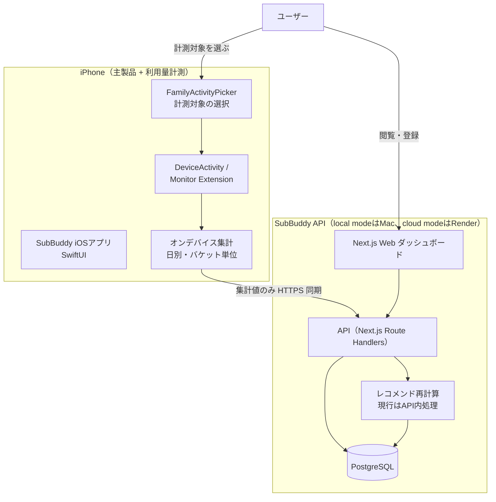
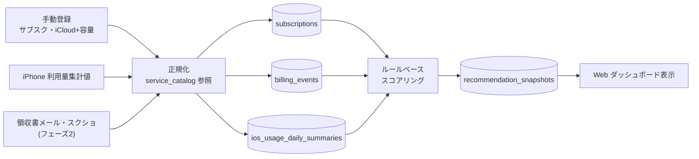
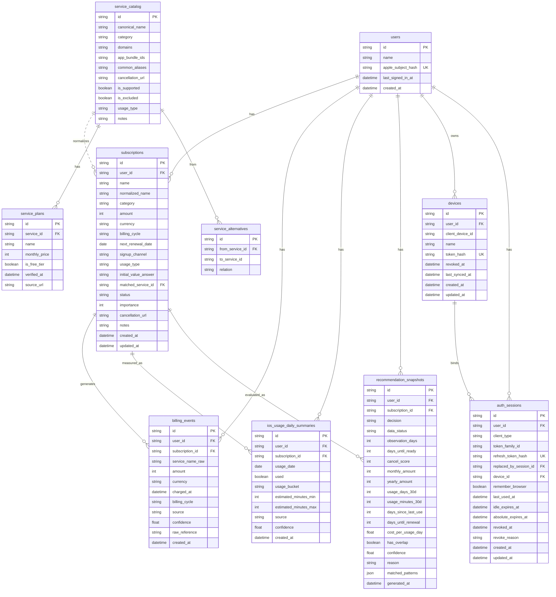
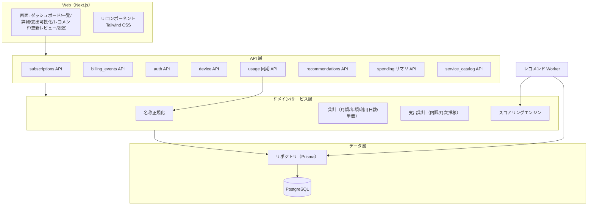
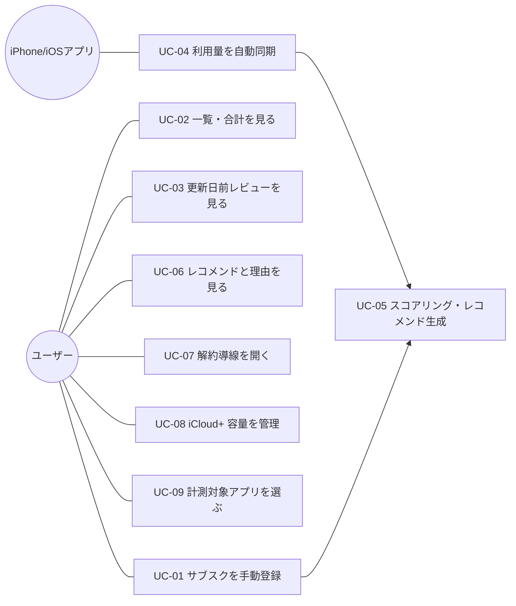
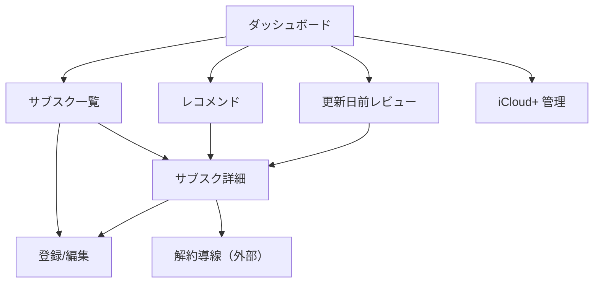
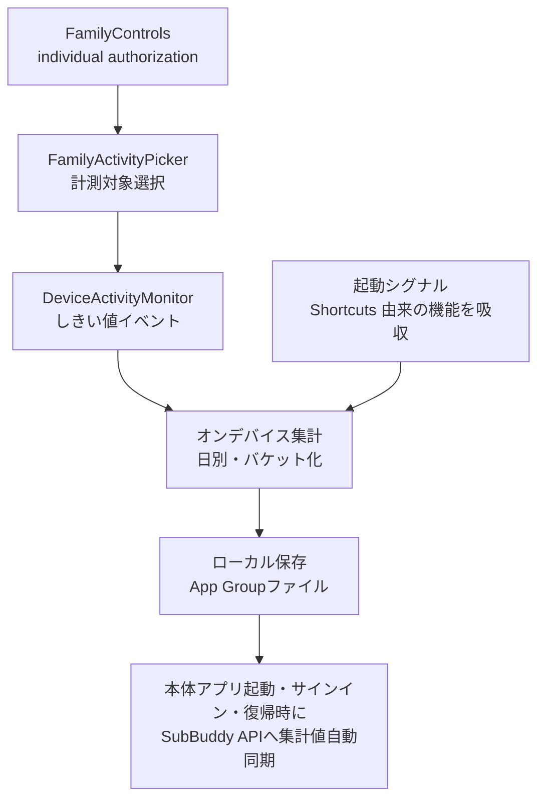

# 機能設計書（Functional Design）

> プロジェクト名 / アプリ名：**SubBuddy**
> ドキュメント種別：永続的ドキュメント（`docs/`）
> 最終更新：2026-07-20（Screen Time自動計測・自動同期・契約別集計を反映）
> 関連：`product-requirements.md`（要求）、`architecture.md`（技術仕様）、`glossary.md`（用語）

---

## 1. 本書の位置づけ

本書は「**何を・どう作るか**」のうち、機能面のアーキテクチャ・データモデル・コンポーネント・
ユースケース・画面・API を定義する。技術スタックや非機能の詳細は `architecture.md` に委ねる。

設計の前提（`product-requirements.md` の決定事項）：

- **local mode と cloud mode を同一コードベースで扱う**：MVP は Mac ローカル、小規模検証版はフルクラウドで動かす。
- **利用量は iPhone Screen Time（DeviceActivity）から自動取得**する。**利用量の手動入力は行わない**。
- サブスクの**登録は手動**（見直したいものをユーザーが登録＝調査対象への指定）。
- 解約判断は**ルールベースのスコアリング**。AI は MVP では使わない。
- **自動解約しない／外部サービスの ID・PW を保存しない／自動ログイン・スクレイピングをしない**。
- Apple Music / TV+ / Arcade / One は対象外。Amazon Music は音楽カテゴリの実利用サービス。iCloud+ は容量ベースで対象。
- iPhone から SubBuddy API へ送るのは詳細ログではなく**集計値のみ**。

---

## 2. システム構成図



> MVP では API と Worker を Next.js 内に同居させてよいが、将来 Worker を分離しやすい構造とする（詳細は `architecture.md`）。

---

## 3. データ取得・処理フロー



---

## 4. 機能一覧と機能ごとのアーキテクチャ

| ID | 機能 | フェーズ | 概要 |
|----|------|---------|------|
| F-01 | サブスク管理 | MVP | 登録・編集・削除・一覧（調査対象の管理） |
| F-02 | 金額集計 | MVP | 月額・年額合計、年換算 |
| F-03 | 更新日管理・更新日前レビュー | MVP | 次回更新日の管理と直近更新の抽出 |
| F-04 | 利用量自動取得 | MVP | iPhone Screen Time → 集計値同期 → 日別サマリ保存 |
| F-05 | 単価算出 | MVP | 1利用日あたり単価（料金 ÷ 過去30日利用日数） |
| F-06 | レコメンドエンジン | MVP | 6つの検出パターン（P1〜P6）と該当なしのフォールバックによる判定・理由・判定根拠（matchedPatterns）の保存 |
| F-07 | サービスカタログ | MVP | 名称正規化・対象/対象外フラグ・ドメイン/BundleID 候補ヒント（iOS 計測対象の確定はユーザー手動） |
| F-08 | iCloud+ 容量管理 | MVP | 容量・プランベースの評価（時間計測の対象外） |
| F-09 | iOS 計測対象選択 | MVP | FamilyActivityPickerで1契約につき1アプリを選択すると自動計測を開始。状態を端末内で復元し、同じアプリの契約間重複を拒否。対象変更・解除時は確認後に旧計測データを削除 |
| F-12 | 支出可視化 | MVP | 月額/年額合計・カテゴリ別内訳・月次推移の集計と表示 |
| F-13 | デバイス登録・同期トークン管理 | 小規模検証版 | Apple サインイン後の iPhone デバイス登録、同期トークン発行・失効・再発行 |
| F-10 | 請求イベント自動化 | フェーズ2 | 領収書メール・スクショからの抽出 |
| F-11 | AI 補助 | フェーズ2 | 理由文・月次レポートの自然文生成 |

### 4.1 各機能の責務（MVP 主要機能）

- **F-04 利用量自動取得**：iOS 側が OS の Screen Time を計測し、`used / usage_bucket / 推定時間レンジ` を
  **日別・サブスク単位の集計値**として生成し、API へ同期。実行モードに対応するPostgreSQLの`ios_usage_daily_summaries`に保存する。
  詳細ログ・全アプリ一覧は送らない。同期は冪等（同一 `subscription_id × usage_date` は upsert）。
- **F-06 レコメンドエンジン**：Worker（または API 内処理）が、subscriptions・billing_events・
  ios_usage_daily_summaries を入力に `decision` と判定根拠 `matchedPatterns`（当てはまったパターンの一覧）を算出し、
  `recommendation_snapshots` に履歴保存する。`reason`（理由文）は `matchedPatterns` から組み立てる。
- **F-12 支出可視化**：`domain/spending` の純粋関数が、継続中サブスクから月額/年額合計・カテゴリ別内訳・月次推移を集計する。
  画面（`/spending`）と `GET /api/spending/summary` が同じ集計を利用する（読み取りのみ・データモデル変更なし）。
- **F-13 デバイス登録・同期トークン管理**：クラウド配布版では、Apple サインイン済みユーザーが iPhone を登録し、サーバーがデバイス同期トークンを発行する。
  `POST /api/usage/daily` はこのトークンから `user_id` を解決し、クライアント指定の `user_id` は信じない。

---

## 5. データモデル

### 5.1 ER図



### 5.2 主要テーブル定義

#### subscriptions（サブスク本体＝調査対象）

| 項目 | 説明 |
|---|---|
| id | 主キー |
| user_id | 所有ユーザー。local mode は固定ローカルユーザー、cloud-testflight mode 以降は Apple サインイン済みユーザー |
| name | 表示名（入力値） |
| normalized_name | 正規化名（service_catalog で表記揺れを吸収） |
| category | カテゴリ（音楽/動画/AIツール/ストレージ 等） |
| amount / currency | 料金・通貨（既定 JPY） |
| billing_cycle | 課金周期（monthly / yearly 等） |
| next_renewal_date | 次回更新日 |
| signup_channel | 契約経路（App Store / Web 等） |
| usage_type | 利用の性質（§8.3）。「使っていない」パターンの適用可否を決定 |
| initial_value_answer | なくなったら困るか（very_important / somewhat / not_much） |
| status | active / canceled / paused 等 |
| importance | ユーザー主観の重要度（スコアリング補正に使用） |
| cancellation_url | 公式の解約導線 URL |
| notes | メモ |

#### billing_events（請求イベント）

請求履歴。MVP は手動、フェーズ2 で領収書メール・スクショ由来。`source`（manual/email/screenshot 等）と
`confidence` で由来と確からしさを保持。`raw_reference` は抽出元参照（**メール全文は保存しない**）。

#### ios_usage_daily_summaries（日別利用量サマリ）

iPhone Screen Time から自動取得した**集計値**。`usage_bucket` は
`none / 1m_plus / 5m_plus / 15m_plus / 30m_plus / 60m_plus / 120m_plus`。
`source` は `ios_device_activity` / `ios_shortcut` / `manual_synthetic` 等。`subscription_id × usage_date` を一意キーとして upsert。

`usage_bucket`はAPIのwire表現（＝通信上の値）。現行のDeviceActivityが生成するのは`15m_plus / 30m_plus / 60m_plus / 120m_plus`で、`1m_plus / 5m_plus`は既存入力との互換用に残す。PostgreSQLではPrisma enumの内部表現`m15_plus`等として表示される。

#### devices（登録済み iPhone デバイス）

クラウド配布版で、ユーザーに紐づく iPhone デバイスを表す。`token_hash` はデバイス同期トークンのハッシュであり、平文トークンは保存しない。
`client_device_id` は iOS が端末内で生成し Keychain に保存する UUID で、同一ユーザーの同一端末登録を1レコードへ収束させるために使う（個人情報や Apple の端末識別子は使わない）。
`revoked_at` は失効日時、`last_synced_at` は最後に利用量同期が成功した日時。ユーザーが端末を紛失した場合や再設定した場合に、トークンを失効・再発行できるようにする。

#### auth_sessions（Web・iPhone認証セッション）

Appleサインイン後の通常APIセッションを表す。アクセストークンは15分、更新トークンは一度だけ使えるopaque token（中身を読めないランダム値）とし、DBには`refresh_token_hash`だけを保存する。更新のたびに新しい行を作り、`replaced_by_session_id`で世代を結ぶ。使用済み更新トークンの再利用時は`token_family_id`単位で失効する。

Webの保持ログインがオフならブラウザsession Cookieかつサーバー側24時間、オンなら30日未使用または発行から90日の早い方で失効する。iPhoneも30日未使用または90日最長とする。有効セッション上限は1ユーザー10件である。利用者向け一覧にはクライアント種別、任意端末名、作成日時、最終利用日時だけを返し、IPアドレスや詳細User-Agentは保存しない。

Appleサインイン障害中は環境設定の障害開始時刻を基準に新規セッション交換を停止する。障害前から存在するトークン系列だけを、通常のidle/absolute期限内かつ障害開始から最大72時間まで利用できる。


#### recommendation_snapshots（レコメンド履歴）

スコアリング結果の履歴。判定 `decision` と `cancel_score`、算出根拠（30日利用日数・利用分・最終利用からの日数・
更新日までの日数・単価・重複有無）と `reason`（MVP は定型文、フェーズ2 で AI 生成）を保持。
`matched_patterns`（jsonb）は判定時に当てはまったパターン（`MatchedPattern[]`：pattern/label/evidence/caveat）をそのまま保存し、
画面が判定時と同じ内容の根拠ラベルを表示できるようにする。`reason` はこの `matched_patterns` から組み立てた表示用の文章。
旧データや観測中で根拠なしの場合は null。
利用量の集計は **SubBuddy への登録時点（`subscriptions.created_at`）から開始**し、過去には遡らない。
`data_status`（`observing` / `ready`）・`observation_days`（登録からの観測日数）・`days_until_ready`（確定まで残り日数）・
`confidence`（暫定/確定の確からしさ）で、**段階的な情報提供**（§8.5）の状態を表す。

#### service_catalog（正規化辞書）

サービス名の表記揺れ正規化と対象判定。`is_excluded=true` に Apple Music / TV+ / Arcade / One を登録し、
登録候補・レコメンド対象から除外する。`domains` / `app_bundle_ids` は iOS 計測対象の**候補ヒント**（Picker で選ぶ際の推測表示・並び順）に使う。
**iOS 計測対象の確定は、サーバーの自動突合ではなくユーザーの手動選択で行う**（`FamilyActivityToken` は不透明で bundleId/名称を取り出せないため。ADR 0005）。
`usage_type` でサービスの利用の性質の既定値を保持し、サブスク登録時にカタログから自動設定する。

#### service_plans（サービスプラン）

同一サービスの料金プラン情報。`monthly_price`（月額換算）を持ち、P3（安いプランがある）の判定に使用する。
`is_free_tier=true` のプランは比較対象から除外する。`verified_at` で料金の確認日を持ち、
リリース要件では公式確認から90日を超えた情報を節約額・確認優先度の根拠に使わない。現行コードの180日で信頼度を下げる処理は、外部TestFlight前に90日ルールへ移行する。

#### service_alternatives（代替サービス）

サービス間の代替関係。`from_service_id` → `to_service_id` の関係で、P4（安い競合がある）の判定に使用する。
`relation` は `same_category` 等。

> 注：実データ（実在のサブスク・請求・利用）は実行モードに応じて local DB またはクラウド DB に保存し、リポジトリには含めない。
> seed/fixture は合成データのみ（`AGENTS.md` PII 方針）。

---

## 6. コンポーネント設計

### 6.1 論理コンポーネント



### 6.2 主なモジュール責務

- **名称正規化（Normalizer）**：入力名を `service_catalog` と突合し `normalized_name` を決定。`app_bundle_ids` / `domains` は候補ヒントとして提示に使う。**iOS からは bundleId/domain を受け取らない**（`FamilyActivityToken` 不透明のため。サブスクと計測対象アプリの対応付けは iOS 上のユーザー手動選択で確定。ADR 0005）。
- **集計（Aggregator）**：月額/年額換算、過去30日の利用日数・利用分、最終利用日、1利用日あたり単価を算出。
- **支出集計（Spending／`domain/spending`）**：継続中サブスクから月額/年額合計・カテゴリ別内訳・月次推移を集計する純粋関数（画面と API が共用）。
- **スコアリングエンジン（Scoring）**：セクション8のルールで `decision` と判定根拠 `matchedPatterns` を生成し、`reason` を組み立てる。
- **認証（Auth API）**：local mode の簡易認証とクラウド版の Apple サインインを受け、内部の認証済み主体へ正規化する。
- **デバイス管理（Device API）**：iPhone デバイス登録、同期トークン発行・失効・再発行、最終同期日時の更新を担う。
- **同期（Usage 同期 API）**：iOS からの集計値バッチを、local mode ではローカルユーザー、cloud mode では認証済みデバイスの `user_id` で冪等 upsert。

---

## 7. ユースケース

### 7.1 ユースケース図



### 7.2 主要ユースケース定義

#### UC-01 サブスクを手動登録する

- **目的**：ユーザーが見直したい（調査・評価したい）サブスクリプションを SubBuddy に登録し、料金・更新日・
  利用量のモニタリング、および解約判断（スコアリング・レコメンド）の**対象として取り込む**。
  登録＝調査対象への指定であり、登録したサブスクのみが集計・利用量記録・単価算出・スコアリング・
  更新日前レビューの対象になる。登録しないサブスクは SubBuddy の評価対象外（全契約の自動取得はしない）。
- **アクター**：ユーザー
- **事前条件**：SubBuddy API が利用可能である。local mode では Mac ローカル、cloud-testflight mode 以降ではクラウド API を使う。
- **入力（必須）**：name / amount / currency / billing_cycle / next_renewal_date / usage_type
- **入力（任意）**：category / importance / initial_value_answer / signup_channel / cancellation_url / notes
- **基本フロー**：
  1. 登録フォームを開く
  2. 項目を入力
  3. バリデーション（必須・数値・日付・XSS サニタイズ）
  4. `normalized_name` を生成（service_catalog 参照）
  5. status=active で保存
  6. 一覧へ反映、月額・年額合計を再計算
- **例外**：必須未入力/不正値はエラーで保存しない。対象外 Apple サービスは候補に出さず注意表示。
- **事後条件**：subscriptions に1件追加、以降のモニタリング・スコアリング対象になる。

#### UC-04 利用量を自動同期する（iPhone → SubBuddy API）

- **アクター**：iPhone（iOSアプリ）
- **事前条件**：Family Controls の authorization 済み、計測対象が選択済み（UC-09）。クラウド配布版では Apple サインイン後にデバイス登録済み。
- **基本フロー**：
  1. iOS が Screen Time のしきい値イベントを集計
  2. 日別・サブスク単位で `used / usage_bucket / 推定時間レンジ` を生成
  3. 本体アプリの起動、Appleサインイン完了、フォアグラウンド復帰時に、サインイン状態と同期中状態を確認
  4. 計測対象変更・解除の保留中ではない契約だけを同期対象にする
  5. HTTPS で API（usage 同期）へ集計値バッチを送信
  6. API が同期トークンから `user_id` と `device_id` を解決
  7. API が `subscription_id` の所有者を確認
  8. API が `subscription_id × usage_date` で upsert 保存
  9. 成功日時を端末内へ記録。失敗時は未送信集計を保持し、次回起動・復帰または手動操作で再試行
- **例外**：サインアウト中は送信しない。同時に別の自動同期が動いている場合は追加実行しない。通信・認証・サーバーエラーでは集計を削除しない。
- **制約**：送信は集計値のみ（詳細ログ・全アプリ一覧は送らない）。request body の `userId` は受け付けない。iOSが実行時刻を保証しないため、アプリ未起動中の即時同期は保証しない。
- **事後条件**：`ios_usage_daily_summaries` 更新、スコアリングの入力になる。

#### UC-05 スコアリング・レコメンド生成

- **トリガー**：iPhoneの`見直し`画面またはWebの明示的な再計算操作。計測対象の変更・解除APIは旧利用量と旧スナップショットを削除した後、利用量なしで再計算する。通常の利用量同期だけでは自動再計算しない。
- **基本フロー**：入力（subscriptions・billing_events・usage）→ ルール適用 → `cancel_score`・`decision`・`reason` →
  `recommendation_snapshots` に履歴保存。
- **事後条件**：最新レコメンドがiPhoneとWebに表示可能になる。同期直後に新しい集計を反映したい場合は再計算操作が必要。

#### UC-07 解約導線を開く

- **基本フロー**：解約検討中のサブスク詳細で `cancellation_url` を表示し、外部ブラウザで公式導線を開く。
- **制約**：SubBuddy は**自動解約しない**。導線の提示のみ。

> その他（UC-02 一覧・合計、UC-03 更新日前レビュー、UC-06 レコメンド閲覧、UC-08 iCloud+ 容量、UC-09 計測対象選択）は
> 画面仕様（セクション9）と API（セクション10）に詳細を展開する。

---

## 8. レコメンドエンジン設計（ルールベース）

### 8.1 判定カテゴリ

| decision | 意味 |
|---|---|
| keep | 継続 |
| review | 様子見 |
| consider_downgrade | ダウングレード検討 |
| consider_cancel | 解約検討 |
| strong_cancel_candidate | 強い解約候補 |

### 8.2 パターン判定方式

レコメンドは**具体的な6つの検出パターン（P1〜P6）**で判定する。どれにも該当しない場合はフォールバックとして内部値`keep`を返すが、`P7`という判定根拠は保存しない。サブスクの`usage_type`（利用の性質）に応じて適用するパターンを切り替える。

| パターン | 状況 | レコメンド | 適用条件 |
|---|---|---|---|
| P1 | 使っていない（スパン内利用日数＋最終利用経過日数で判定） | 解約検討 | 能動利用（前面/背景）のみ。受動利用・権利保有には適用しない |
| P2 | 同カテゴリに複数あり、こちらの方が高い | 解約検討 | 全サブスク共通 |
| P3 | 同じサービスにもっと安い有料プランがある | ダウングレード検討 | 知識ベースにプラン情報があるサブスク。無料プランは比較対象外 |
| P4 | 同カテゴリにもっと安い有料の競合がある | 乗り換え検討 | 知識ベースに代替情報があるサブスク。無料プランは比較対象外 |
| P5 | 年額更新が7日以内に迫っている | 更新前に見直し | 年額契約のサブスク |
| P6 | 月額¥2,000以上で12ヶ月以上継続 | 本当に必要か確認 | 全サブスク共通 |
| 該当なし | 上記のどれにも該当しない | 内部互換値`keep` | `matchedPatterns`は空。利用者には最終判断ではなく「現時点では急いで確認する材料が少ない」と表示する |

- 複数パターンが該当する場合は、最も強い Decision を採用し、該当した全パターンの根拠を表示する。ただし容量型（iCloud+）で「安全に下げられる」と確認できているときは、他社への乗り換え（P4）より同一サービス内の安全なダウングレード（P3）を優先する（下記「容量ベースの安全ゲート」参照）。
- しきい値は `config/scoring.ts` に外出しし、テストで差し替え可能。
- `reason` はパターン別の定型文で組み立てる。

#### 容量ベースの安全ゲート（iCloud+）

iCloud+（`usage_type=capacity`）のダウングレード判定は、**新しいパターンを増やさず、「安いプランがある」判定に使用容量の安全確認を足す**かたちで行う。使用容量を知らずに下位プランを断定すると、収まらず同期・バックアップが止まる恐れがあるため、容量を確認できたときだけ踏み込む。

- 使用容量が未確認：ダウングレードを断定せず「使用容量を確認すると判定できる」という確認の促し（様子見）にとどめる。
- 使用容量が新しく、安全バッファ込みで収まる下位プランがある：そのうち**最小容量のプラン**を提示してダウングレードを提案する。
- 使用容量が古い（鮮度しきい値超過）：提案を弱め、再確認を促す。
- 安全に下げられると確認できている（確認済み）場合は、他社への乗り換え（P4）が同時に該当しても、エコシステム内の安全なダウングレードを優先する（移行コストが低く、「怖くて下げられない固定費を安全に下げる」という狙いに沿う）。重複・割高（P2）が同時に該当する場合は従来どおりそちらを優先する。使用容量が未確認のときは安全側に倒し、P4 の乗り換え提案を優先する。
- 価格は確定額として断定しない（目安）。年額は「月額×12の目安」と明示。データ消失は断定せず「同期・バックアップが止まる可能性、変更前に Apple 画面で確認」と添える。
- 鮮度日数・安全バッファは `config/scoring.ts` に外出し。判定根拠には確認状態（確認済み／要容量確認）を持たせ、スナップショット保存・読み戻しでも保持する。
- 下げ先プランの絞り込みは**月額（実際の支払額）と使用容量**で行う。**契約プラン容量は判定には使わない**。容量確認パネルでプランを再入力させず、プランは登録（サービス名・金額）を唯一の出所とし、表示に必要なプラン容量は**登録情報（金額→カタログのプラン）から導出**する（使用率の表示と、確定提案の文言「◯◯から△△へ」の具体化にのみ用いる）。これにより「登録」と「使用容量の確認」で同じプランを二重に入力する混乱を避ける。

### 8.3 `usage_type`（利用の性質）

| `usage_type` | 意味 | P1 の適用 |
|---|---|---|
| `active_foreground` | iPhone 前面で操作する | する（DeviceActivity で計測） |
| `active_background` | 裏で再生する（音楽等） | 補助的に（iPhone アプリに吸収した起動シグナルで起動のみ） |
| `active_other_device` | PC/TV/Web で使う | しない |
| `passive` | 保管・同期・常時稼働 | しない |
| `entitlement` | 権利として保有 | しない |
| `capacity` | 容量ベース（iCloud+） | しない（容量判定） |

### 8.4 サービス知識ベース

サービスカタログ（`ServiceCatalog` + `ServicePlan` + `ServiceAlternative`）で代替・プラン・料金を管理する。
P3（安いプランがある）と P4（安い競合がある）の判定に使用。無料プラン（`isFreeTier=true`）は比較対象から除外する。
料金データには`verifiedAt`を持たせる。リリース要件では90日を超えた情報を節約額・確認優先度の根拠に使わない。現行コードの180日補正は移行対象である。

### 8.5 段階的な情報提供

- P2〜P6（利用履歴に依存しないパターン）は登録直後から即時に判定できる。
- P1（使っていない）は利用データの蓄積が必要。能動利用（前面/背景）のサブスクで、`usage_type` に応じて iPhone アプリ内の DeviceActivity または起動シグナルのデータが一定期間蓄積されるまで `data_status = observing` とする。
- 受動利用・権利保有のサブスクは P1 を適用しないため、即時に P2〜P6 で判定が確定する。

---

## 9. 画面設計

### 9.1 画面一覧

| 画面 | 内容 |
|---|---|
| ダッシュボード | 月額/年額合計、強い解約候補の件数、更新間近の件数 |
| サブスク一覧 | 登録済みサブスク、料金・更新日・判定バッジ |
| サブスク詳細 | 詳細情報、単価、判定理由、判定根拠タグ（matchedPatterns）、解約導線 |
| サブスク登録/編集 | 入力フォーム（UC-01） |
| 支出の可視化 | 月額/年額合計・カテゴリ別内訳・月次推移（F-12） |
| レコメンド | 判定別の一覧（strong_cancel_candidate 等） |
| 更新日前レビュー | 直近で更新が来るサブスクの一覧 |
| iCloud+ 管理 | 容量・プラン入力、容量ベース判定 |
| 設定（iOS側） | 1契約につき1つの計測対象アプリを選択（FamilyActivityPicker）。認可・契約・対応付けから計測状態を自動決定し、手動開始・停止は設けない |

### 9.2 画面遷移図



### 9.3 ワイヤフレーム（概略・ASCII）

ダッシュボード：

```
┌───────────────────────────────────────────────┐
│ SubBuddy                                  [設定] │
├───────────────────────────────────────────────┤
│ 月額合計: ¥12,800   年額換算: ¥153,600          │
│ 強い解約候補: 2件   更新間近(14日): 3件          │
├───────────────────────────────────────────────┤
│ [サブスク一覧] [レコメンド] [更新レビュー] [iCloud+]│
└───────────────────────────────────────────────┘
```

サブスク一覧：

```
┌───────────────────────────────────────────────┐
│ サブスク一覧                          [+ 登録]  │
├───────────────────────────────────────────────┤
│ Amazon Music   ¥1,080/月  更新 6/12  [解約検討] │
│ 日経電子版     ¥4,277/月  更新 6/20  [様子見]   │
│ iCloud+ 200GB  ¥400/月    更新 6/05  [DG検討]   │
│ AIツールX      ¥3,000/月  未使用62日 [強解約候補]│
│ 新規登録サービス ¥980/月  更新 6/30  [観測中 あと9日]│
└───────────────────────────────────────────────┘
```

> 登録直後の `観測中` でも、同カテゴリ重複・割高・更新間近の指摘は即時に表示する（§8.5）。

サブスク詳細：

```
┌───────────────────────────────────────────────┐
│ AIツールX                              [編集]   │
├───────────────────────────────────────────────┤
│ 料金: ¥3,000/月（年換算 ¥36,000）               │
│ 次回更新: 2026-06-28（あと 28日）               │
│ 過去30日 利用日数: 0日 / 最終利用: 62日前       │
│ 1利用日あたり単価: ―（未使用）                  │
│ 判定: 強い解約候補                              │
│ 理由: 60日以上未使用のため                      │
│ [公式の解約ページを開く]                         │
└───────────────────────────────────────────────┘
```

---

## 10. API 設計（local mode / cloud mode 共通）

API は Next.js Route Handlers で提供する。API 契約は local mode と cloud mode で揃え、認証境界だけを実行モードごとに切り替える。
local mode は単一ユーザー前提、cloud-testflight / production は Apple サインインとデバイス同期トークンを前提にする。

| メソッド | パス | 用途 |
|---|---|---|
| GET | `/api/subscriptions` | 一覧取得 |
| POST | `/api/subscriptions` | 登録（UC-01） |
| GET | `/api/subscriptions/{id}` | 詳細取得 |
| PUT | `/api/subscriptions/{id}` | 更新 |
| DELETE | `/api/subscriptions/{id}` | 削除 |
| DELETE | `/api/subscriptions/{id}/usage` | 契約を残してScreen Time集計と関連する見直し結果だけを削除し、利用量なしで再計算。所有契約に限定した冪等操作 |
| GET | `/api/summary` | 月額/年額合計・件数サマリ |
| GET | `/api/spending/summary` | 支出サマリ：月額/年額合計・カテゴリ別内訳・月次推移（F-12） |
| GET | `/api/auth/apple/config` | Web Appleサインインの公開設定取得 |
| POST | `/api/auth/apple/start` | Web認証用state・nonce発行。保持ログインは初期オフ |
| POST | `/api/auth/apple/callback` | Apple サインインのコールバック（クラウド版・Web リダイレクト用） |
| POST | `/api/auth/apple/native` | iOS ネイティブ Sign in with Apple の identity token 検証（クラウド版・iOS 用。Web コールバックと処理分離。ADR 0004） |
| POST | `/api/auth/refresh` | 更新トークンのローテーションとアクセストークン再発行 |
| POST | `/api/auth/logout` | 現在セッションと紐づく端末トークンの失効 |
| GET | `/api/sessions` | 自分の有効セッション一覧 |
| DELETE | `/api/sessions/{id}` | 自分の指定セッションを失効 |
| DELETE | `/api/sessions` | Apple再認証後に全セッション・全端末トークンを失効 |
| POST | `/api/devices` | iPhone デバイス登録・同期トークン発行（クラウド版）。`clientDeviceId` がある場合、同一ユーザー・同一端末を upsert |
| DELETE | `/api/devices/{id}` | デバイス同期トークン失効（クラウド版） |
| POST | `/api/usage/daily` | iOS からの日別利用量集計値の同期（バッチ upsert, UC-04） |
| DELETE | `/api/account` | アカウント削除（クラウド版）。当該 `user_id` の全データをカスケード物理削除（App Store 5.1.1(v) 対応。デバイス失効とは別導線） |
| GET | `/api/recommendations` | 最新レコメンド一覧 |
| POST | `/api/recommendations/recompute` | スコアリング再計算（UC-05） |
| GET | `/api/renewals/upcoming` | 更新日前レビュー対象 |
| GET | `/api/service-catalog` | 正規化辞書参照 |
| GET/PUT | `/api/icloud-plus` | iCloud+ 容量・プラン管理（UC-08）※専用ルートは未実装（計画） |

### 10.1 利用量同期 API（POST /api/usage/daily）リクエスト例

```json
{
  "items": [
    {
      "subscriptionId": "sub_amazon_music",
      "date": "2026-05-30",
      "used": true,
      "usageBucket": "30m_plus",
      "estimatedMinutesMin": 30,
      "estimatedMinutesMax": 59,
      "source": "ios_device_activity"
    }
  ]
}
```

- `subscriptionId × date` で upsert（冪等）。バケットは新旧の**最大値**を採用してマージする（後勝ち上書きにしない）。当日を複数回受信しても最大値へ収束する（ADR 0006）。所有権確認と全upsertは同一DB transactionで行い、別ユーザーの契約IDが1件でもあればバッチ全体を保存しない。
- `date`（`usage_date`）は iPhone 現地時刻で確定した値をそのまま保存する。サーバー時刻で日付を作らない。
- 詳細ログ・`FamilyActivityToken`・bundleId は受け付けない。
- request body に `userId` は含めない。保存する `user_id` は認証境界で解決した値を使う。
- `local mode` は環境変数 `USAGE_SYNC_TOKEN` を `Authorization: Bearer` ヘッダで検証する。
- `cloud-testflight mode` / `production mode` はデバイス同期トークンを `Authorization: Bearer` ヘッダで検証し、`devices` から `user_id` / `device_id` を解決する。
- `subscriptionId` が認証済み `user_id` の所有物でない場合は保存しない。情報漏えいを避けるため、原則として 404 を返す。

### 10.2 iOS ネイティブ Apple サインイン（POST /api/auth/apple/native）

`cloud-testflight mode` / `production mode` の iOS アプリは、ネイティブ Sign in with Apple で取得した identity token をサーバーへ送る。サーバーは Apple 公開鍵で署名を検証し、`iss = https://appleid.apple.com` と `aud ∈ { com.subbuddy.web, com.subbuddy.app }` を確認する（ADR 0004）。検証後は Apple の stable identifier（`sub`）をハッシュ化した値で `users` を解決し、メールアドレスを必須識別子にしない。

Web のリダイレクト用 `POST /api/auth/apple/callback` と iOS 用 `POST /api/auth/apple/native` は、入力形式とフローが異なるため Route Handler を分ける。ただし、検証済み Apple subject から `users` を解決するドメイン処理は共通化する。

### 10.3 アカウント削除（DELETE /api/account）

Apple サインインでアカウントを作るクラウド配布版では、iOS アプリ内からアカウント削除できることを必須とする。`DELETE /api/account` は認証済み `user_id` のデータを物理削除する。

削除対象：

- `users`
- `devices`
- `subscriptions`
- `billing_events`
- `ios_usage_daily_summaries`
- `recommendation_snapshots`
- `auth_sessions`

`service_catalog` / `service_plans` / `service_alternatives` は共有マスタのため削除しない。削除成功後、iOS アプリは Keychain のデバイス同期トークン、App Group の対応表・未送信集計値を消去し、DeviceActivity 監視を停止する。デバイス失効（`DELETE /api/devices/{id}`）は「送信を止める」用途であり、アカウント削除とは別導線として扱う。

---

## 11. iOS アプリ機能設計（主製品・利用量計測）



- ユーザーが1契約につき1つの計測対象アプリを選択（UC-09）。同じアプリを複数契約へ重複して紐付けず、SubBuddyは全アプリ一覧を自由取得しない。Webドメイン選択はv1の対象外とする。
- サブスクと計測対象アプリの対応付けは iOS 上のユーザー手動選択を正とする。v1 は **1サブスク=1計測対象アプリ** とし、複数アプリ合算は対象外。`FamilyActivityToken` / 選択トークン / bundleId はサーバーへ送らず、iPhone ローカル（App Group）だけに保存する（ADR 0005）。
- Screen Time認可済みで有効な契約にアプリを対応付けた時点から自動的に監視を開始する。手動の開始・停止状態は持たず、認可・契約・対応付けと実際の監視登録を、起動・フォアグラウンド復帰・認可変更・契約一覧更新時に照合する。
- Shortcuts 由来の起動シグナルは iPhone アプリの機能として吸収し、外部ショートカット設定を v1 の主経路にしない。既存の `ios_shortcut` ソース値は互換のため残す。
- 集計はオンデバイスで行い、SubBuddy API へは集計値のみ送信。詳細 Screen Time データは端末内に留める。
- DeviceActivityMonitor Extension は通信しない。しきい値到達時に App Group へ `activityName × usage_date × usage_bucket` を upsert し、本体アプリが起動・サインイン完了・フォアグラウンド復帰時に自動同期する。同期中の重複要求は抑止し、失敗時は未送信集計を削除せず次の自動同期で再試行する。設定の`今すぐ同期`は障害時・確認時の手動再試行として残す。iOSが実行時刻を保証しないため、アプリ未起動中の即時同期は約束しない。
- 計測対象変更または紐付け解除では、削除範囲を確認後、対象契約の監視を停止し、端末内の対応表・未送信利用記録、同期済み日別集計、旧利用量に基づく見直し結果を削除する。変更時は削除完了後に新対象の監視を自動開始する。処理中は対象契約の同期を保留し、App Groupに再試行状態を残して旧・新データの混在を防ぐ。
- Screen Time認可の取消だけでは対応表と過去集計を削除しない。再認可後、既存の対応付けから自動的に監視を再開する。
- 契約削除では、対象契約の監視、計測対象対応表、端末内の未送信利用記録をまとめて削除する。契約一覧の再読込時には、対応表を失った孤立記録も整理し、別契約の記録は残す。
- 契約削除の確認画面では、計測対象の紐付け、端末内未送信記録、同期済み利用集計、見直し結果が削除されること、他契約へ影響しないこと、元に戻せないことを削除前に示す。契約を残して計測だけやめる場合は、別操作の「アプリとの紐付けを解除」を使う。
- iOS の device sync token は Keychain に保存し、App Group の平文ファイルや UserDefaults に置かない。
- iOS Spikeと開発実機で計測からRender同期まで確認済み。現行認証セッションでのWeb・iPhone実機再確認も完了した。7日連続計測とArchive/codesignは外部TestFlight前の未完了ゲートである。

---

## 12. バリデーション・セキュリティ（機能面）

- 入力バリデーション（必須・型・範囲）、XSS サニタイズ（名称・メモ）。
- 外部サービスの ID/PW は**入力させない・保存しない**。
- local mode の iOS→Mac はローカルネットワーク内 HTTPS、cloud mode は正規 TLS のクラウド API。送信はどちらも集計値のみ。
- 実データは実行モードに応じて local DB またはクラウド DB に保存する。リポジトリ・ログ・スクショに実 PII を残さない（`AGENTS.md` PII 方針）。

---

## 13. フェーズ2 以降の拡張ポイント（設計上の余地）

- 請求イベントの自動化（領収書メール/スクショ抽出、`source`/`confidence` を既に保持）。
- AI による `reason`・月次レポートの自然文生成（`recommendation_snapshots.reason` を差し替え可能に）。
- Worker 分離（BullMQ + Redis）、production mode 向けの監視・運用強化。
- 公式 OAuth API によるトークンベースの利用量補完（PW 保存型の自動ログインとは区別、将来検討）。

---

## 14. クラウド配布版の利用者体験

### 14.1 クライアント境界

次表は外部TestFlight開始時の**目標仕様**であり、2026-07-17時点の完成状況ではない。

| 機能 | iPhone | Web |
|---|---|---|
| Appleサインイン、契約CRUD、支出、見直し、更新、容量管理 | 対応 | 対応 |
| データ出力、完全退会、端末・セッション管理、問い合わせ | 対応 | 対応 |
| Screen Time権限、計測対象選択、主計測端末処理、アプリロック | 対応 | 対象外 |
| オフライン閲覧・編集 | 対応 | 対象外 |

TestFlight期間中は招待済みiPhoneで初回有効化したアカウントだけWebを利用できる。一般公開後はWebからも新規登録できる。iPhoneだけで主要操作を完結でき、Webを利用条件にしない。

現行実装には、Webの主要MVP画面・API、Apple認証セッション、テナント境界に加え、iPhoneの利用者向け初回導線、ホーム・契約・見直しの3タブ、支出、計測設定、同期、設定、端末・セッション、Apple再認証付き完全退会のSwiftUIコードがある。計測設定は対応付け後の自動開始と、対象変更・解除時の旧計測データ削除・失敗後再試行へ変更した。開発用のAPI URL・内部契約ID入力は利用者画面から除去した。

2026-07-17に新UIのSimulator buildとiOS単体テスト22件以上、実機API結合、標準・大画面、VoiceOver、最大Dynamic Type、200契約時の性能確認が合格した。金額未入力保存、見直しの代替案・節約額全出力、暗号化オフライン編集、競合解決、アプリロック、データ出力、問い合わせ送信、通知配信は後続タスクが残り、外部TestFlight開始条件には未到達である。

### 14.2 画面構成

- iPhoneの主タブは「ホーム」「契約」「見直し」とし、設定はホーム右上から開く。
- ホームは年間支出、次に確認する1件、更新間近、棚卸し再開を示す。
- 契約は一覧、検索、追加、編集、不足情報、計測設定、容量管理を扱う。
- 見直しは確認優先度、事実、対象期間、根拠、分からないこと、注意点、選択肢、公式導線を扱う。
- 判断記録の3択と自動解約は初回版に含めない。

画面は、空、読込中、通信失敗、権限拒否、同期失敗、情報不足、保存中、削除確認、再認証要求を通常の状態として扱う。通信失敗で読込済み内容や入力下書きを消さず、再試行またはScreen Timeを使わない別経路を示す。

### 14.3 見直し表示

利用者向け区分は「今確認したい」「更新前に確認したい」「情報が不足している」「現時点では急いで確認する材料が少ない」とする。既存の`decision`は内部互換値とし、継続・解約の最終判断として表示しない。

利用実績ゼロだけで優先度を上げない。別ユーザー情報、登録事実との不一致、期限切れ料金、情報不足の隠蔽、誤った公式導線、節約額条件の取り違えは重大な見直し情報エラーとして該当表示を停止する。カタログ情報は公式確認から90日を超えたら節約額・優先度の根拠から除外する。

### 14.4 オフライン・競合・端末保護

- iPhoneは契約、最新集計・見直し、過去90日利用量、未同期編集だけを暗号化保存する。最後のオンライン認証から30日を超えたら再認証まで表示をロックする。
- 通信回復後に自動同期し、同じ項目が双方で変わった時だけ差分を表示してユーザーが選ぶ。契約削除との競合は削除確定または同じ契約IDでの復元とし、複製しない。
- Face ID・端末パスコードのアプリロックは初期オンとし、5分以上の背景移行後に再ロックする。背景移行時は内容を即時に隠す。
- 契約200件、登録iPhone5台、主計測iPhone1台、Web有効セッション10件を上限とする。上限時も閲覧、編集、削除、出力、完全退会を維持する。

### 14.5 削除・出力・環境移行

- 完全退会はApple再認証後に関連データ、セッション、端末トークン、Apple関連付けを削除し、Apple側の認可も取り消す。
- Apple認証不能時だけ、閲覧・復旧には使えない削除専用コードで7日後削除を申請できる。
- CSV・JSON出力はiPhone・Webの両方で再認証後に生成し、メール送信・長期保存しない。
- TestFlightから一般公開環境へは、本人が選んだ契約、金額、更新日、容量、利用量集計、任意メモだけを移す。見直し結果は再計算し、セッション、トークン、問い合わせ、アンケート、監査ログを移さない。

### 14.6 任意アンケートと通知

- アンケートは見直し詳細確認後にホームへ戻った時だけ、閉じられる画面内案内として表示する。契約保存・同期とは別処理にし、入力・未同期変更を失わせない。
- 通知は更新日前、同期失敗、新規サインイン、削除予定、セキュリティ事故・長期障害の5種類だけとする。前2つは初期オフ、新規サインインのプッシュは停止可能、後2つは重要連絡としてアプリ内表示を停止できない。
- ロック画面とメール件名に契約名、金額、更新日、利用量、見直し内容を出さない。
