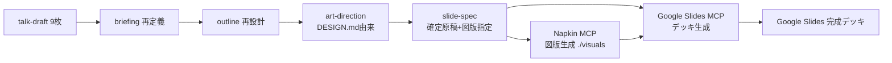

# 設計 — 道場中間発表スライド（spec駆動＋Napkin＋Google Slides）

## 実装アプローチ

3ツール（AWS手法／Napkin／Google Slides）はそのままでは噛み合わない。AWSツールは pptx を丸ごと生成、Napkin は図版の部品のみ、最終 container は Google Slides。役割を次のように分担して composes させる。

- **AWS手法 = プロセスとして借用**：briefing → outline → art-direction → 生成、の思考フローだけ採る。AWSサンプルアプリ・pptx出力経路は使わない。
- **デッキ本体 = Google Slides MCP（ryanvo162）で直接構築**：pptx変換を挟まず Slides ネイティブに作る。自前ホスト＝Google直で第三者を経由しない（ローカルファースト整合）。
- **図版 = Napkin AI MCP で部品生成 → Slides に埋め込み**：SVG/高解像度PNG を `./visuals` に保存し、Slides MCP で画像挿入。

代替案を退けた理由:
- 「AWSツールで pptx 生成 → Slides 取込」：変換ロスと二重管理。Slides ネイティブ構築の方が破綻が少ない。
- 「Napkin 中心 + Slides は器」：Napkin は完全なデッキビルダーでなく、原稿構成を別管理せねばならず弱い。
- Slides MCP のマネージド型（Composio/Zapier）：設定は楽だがスライド内容が第三者経由。自前ホストの方が方針整合。

## 変更するコンポーネント

| コンポーネント / ファイル | 変更内容 | 対応する受け入れ条件 |
|---|---|---|
| `.mcp.json` | `napkin-ai`（npx）と `google-slides`（自前ビルド build/index.js）を追記 | AC-1, AC-3 |
| `slides/setup/setup-google-slides-mcp.md` | GCP OAuth取得＋ビルド＋登録手順 | AC-2 |
| `slides/setup/setup-napkin-mcp.md` | 有料プラン＋トークン発行＋登録手順 | AC-4 |
| `slides/spec/briefing.md` | 聞き手・伝えたいこと・どうなってほしいか | AC-5 |
| `slides/spec/outline.md` | 1スライド1メッセージのアウトライン（9枚） | AC-5 |
| `slides/spec/art-direction.md` | 色・フォント・レイアウト（DESIGN.md由来） | AC-6 |
| `slides/spec/slide-spec.md` | 各スライドの確定原稿＋図版指定（生成の入力） | AC-5, AC-7 |
| Google Slides（クラウド側） | slide-spec に基づくデッキ生成・図版埋め込み | AC-7 |

## データ構造の変更

アプリのスキーマ・型変更なし。`.mcp.json` に MCP サーバ定義を追加するのみ。秘密情報（OAuthトークン・APIキー）は env で渡し、リポジトリにコミットしない。

## 影響範囲の分析

- `docs/` への影響: なし（基本設計に触れない）。
- 既存コード・既存機能への影響: なし（`apps/web` 等は不変）。`.mcp.json` 追記のみ。
- 後方互換 / マイグレーション: 不要。

## 設計上の前提

- 前提1（PII）: スライド・spec・図版に実データ／PII を載せない。例示は合成データのみ。
- 前提2（ローカルファースト）: Slides MCP は自前ホスト（Google直）。マネージド型は不採用。
- 前提3（しきい値の正）: スライド記載の判定しきい値・定義は `talk-draft` および実装の値を正とする（7日・¥2,000・12ヶ月、判定5種＝継続/様子見/ダウングレード検討/解約検討/強い解約候補、型は6つ＋未マッチ時は継続）。
- 前提4（デザインの源）: `DESIGN.md`（Serene Capital）が唯一の源。色＝セージ緑＋オフホワイト、強い解約候補のみテラコッタ。煽らない。
- 前提5（秘密情報）: OAuth client secret / refresh token / NAPKIN_API_KEY はコミットしない。`.gitignore` と env 運用で除外。
- 前提6（外部仕様）: Napkin API は developer preview（破壊的変更あり得る）。Napkin MCP は v1.1.16 で動作確認の非公式実装。Slides MCP も OSS。

## アートディレクション方針（art-direction の骨子・詳細は spec/art-direction.md）

- 比率 16:9・日本語。
- 配色: 背景オフホワイト、本文インク濃グレー、アクセントにセージ/深緑、強い解約候補の語のみテラコッタ。
- フォント: 大見出し＝Shippori Mincho（明朝）、本文/小見出し＝Zen Kaku Gothic New、数字＝BIZ UDPGothic（tabular）、欧文＝EB Garamond。Google Slides 側で同等フォント（Shippori Mincho / Zen Kaku Gothic New / EB Garamond は Google Fonts にあり利用可）。
- レイアウト: 余白広め・細罫線・1スライド1メッセージ・金額は静かな主役数字。
- Napkin 図版: light / 低彩度 / セージ寄りスタイルを `list_styles` から選定し統一。

## 図表

