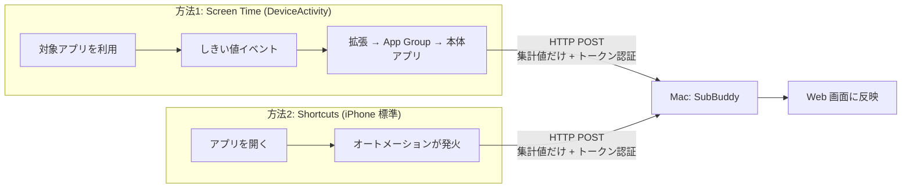
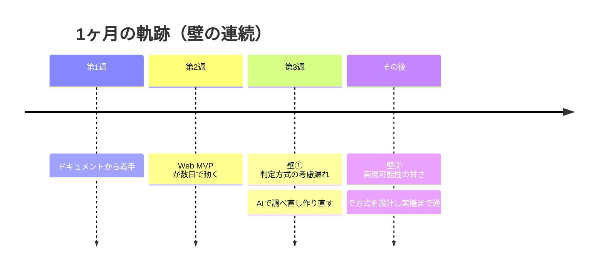
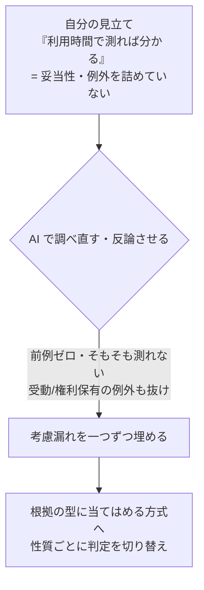

# 登壇草案（10分・中間発表） — AIコーディング道場 勉強会

> **LT タイトル：サブスク見直しアプリ SubBuddy 〜詰めの甘さで何度もぶつかった壁を、AIと越えた話**

> テーマ：「十分によく動き、役に立つソフトウェアを AI とともに開発する中で得られた課題と知見」
> 題材：個人開発アプリ **SubBuddy**（サブスク見直しの相棒）
> 位置づけ：**目標「2ヶ月で商用リリース」の折り返し＝1ヶ月地点での中間報告**
> 想定時間：10 分（質疑除く）／聴衆：道場生・メンターエンジニア
> トーン：宣伝ではなく「同じ実践者への共有」。完成報告ではなく**途中経過**。詰まった所も正直に。

---

## ひとことで言うと（この登壇の主張）

**「サブスク見直しくらい作れる」と甘く見ていた。でも *判定方式の考慮漏れ* と *実現可能性の見積もりの甘さ* で、何度も壁にぶつかった。その壁を AI に助けてもらいながら越え、開発を進められている——という途中経過の話。**
1ヶ月の中間報告として、いま動いているものを簡単に見せたうえで、**自分のどこが甘かったか → AI にどう助けられたか**を正直に共有する。
（AI は壁を越えるための相棒。**調べさせ・反論させ・設計を助けてもらう。ただし決めるのも責任を持つのも自分。**）

---

## スライド構成と話の流れ

| # | スライド | 目安 | 役割 |
|---|---------|------|------|
| 1 | タイトル＋自己紹介＋立ち位置 | 0:40 | つかみ |
| 2 | SubBuddy とは | 0:40 | 題材の共有 |
| 3 | いまのアプリの姿（進捗） | 1:10 | 何をやっているか分かってもらう |
| 4 | **iPhone→SubBuddy へ利用データをこう送った（2方法）** | 1:00 | 壁②を越えた成果（動く形）を先に見せる |
| 5 | 1ヶ月の軌跡＝壁の連続 | 0:50 | どう来たか |
| 6 | **壁① 判定方式の考慮漏れ** | 1:40 | **山場（甘さ→AIで越えた）** |
| 7 | 知見：判定の6つの型と「利用」の定義 | 1:30 | 壁①で詰め直した中身 |
| 8 | **壁② 実現可能性の見積もりの甘さ** | 1:30 | **山場（甘さ→AIで越えた）** |
| 9 | まとめ：甘さ→壁→AIと越えた | 0:40 | 締め |

---

## スライド1：タイトル＋自己紹介＋立ち位置（0:40）

**スライド見出し**
> サブスク見直しアプリ SubBuddy
> 〜詰めの甘さで何度もぶつかった壁を、AIと越えた話【中間報告】

### 自己紹介
- 道場生の〇〇です。普段は△△をしています。

### 今日のスタンス（先に宣言する）
- これは**完成報告ではなく中間報告**。目標は「2ヶ月で商用サービス」、今ちょうど**折り返しの1ヶ月地点**。
- 正直に言うと、**「サブスク見直しくらい作れる」と甘く見ていました。** その甘さで何度も壁にぶつかった話を、AI にどう助けられたかと一緒に共有します。

---

## スライド2：SubBuddy とは（0:40）

**スライド見出し**
> 自動更新に流されないための、手元で動く「見直しの相棒」

### 解決したい課題
- 「契約しているサブスク、ぜんぶ把握できてますか？」「使ってないのに払い続けてませんか？」

### やること（一言）
- 登録したサブスクを **料金・更新日・使い方の性質** から見て、「継続／様子見／プラン見直し／解約検討」を**根拠つきで**提案する。

### 2つのこだわり
- **判断するのは人、アプリは材料を出すだけ**（自動で解約しない・煽らない）。
- **機微な支出情報はクラウドに預けず手元（Mac）に置く**（ローカルファースト）。

---

## スライド3：いまのアプリの姿（進捗）（1:10）

> ねらい：聴衆に「**実際に動くものをここまで作っている**」と具体的に分かってもらう。実画面のスクショを2〜3枚。

**スライド見出し**
> 1ヶ月で、ここまで動いています

### いま触れる画面（Web・動作する）
- **ダッシュボード**：月額・年額の合計支出
- **サブスク登録／一覧／詳細**：見直したい契約を管理
- **支出の可視化**：カテゴリ別内訳・月ごとの推移
- **見直しレコメンド**：判定を**「なぜそう出たか」の根拠つきで**表示
- **更新間近レビュー**：更新日が近い契約を抽出

### 進捗を一枚で（信号で示す）
| 状態 | 中身 |
|------|------|
| 🟢 動く | 登録・合計支出・支出可視化・更新間近・判定＋根拠表示／**iPhone 連携（次スライド）** |
| 🟡 磨き込み中 | 判定方式の精度、最初の棚卸し体験のUI |
| ⚪ これから | 商用を意識した形へ寄せる（残り1ヶ月） |

---

## スライド4：iPhone→SubBuddy へ、利用データをこう送った（1:00）

> ねらい：**iPhone から Mac の SubBuddy へどう送ったか**を「さらっと」見せる。
> 送り方は2通り用意した。深入りせず、各ブロック1〜2文。図（2つの経路が SubBuddy に合流）が1枚あると一発で伝わる。

**スライド見出し**
> iPhone の利用データを、Mac の SubBuddy へ「集計値だけ」送る（2つの方法で実現）

### データの流れ（このまま1枚のスライドに）

### 方法1：Screen Time（DeviceActivity）
- iPhone 標準の **Screen Time 系の公式 API** を使う。
- 選んだアプリが一定時間使われると**しきい値イベント**が飛ぶ → 拡張機能が受け取り → **App Group（アプリ間の共有領域）**経由で本体アプリへ → 本体が **HTTP POST** で SubBuddy へ。
- 送るのは「**どれだけ使ったか（利用時間）**」の集計値。**精密だが、専用の仕組みが要る**。

### 方法2：Shortcuts（iPhone 標準のショートカット）
- 「**アプリを開いたら**」をきっかけに、ショートカットのオートメーションが **直接 HTTP POST**。
- 送るのは「**そのアプリを開いた**」という記録（最終利用日など）。
- **専用アプリ不要・iPhone 標準機能だけ**で動く。手軽だが、利用時間までは分からない（粗い）。

### 共通の約束（どちらの方法でも）
- 送るのは**集計値だけ**。何を見た等の詳細は送らない＝プライバシー設計と一致。
- 送信は**事前共有トークン**で認証（誰でも投げ込めないように）。
- → 「**精密だが重い Screen Time**」と「**手軽だが粗い Shortcuts**」を、アプリの性質で使い分ける。

---

## スライド5：1ヶ月の軌跡＝壁の連続（0:50）

**スライド見出し**
> 「動いた！」のあとに、壁が何度も出てきた

- **第1週**：ドキュメントから書いた（コードより先に「何を作るか」）。
- **第2週**：数日で Web の MVP が動いた（「AI 速いな、ヨシ」）。
- **第3週〜**：ここから壁の連続。**自分の甘さ**が次々表に出た。
  - 壁①：そもそもの**判定方式**が詰められていなかった（スライド6）。
  - 壁②：iPhone 連携の**実現可能性**を軽く見ていた（スライド8）。
- そのたびに AI に助けられて越えてきた、というのが今日の本題。

---

## スライド6：壁① 判定方式の考慮漏れ（1:40）

**スライド見出し**
> 「使ってないサブスクを見つける」を、軽く考えすぎていた

### 自分が甘かった点
- 最初は「**iPhone の利用時間を測れば、使ってないサブスクが分かる**」と単純に考えた。
- でも、肝心なところを詰めていなかった：
  - そもそも**利用時間で解約を判定していいのか**（妥当性）。
  - **流し聞きの音楽**や、**特典として持つだけのサービス**に「使ってない」と言っていいのか。
  - **登録直後でデータが無い**サブスクをどう扱うのか。

### AI にどう助けられたか
- 市場と技術を**出典つきで一つずつ検証**させたら、考慮漏れが次々出た：
  > 利用時間で解約を判定するアプリは**前例ゼロ**。iPhone は使ったアプリを**暗号化して隠す**ため、**そもそも測りきれない**。
- 別の AI に反論もさせて、「補助に下げるだけだと“手動家計簿”になる」と詰めの甘さも突いてもらった。

### 越えた結果（作り直し）
- 判定を「利用時間で測る」から「**根拠の型に当てはめる方式**」へ作り直した。
- → その中身（判定の**6つの型**と、詰め直した**「利用」の定義**）が次のスライド。

---

## スライド7：知見 — 判定の「6つの型」と「利用」の定義（1:30）

> ねらい：壁①で詰め直した判定の中身を、**知見として**共有する。表2つで見せる。

**スライド見出し**
> 点数ではなく、状況の「型」に当てはめて理由を出す

### 判定の「6つの型」＋どれにも当てはまらなければ「継続」（当てはまった型が、そのまま“理由”になる）

> 判定は5種類だけ：継続／様子見／ダウングレード検討／解約検討／強い解約候補

| 状況の型（＝そのまま理由になる） | アプリが出す判定 |
|---|---|
| 使っていない（能動利用なのに） | 様子見（長期間ずっと未使用なら「強い解約候補」） |
| 同カテゴリに複数あって割高 | 解約検討 |
| 同じサービスに安い有料プランがある | ダウングレード検討 |
| 同カテゴリに安い有料競合がある | 解約検討（理由：安い競合がある） |
| 年額更新が近い（7日以内） | 様子見（更新前に見直し） |
| 高額で長く継続（月¥2,000以上・12ヶ月以上） | 様子見（確認をうながす） |
| ——（どれにも当てはまらない） | 継続 |

### 「利用」の定義 ＝ ここが壁①の肝
- **能動利用**（自分が使う）：前面で操作する／裏で再生する（音楽など）／別端末で使う（PC・TV）
- **受動利用**：保管・同期・常時動いているだけ（バックアップ等）
- **権利保有**：特典として持っているだけ（プライムなど）／**容量で見るもの**：iCloud+ など
- → 「**使っていない**」を出してよいのは **能動利用（前面・背景）だけ**。受動利用・権利保有に「使ってない」とは言わない。

> ひとこと：この**「利用」をきちんと定義し直すこと**こそ、自分が最初に飛ばしていた考慮だった。

---

## スライド8：壁② 実現可能性の見積もりの甘さ（1:30）

**スライド見出し**
> 「iPhone の利用量、取って送ればいいだけでしょ」が甘かった

### 自分が甘かった点
- 「iPhone から利用量を取って、Mac のアプリに送ればいい」と軽く考えていた。
- 実際は未知だらけだった：
  - Apple の**特別な権限**が要る／**実機でしか確認できない**／対象アプリは**暗号化トークンで隠れる**。
  - 開発環境（Linux コンテナ）では**そもそもビルドできない**。
  - ローカルファーストなのに、外部から**手元の Mac へどう安全に送るか**。

### AI にどう助けられたか
- 実装に飛びつく前に、**実現方式を AI で調査・設計**（出典つき）。やる／やめるを決める小さな技術検証として切り出した。
- 送信は**2経路で実現**：精密だが仕組みの要る Screen Time、手軽だが粗い Shortcuts（→ スライド4）。集計値だけ・トークン認証も設計。

### 越えた結果（と、AI に任せない線引き）
- iPhone → Mac へ**集計値が実機で届く**ところまで動いた。
- 最後の**実機での確認・OS の許可操作は自分の手で**。ツールに任せきれない所は自分でやる。

---

## スライド9：残り1ヶ月の計画＋まとめ（0:40）

**スライド見出し**
> 折り返した。残り1ヶ月で「動く」から「役立つ」へ

### 残り1ヶ月でやること
- 立て直した判定方式の**作り込みと体験の磨き込み**（最初の棚卸しを最後までやり切れるUIへ）。
- 動いた iPhone 連携（Screen Time / Shortcuts）を判定に活かし、**商用を意識した形へ寄せる**。

### この1ヶ月の学び（3点）
1. **軽く見ていた所ほど壁になった** → 判定方式でも実現可能性でも、詰めていない前提が必ず表に出る。
2. **壁のたびに AI に助けられた** → 飛びつく前に調べさせ・反論させ・方式を設計してもらうと、自分の考慮漏れが見える。
3. **AI はツール。決めるのも、確かめるのも、責任を持つのも自分** → 重要な判断と、実機での確認は自分の手で。

**最後のひとこと**
> 「サブスク見直しくらい作れる」と思っていた甘さを、何度も壁で思い知りました。
> でも AI は、その壁を**一緒に越えてくれる相棒**でした。

---

## 付録：質疑で来そうな質問への備え

- **Q. iPhone 連携はどう実現？** → 2通り。①Screen Time（DeviceActivity）でしきい値イベントを受け、App Group 経由で本体が集計値を POST（利用時間がとれる）。②Shortcuts のオートメーションで「アプリを開いた」を直接 POST（標準機能だけで手軽だが粗い）。どちらも集計値だけ・トークン認証。
- **Q. パターン判定方式って？** → 「未利用・重複・割高・安い代替・更新間近・高額長期」など根拠の“型”に当てはめて判定を出す。点数より理由が伝わる。
- **Q. どの AI ツールを？** → 主に Claude Code。調査・反証に別系統の AI も併用。
- **Q. 中間地点でこの作り直し、間に合う？** → 「動く」土台はあり、転換の多くは設定とドキュメント改訂で吸収できた。方向転換のコストが小さく済んでいるのも今日の知見。

---

## 当日メモ（運用）

- スライド3で**実画面のスクショ**、スライド4で**データの流れ図（2経路が SubBuddy に合流）**を見せる（言葉だけにしない）。
- スライド4は「さらっと」。2つの方法の**使い分け（精密=Screen Time／手軽=Shortcuts）**だけ伝えれば十分。深掘りしない。
- 山場はスライド6・8（壁①・壁②）。各スライドは「**自分が甘かった点 → AI にどう助けられたか → 越えた結果**」の順で話すと一貫する。
- スライド7（6つの型＋利用の定義）は壁①の“答え”。表2枚を見せるだけで、読み上げない。時間が押したら利用の定義（能動／受動）に絞る。
- スライド4（送り方）は壁②の“成果”。先に動く形を見せ、スライド8で「実はここに苦労した」と振り返る流れ。
- 冒頭スライド1で「**中間報告です**」「**甘く見ていました**」を先に正直に言うと、以降の壁の話が効く。
- 10分厳守。各スライドの目安秒数でリハ計測する（9枚・合計約9分40秒。余白は壁①・壁②と質疑に回す）。
</content>
